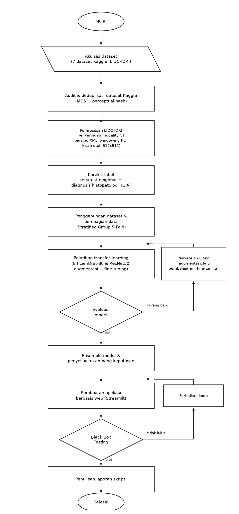
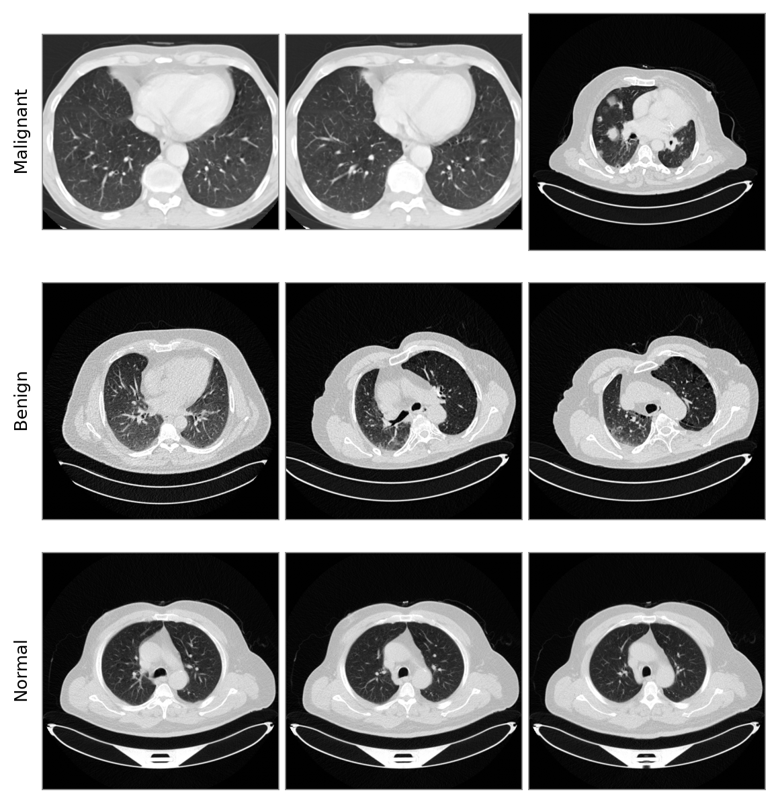
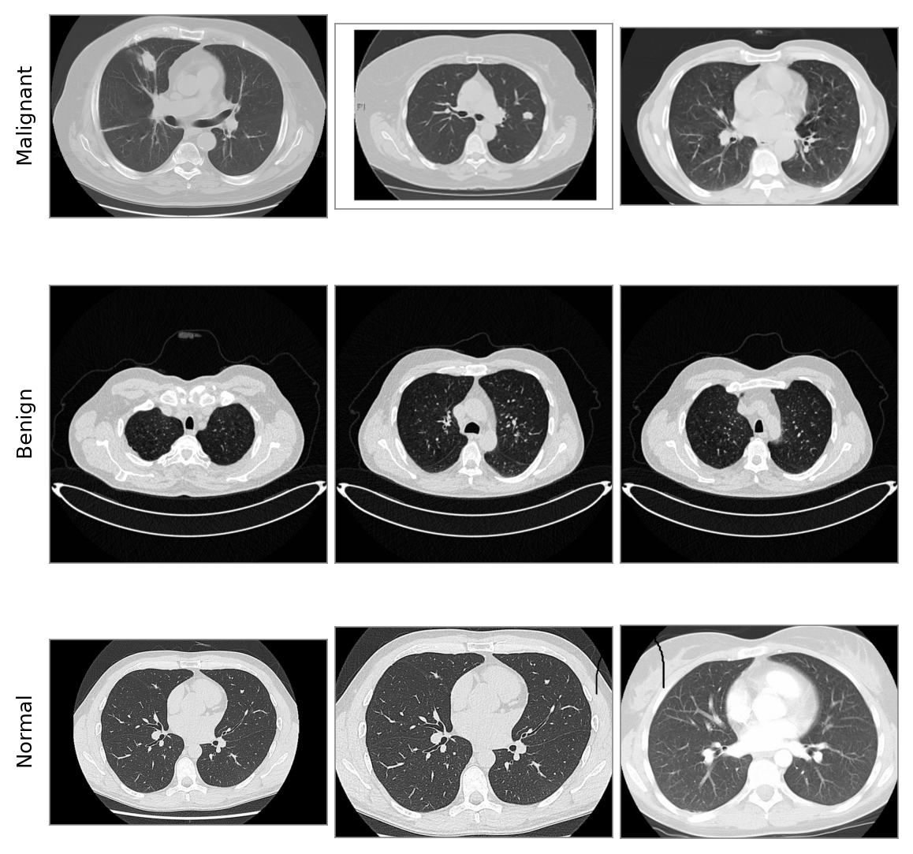
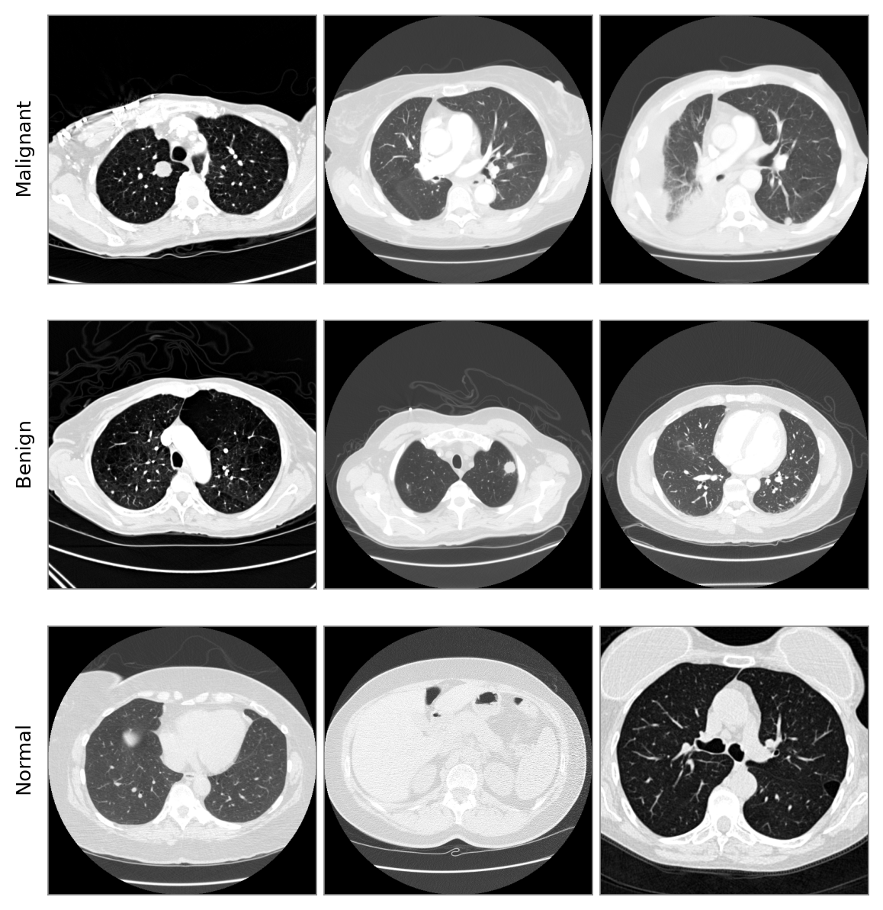
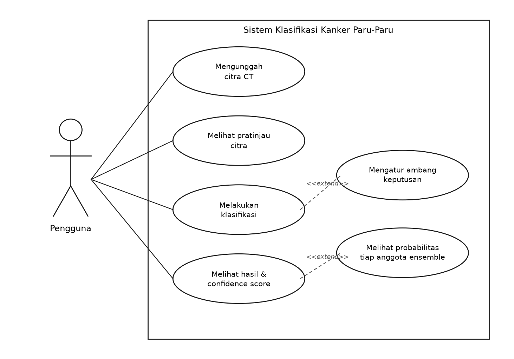

# BAB III

# ANALISIS DAN PERANCANGAN

Bab ini menjelaskan tahapan penelitian dan metode yang digunakan dalam membangun model klasifikasi, mencakup alur penelitian, analisis kebutuhan, perancangan skenario eksperimen, perancangan model *Deep Learning*, dan perancangan prototipe aplikasi.

## 3.1 Alur Penelitian

Penelitian ini dirancang sebagai rangkaian eksperimen bertahap, bukan satu kali pelatihan tunggal, karena setiap tahap dipakai untuk memvalidasi apakah suatu keputusan metodologis (misalnya memotong citra di sekitar nodul, atau menggabungkan dua sumber data) benar-benar memperbaiki hasil sebelum dianggap sebagai konfigurasi final. Gambar 3.1 menunjukkan diagram alur penelitian secara keseluruhan.



Gambar 3.1 Diagram Alur Penelitian

Rincian tiap tahap adalah sebagai berikut:

1. **Studi Literatur dan Analisis Masalah.** Mempelajari konsep dasar kanker paru-paru, citra CT, arsitektur EfficientNet dan ResNet, serta metode penanganan dataset LIDC-IDRI yang label sebagian nodulnya ambigu.
2. **Akuisisi dan Audit Dataset Kaggle.** Mengunduh tujuh dataset publik dari Kaggle, memetakan label dari struktur folder ke tiga kelas target, lalu mendeteksi duplikasi di dalam dan lintas ketujuh dataset tersebut lewat pencocokan MD5 dan *perceptual hash*.
3. **Akuisisi dan Pemrosesan Dataset LIDC-IDRI.** Mengunduh berkas DICOM dan anotasi XML radiolog dari TCIA, mem-parsing anotasi menjadi label per seri pemindaian, lalu mengekstraksi citra irisan utuh lewat *windowing* HU.
4. **Koreksi Label.** Melabeli ulang nodul dengan skor keganasan ambigu lewat pendekatan *nearest-neighbor*, lalu mengoreksi label lebih lanjut memakai data diagnosis histopatologi resmi TCIA pada pasien yang datanya tersedia.
5. **Pemulihan Label Citra Kaggle Tanpa Label.** Memperkirakan label 197 citra Kaggle yang tidak berlabel lewat pendekatan *nearest-neighbor* dengan syarat kesepakatan yang lebih ketat, sehingga citra tersebut tetap dapat dimanfaatkan sebagai data latih.
6. **Penggabungan Dataset.** Menggabungkan seluruh pool yang sudah berlabel final, disertai pengecekan ulang duplikasi lintas sumber.
7. **Pembagian Data.** Membagi data gabungan memakai *Stratified Group K-Fold* (5 *fold*) beserta *held-out test set* terpisah yang sama sekali tidak dipakai selama pelatihan maupun pemilihan model.
8. **Pelatihan Model.** Melatih EfficientNet-B0 dan ResNet50 pada tiap *fold*, masing-masing lewat dua fase (*feature extraction* dan *fine-tuning*) dengan augmentasi data pada data latih.
9. **Pengukuran Kontribusi Tiap Teknik.** Mengukur sumbangan *fine-tuning*, *data augmentation*, dan *ensemble model* lewat perbandingan terkendali yang hanya mengubah satu faktor pada tiap pengujian.
10. **Pemilihan Konfigurasi Final.** Memilih konfigurasi dengan keseimbangan akurasi dan *cancer recall* terbaik sebagai model yang diintegrasikan ke prototipe aplikasi.
11. **Pembangunan Prototipe Aplikasi dan Pengujian.** Mengimplementasikan model final ke aplikasi Streamlit beserta lapisan validasi input yang menyaring unggahan di luar domain, lalu diuji lewat *Black Box Testing*.
12. **Penulisan Laporan.** Mendokumentasikan seluruh proses dan hasil, termasuk eksperimen yang tidak berhasil meningkatkan performa, ke dalam laporan skripsi.

## 3.2 Analisis Kebutuhan

Tahap analisis kebutuhan memetakan sumber daya yang diperlukan agar seluruh rangkaian eksperimen dapat dijalankan. Pemetaan ini mencakup tiga hal: data citra beserta labelnya, perangkat keras yang sanggup menampung beban pelatihan pada resolusi 512 piksel, dan perangkat lunak yang menjalankan seluruh alur mulai dari pembacaan berkas DICOM hingga penyajian hasil. Ketiganya diuraikan berturut-turut pada sub-bab berikut.

### 3.2.1 Kebutuhan Data

Penelitian ini menggunakan data dari dua sumber utama yang karakteristiknya jauh berbeda: kompilasi dataset publik Kaggle yang labelnya berbasis struktur folder, dan LIDC-IDRI yang labelnya berbasis anotasi radiolog serta diagnosis histopatologi resmi. Kedua sumber diaudit dan diproses secara terpisah sebelum digabung.

**1. Dataset Kaggle (Tujuh Sumber)**

Ketujuh dataset ini pada dasarnya adalah kompilasi ulang dari beberapa koleksi citra CT paru-paru yang sama (terutama dataset IQ-OTHNCCD asal Irak), diunggah ulang oleh pengguna Kaggle yang berbeda-beda dengan struktur folder dan penamaan kelas yang bervariasi. Tabel 3.1 merangkum ketujuh sumber tersebut beserta jumlah citra mentahnya sebelum audit.

Tabel 3.1 Sumber Dataset Kaggle

| No | Nama Dataset | Jumlah Citra Mentah | Keterangan |
|---|---|---|---|
| 1 | IQ-OTHNCCD Lung Cancer Dataset (Augmented) (Subhajeet Das) | 3.609 | Dikecualikan; berisi citra hasil augmentasi sintetis, bukan citra asli |
| 2 | CT Scan Images for Lung Cancer (Dishan Rathi) | 2.274 | |
| 3 | Lung Cancer Dataset (IQ-OTHNCCD) (Waseim Nagah Hennes) | 2.073 | |
| 4 | CT Scan Images of Lung Cancer Patients (MD. Nafees Imtiaz) | 1.535 | |
| 5 | IQ-OTHNCCD - Lung Cancer Dataset (Aditya Mahimkar) | 1.294 | |
| 6 | The IQ-OTHNCCD Lung Cancer Dataset (Hamdalla F. Al-Yasriy) | 1.097 | |
| 7 | Chest CT-Scan Images Dataset (Mohamed Hany) | 1.000 | Sebagian folder tidak berlabel ("Test cases"), dikecualikan |

Dataset augmentasi sintetis (baris pertama) dikecualikan sepenuhnya karena isinya adalah hasil augmentasi citra lain di daftar ini, bukan citra pemindaian asli, sehingga menyertakannya berisiko menggandakan pola visual yang sama dan membuat evaluasi bias. Folder yang tidak memiliki label kelas yang jelas (misalnya folder "Test cases" tanpa keterangan diagnosis) juga dikecualikan dari proses pelatihan.

Label tiap citra dipetakan dari nama folder ke tiga kelas target lewat pencocokan pola teks (memperhitungkan variasi ejaan seperti "Bengin" dan "Benign" yang sama-sama muncul di dataset yang berbeda), dengan folder bertuliskan subtipe histopatologi tertentu (adenokarsinoma, karsinoma sel skuamosa, karsinoma sel besar) seluruhnya dipetakan ke kelas Malignant.

Audit duplikasi dilakukan lewat dua metode sekaligus: pencocokan **MD5** (mendeteksi berkas yang benar-benar identik bit demi bit) dan ***perceptual hash*** atau *phash* (mendeteksi citra yang identik secara visual meski berkasnya sedikit berbeda, misalnya akibat kompresi ulang). Citra yang membentuk kelompok duplikat disatukan lewat *union-find*, dan dari tiap kelompok hanya disimpan satu representasi dengan resolusi tertinggi. Kelompok duplikat yang labelnya ternyata tidak konsisten antar salinan (misalnya satu salinan berlabel Benign, salinan lain berlabel Malignant) dikeluarkan seluruhnya dari pool data, karena ketidaksepakatan label semacam ini menandakan kesalahan anotasi pada sumber aslinya yang tidak bisa diselesaikan secara otomatis.

Setelah audit, pool data Kaggle final berjumlah **1.627 citra**, dengan distribusi Malignant 1.192, Normal 342, dan Benign 93 citra. Gambar 3.2 dan Gambar 3.3 menunjukkan contoh citra asli (bukan citra staged) untuk tiap kelas dari dua sumber Kaggle yang berbeda, memperlihatkan bahwa karakteristik visual antar sumber (kontras, *framing*, resolusi asli) memang bervariasi -- salah satu alasan audit deduplikasi di atas perlu dilakukan berbasis kandungan citra (*hash*), bukan sekadar nama berkas.



Gambar 3.2 Contoh Citra per Kelas pada Dataset Kaggle (The IQ-OTHNCCD Lung Cancer Dataset, Hamdalla F. Al-Yasriy)



Gambar 3.3 Contoh Citra per Kelas pada Dataset Kaggle (CT Scan Images for Lung Cancer, Dishan Rathi)

**2. Dataset LIDC-IDRI**

LIDC-IDRI diunduh dari TCIA berupa berkas DICOM per pasien beserta anotasi XML radiolog. Pemrosesan dataset ini melalui beberapa tahap:

*Penyaringan Jenis Pemindaian (`scan_lidc_modality.py`).* LIDC-IDRI tidak hanya berisi citra CT. Koleksi ini juga menyertakan foto rontgen dada (*radiografi*) dari sebagian pasien yang sama, disimpan dalam format DICOM yang sama dan struktur folder yang sama persis, sehingga tidak dapat dibedakan dari nama berkas maupun letak foldernya. Pembedanya hanya satu, yaitu tag `Modality` di dalam kepala berkas DICOM, yang bernilai `CT` untuk citra *Computed Tomography* serta `DX` atau `CR` untuk foto rontgen.

Perbedaan ini bersifat menentukan karena nilai piksel kedua jenis citra berada pada skala yang sama sekali berbeda. Citra CT menyimpan nilai dalam satuan *Hounsfield Unit* yang terkalibrasi terhadap kerapatan jaringan, sedangkan foto rontgen menyimpan nilai intensitas detektor yang tidak terkalibrasi. Akibatnya, *windowing* HU yang dipakai pada tahap ekstraksi berikutnya menjenuhkan seluruh piksel foto rontgen menjadi putih polos tanpa struktur anatomi apa pun yang tersisa.

Oleh sebab itu, kepala berkas DICOM dari seluruh 1.308 seri pemindaian dibaca lebih dahulu untuk mencatat nilai `Modality` masing-masing. Hasilnya, 1.018 seri berjenis CT, 237 seri berjenis DX, dan 53 seri berjenis CR. Dengan demikian 290 seri atau 22,2% dari koleksi ternyata bukan citra CT, dan seluruhnya dikeluarkan dari pool agar data penelitian benar-benar hanya berisi citra *Computed Tomography* sebagaimana dinyatakan pada judul. Pemeriksaan lanjutan memastikan penyaringan ini tidak menghilangkan satu pasien pun, karena setiap pasien yang memiliki seri rontgen juga memiliki sekurang-kurangnya satu seri CT.

*Parsing Anotasi (`parse_lidc_labels.py`).* Tiap berkas XML dibaca untuk mengekstraksi penanda nodul dari tiap radiolog, termasuk koordinat kontur nodul dan skor keganasan (1–5). Penanda-penanda dikelompokkan sebagai satu nodul konsensus bila jaraknya berada dalam toleransi 5,0 mm pada arah antar-irisan (Z) dan 40 piksel pada bidang irisan (XY) -- ambang yang dipilih agar penanda dari radiolog berbeda pada nodul fisik yang sama tetap dianggap satu nodul, tanpa menyatukan dua nodul yang sungguh terpisah. Label seri pemindaian ditentukan dari nodul konsensus dengan skor keganasan rata-rata tertinggi (nodul "terburuk" pada seri tersebut menentukan label seluruh seri). Dari 1.018 seri CT yang diproses, 883 seri memiliki nodul yang tercatat radiolog, terdiri dari 436 seri berlabel Malignant, 221 berlabel Benign, dan 226 berlabel ambigu (skor rata-rata tepat 3). Sisanya sebanyak 135 seri tidak memiliki nodul yang tercatat radiolog sehingga berlabel Normal.

*Ekstraksi Citra (`extract_lidc_images_full.py`).* Irisan CT yang memuat nodul konsensus dikonversi dari DICOM ke PNG lewat *windowing* HU (*level* −600, *width* 1500) pada ukuran aslinya, yaitu irisan dada utuh 512×512 piksel tanpa pemotongan. Nilai *windowing* tersebut merupakan pengaturan baku untuk pembacaan parenkim paru, sehingga jaringan paru dan nodul di dalamnya tampil dengan kontras yang memadai sementara tulang dan jaringan lunak di luar paru ditekan.

Citra sengaja dipertahankan utuh, bukan dipotong di sekitar nodul. Alasan utamanya menyangkut keabsahan pengujian, bukan sekadar bentuk masukan. Untuk memotong citra tepat di sekitar nodul, koordinat nodul harus diketahui lebih dahulu, padahal menemukan nodul itulah tugas yang justru dibebankan kepada model. Bila pemotongan saat pengujian tetap dilakukan memakai koordinat dari anotasi radiolog, berarti sebagian jawaban sudah diberikan kepada model sebelum ia menjawab, sehingga angka akurasi yang dihasilkan tidak lagi mencerminkan kemampuan model yang sebenarnya.

Persoalan yang sama muncul pada tahap penggunaan. Pengguna yang mengunggah citra CT ke aplikasi tidak memiliki koordinat nodul; seandainya ia memilikinya, nodul tersebut sudah ditemukan dan sistem ini tidak lagi diperlukan. Model yang dilatih pada citra terpotong dengan demikian hanya dapat bekerja apabila bagian tersulit dari pekerjaannya sudah diselesaikan pihak lain terlebih dahulu.

Alasan kedua bersifat teknis: citra pada dataset Kaggle memang tersimpan sebagai irisan dada penuh. Bila hanya sumber LIDC-IDRI yang dipotong, kedua sumber akan memiliki pembingkaian yang berbeda secara sistematis, dan perbedaan pembingkaian itu sendiri berpotensi dipakai model sebagai penanda kelas.

Konsekuensi dari keputusan ini diterima secara terbuka. Pada irisan utuh, nodul berukuran beberapa milimeter hanya menempati bagian kecil dari keseluruhan citra, sehingga performa pada subset LIDC-IDRI menurun dibandingkan bila citranya dipotong. Penurunan tersebut dilaporkan apa adanya pada Bab IV, Bagian 4.8, dengan pertimbangan bahwa angka yang lebih rendah tetapi diperoleh pada kondisi yang sama dengan pemakaian nyata lebih berguna daripada angka yang lebih tinggi tetapi diperoleh pada kondisi yang tidak akan pernah terjadi.

Implementasi awal skrip ini sempat memiliki bug di mana seri berlabel ambigu ikut terhitung sebagai Normal karena logika pemfilteran seri yang belum lengkap; bug ini diperbaiki dengan mengecualikan seri ambigu secara eksplisit dari kelompok Normal sebelum ekstraksi, dan seluruh citra diekstraksi ulang setelah perbaikan.

*Koreksi Label Ambigu (`relabel_ambiguous.py`).* 226 seri berlabel ambigu dilabeli ulang lewat pencarian *5-nearest-neighbor* pada ruang fitur EfficientNet-B0 *pre-trained* (ImageNet, tanpa pelatihan tambahan) terhadap seri-seri yang labelnya sudah pasti (Malignant/Benign), diambil suara mayoritas dari lima tetangga terdekat berdasarkan jarak *cosine* pada ruang fitur tersebut. Proses ini melabeli ulang 162 seri menjadi Malignant dan 64 seri menjadi Benign, sehingga tidak ada data yang harus dibuang.

*Koreksi Berdasarkan Diagnosis Histopatologi (`apply_pathology_ground_truth.py`).* Sebagai lapisan validasi tambahan, label dicocokkan dengan data diagnosis histopatologi resmi TCIA, yang hanya mencakup 157 dari 1.010 pasien LIDC-IDRI (*tcia-diagnosis-data-2012-04-20.xls*, sheet "*Diagnosis Truth*"), yang mencatat kode diagnosis pada level pasien (0 = tidak diketahui, 1 = jinak, 2 = ganas primer, 3 = ganas metastasis). Kode 1 dipetakan ke Benign, kode 2 dan 3 dipetakan ke Malignant, dan kode 0 dilewati (tidak dijadikan dasar koreksi). Bila diagnosis resmi ini berbeda dari label hasil pemrosesan nodul di atas, label dikoreksi mengikuti diagnosis resmi tersebut sebagai sumber kebenaran yang lebih kuat. Dari 157 pasien yang tercakup berkas tersebut, 130 pasien memiliki seri CT yang beririsan dengan pool penelitian ini, mencakup 131 seri pemindaian. Proses ini mengubah label pada 46 seri dan mengonfirmasi 85 seri lain yang labelnya sudah sesuai.

Sifat koreksi ini yang bekerja pada tingkat pasien, bukan tingkat citra, sekaligus memperjelas mengapa penyaringan jenis pemindaian di tahap awal bersifat wajib. Sebelum penyaringan diterapkan, koreksi yang sama menyentuh 227 seri dan mengubah label 142 di antaranya. Selisih 96 seri seluruhnya merupakan foto rontgen yang sebelumnya berlabel Normal lalu berubah menjadi Malignant atau Benign semata-mata karena pasiennya memiliki diagnosis kanker, padahal citra rontgen itu sendiri tidak memuat bukti visual apa pun yang mendukung label tersebut. Dengan kata lain, foto rontgen bukan hanya mencemari kelas Normal, melainkan juga menyuntikkan citra tanpa struktur ke dalam kedua kelas kanker.

Pool data LIDC-IDRI final berjumlah **1.018 citra** dari 1.010 pasien, dengan distribusi Malignant 609, Benign 286, dan Normal 123 citra. Gambar 3.4 menunjukkan contoh citra irisan utuh untuk tiap kelas.



Gambar 3.4 Contoh Citra Irisan Utuh 512x512 Piksel per Kelas pada Dataset LIDC-IDRI

**3. Pemulihan Label pada Citra Kaggle Tanpa Label**

Audit pada tahap pertama menyisakan 197 citra Kaggle yang tidak memiliki label kelas sama sekali karena tersimpan di luar struktur folder berlabel pada dataset asalnya. Upaya pertama adalah memulihkan label aslinya lewat pencocokan MD5 dan *perceptual hash* terhadap seluruh citra berlabel pada keenam dataset Kaggle lainnya, dengan asumsi citra yang sama mungkin muncul berlabel di tempat lain. Pencocokan ini tidak menemukan satu pun kecocokan, sehingga label aslinya memang tidak dapat dipulihkan dan hanya dapat diperkirakan.

*Pelabelan Perkiraan (`pseudolabel_unlabeled_kaggle.py`).* Label diperkirakan lewat pencarian *k-nearest-neighbor* pada ruang fitur EfficientNet-B0 *pre-trained*, dengan cara yang sama seperti koreksi label ambigu LIDC-IDRI tetapi dengan syarat penerimaan yang lebih ketat: dari lima tetangga terdekat, sekurang-kurangnya empat harus sepakat pada satu kelas. Syarat yang lebih ketat dipakai karena citra-citra ini sama sekali tidak memiliki sinyal label awal, berbeda dengan seri LIDC-IDRI ambigu yang setidaknya sudah memiliki skor keganasan dari radiolog.

Dari 197 citra, 166 memenuhi syarat dan diterima, sementara 31 sisanya dibuang karena tetangganya tidak cukup sepakat. Distribusi hasilnya sangat miring, yaitu 154 Malignant dan 12 Normal, tanpa satu pun Benign. Kemiringan ini perlu dibaca dengan hati-hati karena kemungkinan besar mencerminkan proporsi kelas pada data rujukannya, bukan komposisi sebenarnya dari citra-citra tersebut. Karena itu, seluruh 166 citra berlabel perkiraan ini dipaksa masuk ke data latih dan dilarang muncul di *held-out test set*, dengan pemeriksaan yang menghentikan program bila aturan tersebut dilanggar:

```python
eligible = pool[pool["label_origin"] != "pseudo-knn"].reset_index(drop=True)
forced_train = pool[pool["label_origin"] == "pseudo-knn"].reset_index(drop=True)
...
assert (test_df["label_origin"] != "pseudo-knn").all(), "label tebakan bocor ke data uji"
```

Dengan pembatasan ini, seluruh angka evaluasi pada Bab IV dihitung hanya terhadap citra yang labelnya berasal dari sumber yang dapat dipertanggungjawabkan, yaitu struktur folder dataset Kaggle atau anotasi radiolog dan diagnosis histopatologi LIDC-IDRI.

**4. Dataset COCO (Validasi Input)**

Selain ketiga pool citra CT di atas, penelitian ini memakai sebagian citra dari COCO val2017 (*Common Objects in Context*), yaitu dataset citra objek sehari-hari yang sama sekali tidak berkaitan dengan citra medis. Citra tersebut dipakai sebagai kelas pembanding untuk melatih model klasifikasi biner yang membedakan "Citra CT Paru-paru" dari "Bukan Citra CT Paru-paru". Model biner tersebut berfungsi sebagai lapisan validasi input pada prototipe aplikasi, yang menolak unggahan di luar domain sebelum diteruskan ke model klasifikasi utama. Citra COCO tidak pernah dipakai melatih maupun menguji model klasifikasi tiga kelas, sehingga tidak memengaruhi angka performa yang dilaporkan pada Bab IV.

**5. Penggabungan Dataset**

Ketiga pool digabung menjadi satu manifes pelatihan, didahului pengecekan ulang duplikasi lintas sumber (MD5 dan *phash*) untuk memastikan tidak ada citra yang sama persis kebetulan muncul di lebih dari satu sumber. Hasil pengecekan ini nihil (0 duplikat), sebagaimana diharapkan mengingat kedua sumber berasal dari alur akuisisi yang sama sekali berbeda (Kaggle: citra irisan CT yang sudah disusun ulang pengunggahnya; LIDC-IDRI: hasil ekstraksi langsung dari DICOM oleh penelitian ini sendiri). Dataset gabungan berjumlah **2.811 citra** sebagaimana dirangkum pada Tabel 3.2.

Tabel 3.2 Distribusi Kelas Dataset Gabungan

| Sumber | Malignant | Benign | Normal | Total |
|---|---:|---:|---:|---:|
| Kaggle (7 dataset, setelah audit) | 1.192 | 93 | 342 | 1.627 |
| Kaggle (label perkiraan, hanya data latih) | 154 | 0 | 12 | 166 |
| LIDC-IDRI (setelah penyaringan CT dan koreksi label) | 609 | 286 | 123 | 1.018 |
| **Total Gabungan** | **1.955** | **379** | **477** | **2.811** |

Penggabungan ini diimplementasikan dalam `combine_kaggle_lidc.py`, yang juga menjalankan ulang pengecekan MD5 dan *phash* lintas kedua sumber sebelum menyatukan manifesnya menjadi satu berkas CSV. Identitas grup untuk keperluan *Stratified Group K-Fold* diberi awalan sumbernya masing-masing (`KAGGLE::` diikuti kunci kasus asal, `LIDC::` diikuti ID pasien), sehingga kedua sumber tidak akan pernah tercampur dalam satu grup buatan yang salah, dan citra dari pasien atau kasus yang sama tetap terjamin berada pada *fold* yang sama.

### 3.2.2 Kebutuhan Perangkat Keras

Pelatihan seluruh model dijalankan pada satu komputer lokal dengan spesifikasi berikut:

- GPU: NVIDIA (CUDA-enabled), dipakai untuk mempercepat pelatihan dan inferensi.
- RAM: memadai untuk memuat manifes data dan menjalankan proses audit dataset (deduplikasi, *hashing*) yang bersifat *memory-intensive* pada tahap awal.
- Penyimpanan: cukup untuk menampung data mentah DICOM LIDC-IDRI (berukuran puluhan gigabita sebelum diekstraksi) beserta seluruh citra hasil ekstraksi dan model tersimpan.

### 3.2.3 Kebutuhan Perangkat Lunak

Perangkat lunak inti yang digunakan:

1. **Python** sebagai bahasa pemrograman utama.
2. **PyTorch** dan **torchvision** untuk arsitektur model, pelatihan, dan inferensi.
3. **pydicom** untuk membaca berkas DICOM dan metadatanya.
4. **imagehash** dan **hashlib** untuk audit duplikasi (*perceptual hash* dan MD5).
5. **scikit-learn** untuk metrik evaluasi, *Stratified Group K-Fold*, dan model regresi logistik pada *ensemble stacking*.
6. **Streamlit** untuk prototipe aplikasi *web*.
7. **Matplotlib** untuk visualisasi kurva pelatihan, *confusion matrix*, dan kurva ROC.

## 3.3 Perancangan Skenario Eksperimen

Judul penelitian ini menyebut tiga teknik optimasi, yaitu *fine-tuning*, *data augmentation*, dan *ensemble model*. Melaporkan satu angka akhir saja tidak cukup untuk membuktikan bahwa ketiganya benar-benar berkontribusi, sebab angka tersebut tidak menunjukkan berapa banyak yang berasal dari masing-masing teknik. Karena itu, dirancang tiga skenario eksperimen pembanding terkendali, yaitu perbandingan yang hanya mengubah satu faktor dan mempertahankan seluruh faktor lainnya persis sama, ditambah satu skenario untuk model validasi input pada prototipe aplikasi. Keempat skenario tersebut diuraikan pada sub-bab berikut.

### 3.3.1 Skenario Pengukuran Kontribusi *Fine-Tuning*

Macro-F1 validasi terbaik yang dicapai pada fase A (*backbone* beku, hanya lapisan klasifikasi yang dilatih) dibandingkan dengan macro-F1 validasi terbaik pada fase B (tiga blok terakhir *backbone* ikut dilatih) untuk tiap model dari kesepuluh model. Karena kedua fase dijalankan berurutan pada model dan pembagian data yang sama, selisihnya dapat diatribusikan langsung pada *fine-tuning*. Skenario ini tidak memerlukan pelatihan tambahan, sebab riwayat macro-F1 kedua fase tercatat pada setiap *epoch* selama pelatihan berlangsung.

### 3.3.2 Skenario Pengukuran Kontribusi *Data Augmentation*

Kesepuluh model dilatih ulang dari awal sebanyak dua kali dengan *pipeline* pra-pemrosesan yang identik kecuali pada bagian augmentasinya, sehingga tersedia tiga kelompok model berjumlah tiga puluh model. Kelompok pertama dilatih tanpa augmentasi sama sekali, kelompok kedua memakai augmentasi ringan yang disesuaikan sifat citra CT (hanya pembalikan horizontal dan rotasi 7°, tanpa perubahan kecerahan maupun kontras, tanpa translasi, dan tanpa penskalaan), dan kelompok ketiga memakai augmentasi penuh berupa pembalikan horizontal, transformasi afin (rotasi 15°, translasi 10%, penskalaan 0,90–1,10), serta perubahan kecerahan dan kontras sebesar 0,2. Ketiganya dievaluasi pada *held-out test set* yang sama lewat alur *ensemble* yang sama pula, lalu selisihnya diuji kebermaknaannya memakai uji McNemar. Konfigurasi yang akhirnya dipilih sebagai konfigurasi final adalah kelompok kedua, dengan dasar pemilihan dijelaskan pada Bab IV, Bagian 4.4.3, dan parameternya dicantumkan pada Tabel 3.3.

Pemilihan augmentasi ringan pada kelompok kedua berangkat dari sifat citra CT itu sendiri, bukan sekadar memperkecil parameter secara acak. Tingkat keabuan pada citra CT berasal dari *Hounsfield Unit* yang merupakan besaran kerapatan jaringan terkalibrasi, sehingga perubahan kecerahan dan kontras mengubah keterangan jaringan yang justru menjadi dasar pembedaan kelas. Sementara itu nodul berukuran beberapa milimeter hanya menempati bagian sangat kecil dari irisan 512×512 piksel, sehingga translasi dan penskalaan berpeluang menggeser atau melarutkan objek yang harus dikenali.

### 3.3.3 Skenario Pengukuran Kontribusi *Ensemble Model*

Performa model tunggal dibandingkan secara berjenjang dengan *ensemble soft-voting* (bobot setara dan bobot tertimbang) serta *ensemble stacking* berbasis *meta-learner*, seluruhnya pada *held-out test set* yang sama dan tanpa pelatihan ulang model dasar. Sebagai pelengkap, penyesuaian ambang keputusan kelas Malignant juga diuji pada konfigurasi *ensemble* terbaik, untuk memeriksa titik keseimbangan antara akurasi keseluruhan dan *cancer recall*. Konfigurasi dengan performa terbaik pada skenario ini kemudian diintegrasikan ke dalam prototipe aplikasi berbasis *web*. Seluruh perbandingan dilaporkan apa adanya pada Bab IV, termasuk bagian yang hasilnya tidak sesuai harapan.

### 3.3.4 Skenario Pengujian Model Validasi Input Citra dengan Dataset COCO

Skenario ini bertujuan mengevaluasi kinerja model klasifikasi biner yang difungsikan sebagai mekanisme validasi awal sebelum citra masukan diproses oleh model klasifikasi utama. Arsitektur EfficientNet-B0 yang lapisan klasifikasinya diubah menjadi dua keluaran dilatih khusus untuk membedakan kelas "Citra CT Paru" dari kelas "Bukan Citra CT Paru". Kelas "Citra CT Paru" diwakili seluruh 1.018 citra CT LIDC-IDRI hasil penyaringan tag `Modality`, sedangkan kelas "Bukan Citra CT Paru" diwakili citra COCO val2017 yang diambil acak dengan jumlah yang sama, sehingga kedua kelas berimbang dan model tidak condong ke salah satunya.

Berbeda dengan model utama yang dievaluasi memakai *Stratified Group K-Fold*, model penyaring ini cukup dievaluasi dengan metode *hold-out*, mengingat tingkat kesulitan membedakan kedua kelasnya jauh lebih rendah daripada membedakan jenis temuan pada citra CT. Pembagiannya mengikuti eksperimen utama, yaitu citra LIDC-IDRI pada *held-out test set* utama menjadi data uji model ini, sedangkan sisanya dibagi 90:10 menjadi data latih dan data validasi. Selain evaluasi pada data uji tersebut, model ini juga diuji langsung melalui aplikasi memakai 12 citra CT paru-paru dan 8 citra COCO yang belum pernah dilihatnya.


## 3.4 Perancangan Model *Deep Learning*

Perancangan model mencakup dua hal yang saling terkait, yaitu bentuk arsitektur jaringan yang dipakai dan nilai *hyperparameter* yang mengatur jalannya pelatihan. Keduanya ditetapkan seragam untuk seluruh model dan seluruh lipatan, sehingga perbedaan hasil antar konfigurasi pada Bab IV dapat diatribusikan pada teknik yang sedang diuji, bukan pada perbedaan pengaturan pelatihan. Rincian arsitektur dijabarkan pada sub-bab 3.4.1, sedangkan konfigurasi *hyperparameter* beserta alasan pemilihan tiap nilainya disajikan pada sub-bab 3.4.2.

### 3.4.1 Arsitektur Model

Kedua arsitektur (EfficientNet-B0 dan ResNet50) memakai bobot *pre-trained* ImageNet dari `torchvision`, dengan lapisan klasifikasi akhir diganti menjadi *fully connected layer* berukuran 3 keluaran (Malignant, Benign, Normal). Pelatihan dilakukan dua fase per model per *fold*:

1. **Fase A (*Feature Extraction*).** Seluruh bobot *backbone* dibekukan, hanya lapisan klasifikasi baru yang dilatih, maksimal 12 *epoch*, *learning rate* 1e-3.
2. **Fase B (*Fine-Tuning*).** Beberapa blok/*stage* terakhir *backbone* dibuka, dilatih lebih lanjut bersama lapisan klasifikasi, maksimal 25 *epoch*, *learning rate* 1e-5, dengan `ReduceLROnPlateau` (mode maksimalkan macro-F1 validasi, faktor 0,5, *patience* 3).

`Early stopping` diterapkan dengan *patience* 6 *epoch* terhadap macro-F1 validasi, dan bobot terbaik disimpan lintas kedua fase (bukan hanya dari fase B), sehingga bila performa terbaik justru tercapai sebelum *fine-tuning* dimulai, bobot itulah yang dipakai.

### 3.4.2 Konfigurasi *Hyperparameter* Pelatihan

Tabel 3.3 merangkum konfigurasi *hyperparameter* pelatihan.

Tabel 3.3 Konfigurasi *Hyperparameter* Pelatihan

| Parameter | Nilai |
|---|---|
| *Optimizer* | Adam |
| *Learning Rate* (Fase A) | 1e-3 |
| *Learning Rate* (Fase B) | 1e-5 |
| *Loss* Function | CrossEntropyLoss (*class-weighted*) |
| *Scheduler* | ReduceLROnPlateau (mode maks. macro-F1, faktor 0,5, *patience* 3) |
| *Early Stopping* | *Patience* 6 *epoch* (macro-F1 validasi) |
| *Epoch* Maksimum | 12 (Fase A) + 25 (Fase B) |
| Regularisasi | *Dropout* p = 0,3 sebelum lapisan klasifikasi |
| Augmentasi (konfigurasi final) | RandomHorizontalFlip dan RandomRotation 7°, tanpa ColorJitter, tanpa translasi, tanpa penskalaan (data latih saja) |
| Ukuran Citra Input | 512×512 piksel |
| Jumlah *Fold* | 5 (Stratified Group K-Fold) |
| Porsi *Held-Out Test Set* | 18% grup |
| Random Seed | 42 |

## 3.5 Perancangan Prototipe Aplikasi

Prototipe aplikasi dibangun dengan Streamlit untuk mendemonstrasikan model final secara interaktif, terdiri dari enam laman: Beranda, Prediksi Citra CT, Perbandingan Model, Kurva *Training*, Audit Dataset, dan Tentang & Metodologi.

### 3.5.1 Rancangan Antarmuka Aplikasi

Komponen utama pada laman Prediksi Citra CT meliputi:

1. **Widget Pengunggahan Citra**, mendukung format PNG/JPG/BMP.
2. **Area Pratinjau Citra**, menampilkan citra yang diunggah agar pengguna dapat memastikan masukannya sudah benar sebelum diproses.
3. **Lapisan Validasi Input**, yang menjalankan model klasifikasi biner (CT paru-paru versus bukan) dan menghentikan proses bila citra berada di luar domain, disertai pesan penolakan beserta tingkat keyakinannya.
4. **Panel Hasil Prediksi**, menampilkan label kelas (Malignant/Benign/Normal), probabilitas tiap kelas dari *ensemble stacking*, dan pengaturan ambang keputusan yang dapat digeser pengguna.
5. **Panel Rincian Anggota *Ensemble***, menampilkan probabilitas keluaran tiap model anggota sebelum digabungkan *meta-learner*, sehingga kontribusi masing-masing model terlihat.
6. **Panel Rincian *Meta-Learner***, menampilkan keluaran *meta-learner* pada tiap pasangan *fold* sebelum kelimanya dirata-ratakan, sehingga tahap penggabungan tingkat kedua ikut dapat ditelusuri.

### 3.5.2 Use Case Diagram Aplikasi

Terdapat satu aktor (*User*) dengan use case utama: mengunggah citra, melihat pratinjau, menjalankan klasifikasi yang didahului validasi input oleh sistem, menampilkan hasil prediksi beserta rincian probabilitas tiap anggota *ensemble*, dan menyesuaikan ambang keputusan. Gambar 3.5 menunjukkan diagram *use case* aplikasi secara lengkap, termasuk relasi `<<include>>` antar use case yang menunjukkan ketergantungan urutan eksekusinya.



Gambar 3.5 Use Case Diagram Aplikasi

## 3.6 Pengujian Fungsionalitas Aplikasi (*Black Box Testing*)

Tabel 3.4 merangkum skenario pengujian fungsionalitas yang akan dijalankan pada Bab IV.

Tabel 3.4 Skenario *Black Box Testing*

| No | Fitur | Skenario Pengujian | Masukan | Hasil yang Diharapkan |
|---:|---|---|---|---|
| 1 | Widget Pengunggahan (Format Valid) | Mengunggah citra berekstensi yang didukung | Berkas .jpg/.jpeg/.png/.bmp | Citra dimuat tanpa pesan kesalahan |
| 2 | Widget Pengunggahan (Format Invalid) | Mengunggah berkas bukan citra | Berkas .pdf/.docx/.txt | Sistem menolak berkas |
| 3 | Area Pratinjau Citra | Memeriksa tampilan citra setelah diunggah | Citra yang berhasil diunggah | Citra tampil di layar utama |
| 4 | Validasi Input (Citra CT) | Mengunggah citra CT paru-paru | Satu citra CT paru-paru | Diterima dan diteruskan ke klasifikasi |
| 5 | Validasi Input (Bukan CT) | Mengunggah citra objek umum | Satu citra dari dataset COCO | Ditolak sebelum klasifikasi dijalankan |
| 6 | Panel Hasil Prediksi | Menjalankan klasifikasi pada citra valid | Citra CT yang tervalidasi | Label kelas dan probabilitas tampil |
| 7 | *Slider* Ambang Keputusan | Menggeser ambang dari 0,50 ke 0,30 | Ambang keputusan baru | Prediksi ter-*update* konsisten |
| 8 | Panel Rincian Anggota *Ensemble* | Membuka rincian probabilitas tiap model | Selesainya proses inferensi | Probabilitas kesepuluh model tampil |
| 9 | Panel Rincian *Meta-Learner* | Membuka rincian keluaran *meta-learner* per pasangan *fold* | Selesainya proses inferensi | Probabilitas kelima pasangan *fold* tampil |
