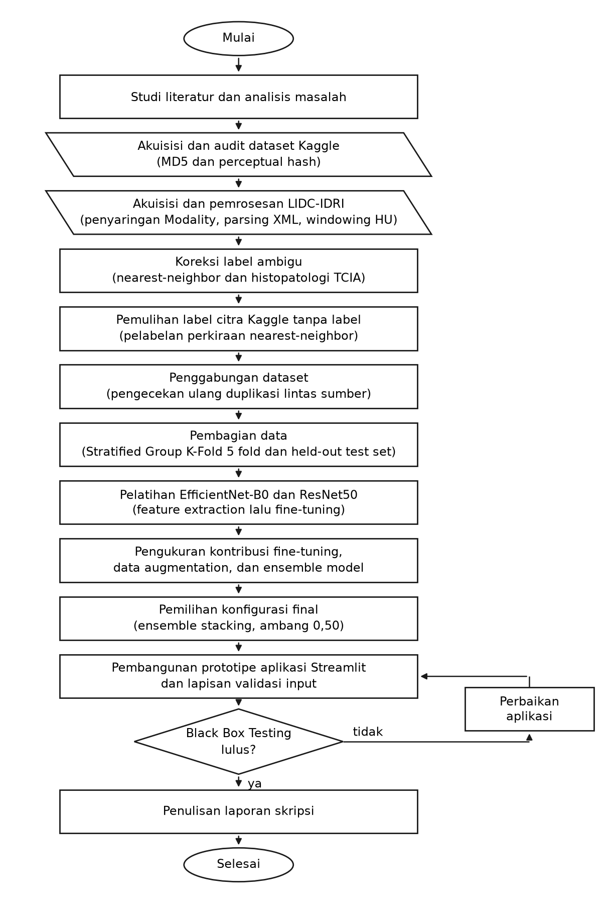
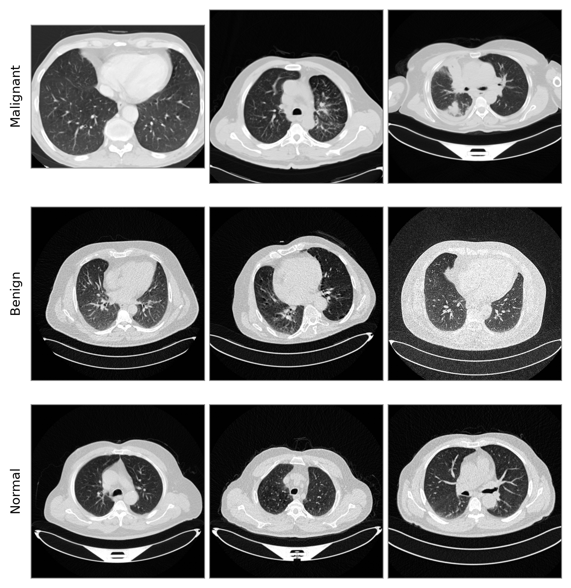
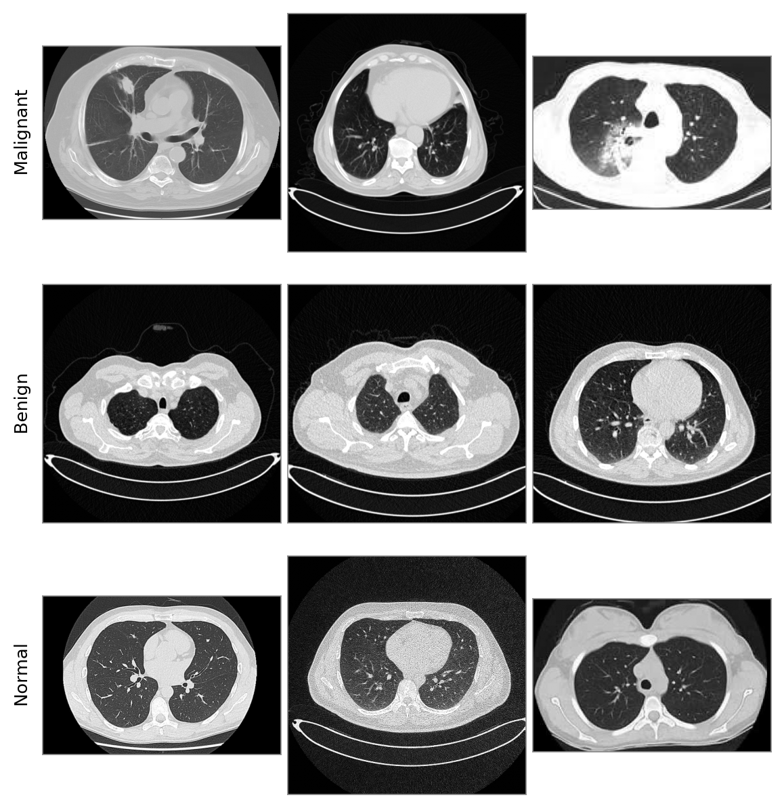
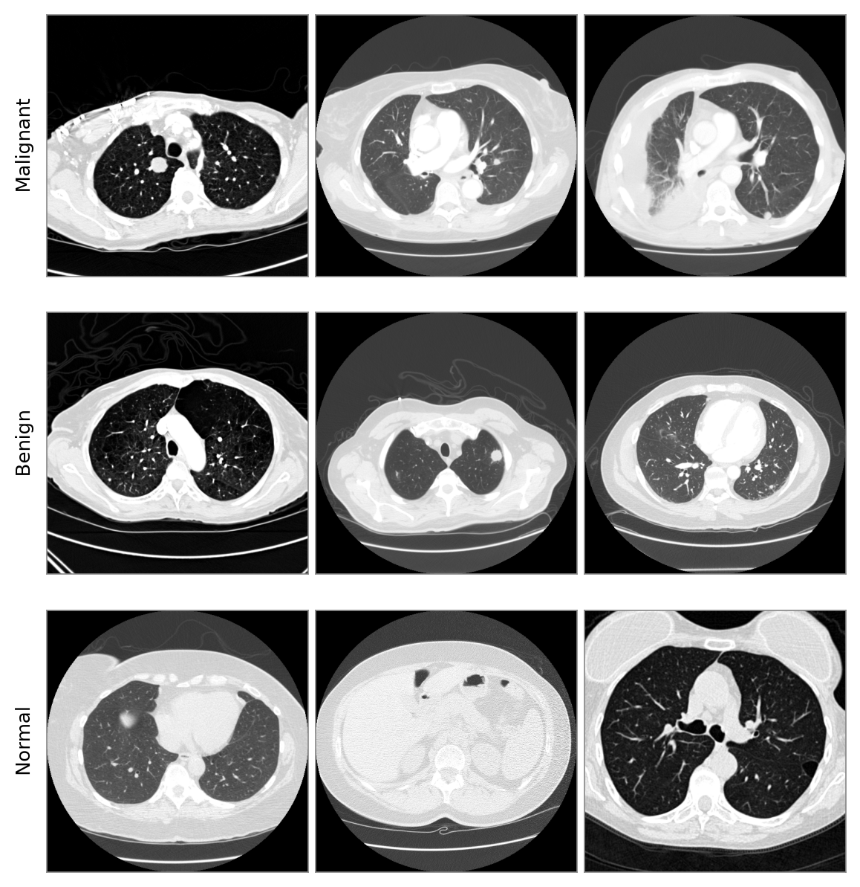
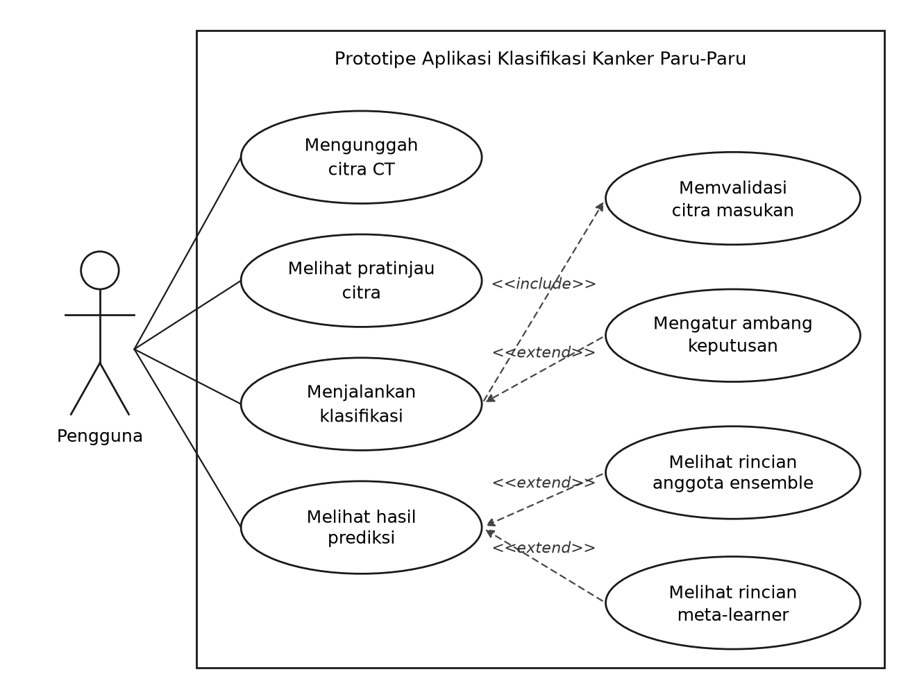

# BAB III

# ANALISIS DAN PERANCANGAN

Bab ini menjelaskan tahapan penelitian dan metode yang digunakan dalam membangun model klasifikasi, mencakup alur penelitian, analisis kebutuhan data, perangkat keras, dan perangkat lunak, perancangan skenario eksperimen, perancangan model *Deep Learning*, perancangan prototipe aplikasi, serta rancangan pengujian fungsionalitas aplikasi.

## 3.1 Alur Penelitian

Penelitian ini dirancang sebagai rangkaian eksperimen bertahap, bukan satu kali pelatihan tunggal, karena setiap tahap dipakai untuk memeriksa apakah suatu keputusan metodologis, misalnya memotong citra di sekitar nodul atau menggabungkan dua sumber data, benar-benar memperbaiki hasil sebelum dianggap sebagai konfigurasi final. Gambar 3.1 menunjukkan diagram alur penelitian secara keseluruhan, mulai dari studi literatur hingga penulisan laporan.



Gambar 3.1 Diagram Alur Penelitian

Alur tersebut terbagi menjadi tiga kelompok besar. Kelompok pertama menyiapkan data, yaitu mengumpulkan, mengaudit, membersihkan, dan melabeli ulang citra dari kedua sumber hingga siap dibagi. Kelompok kedua melatih dan mengukur model, yaitu melatih kedua arsitektur pada lima *fold* lalu mengukur sumbangan setiap teknik optimasi pada judul lewat perbandingan terkendali. Kelompok ketiga menerapkan hasilnya, yaitu memasang konfigurasi terbaik ke prototipe aplikasi dan menguji fungsionalitasnya. Rincian tiap tahap adalah sebagai berikut:

1. Studi literatur dan analisis masalah. Tahap ini mempelajari konsep dasar kanker paru-paru, citra CT, arsitektur EfficientNet dan ResNet, serta metode penanganan dataset LIDC-IDRI yang label sebagian nodulnya ambigu.
2. Akuisisi dan audit dataset Kaggle. Tahap ini mengunduh tujuh dataset publik dari Kaggle, memetakan label dari struktur folder ke tiga kelas target, lalu mendeteksi duplikasi di dalam dan lintas ketujuh dataset tersebut lewat pencocokan MD5 dan *perceptual hash*.
3. Akuisisi dan pemrosesan dataset LIDC-IDRI. Tahap ini mengunduh berkas DICOM dan anotasi XML radiolog dari TCIA, menyaring seri berdasarkan jenis pemindaiannya, mem-*parsing* anotasi menjadi label per seri pemindaian, lalu mengekstraksi citra irisan utuh lewat *windowing* HU.
4. Koreksi label. Tahap ini melabeli ulang nodul dengan skor keganasan ambigu lewat pendekatan *nearest-neighbor*, lalu mengoreksi label lebih lanjut memakai data diagnosis histopatologi resmi TCIA pada pasien yang datanya tersedia.
5. Pemulihan label citra Kaggle tanpa label. Tahap ini memperkirakan label 197 citra Kaggle yang tidak berlabel lewat pendekatan *nearest-neighbor* dengan syarat kesepakatan yang lebih ketat, sehingga citra tersebut tetap dapat dimanfaatkan sebagai data latih.
6. Penggabungan dataset. Tahap ini menggabungkan seluruh kumpulan data yang sudah berlabel final, disertai pengecekan ulang duplikasi lintas sumber.
7. Pembagian data. Tahap ini membagi data gabungan memakai *Stratified Group K-Fold* dengan lima *fold* beserta *held-out test set* terpisah yang sama sekali tidak dipakai selama pelatihan maupun pemilihan model.
8. Pelatihan model. Tahap ini melatih EfficientNet-B0 dan ResNet50 pada tiap *fold*, masing-masing lewat fase *feature extraction* dan fase *fine-tuning*, dengan augmentasi data pada data latih.
9. Pengukuran kontribusi tiap teknik. Tahap ini mengukur sumbangan *fine-tuning*, *data augmentation*, dan *ensemble model* lewat perbandingan terkendali yang hanya mengubah satu faktor pada setiap pengujian.
10. Pemilihan konfigurasi final. Tahap ini memilih konfigurasi dengan keseimbangan akurasi dan *cancer recall* terbaik sebagai model yang diintegrasikan ke prototipe aplikasi.
11. Pembangunan prototipe aplikasi dan pengujian. Tahap ini mengimplementasikan model final ke aplikasi Streamlit beserta lapisan validasi input yang menyaring unggahan di luar domain, lalu mengujinya lewat *Black Box Testing*.
12. Penulisan laporan. Tahap ini mendokumentasikan seluruh proses dan hasil, termasuk eksperimen yang tidak berhasil meningkatkan performa, ke dalam laporan skripsi.

## 3.2 Analisis Kebutuhan

Tahap analisis kebutuhan memetakan sumber daya yang diperlukan agar seluruh rangkaian eksperimen dapat dijalankan. Pemetaan ini mencakup tiga hal, yaitu data citra beserta labelnya, perangkat keras yang sanggup menampung beban pelatihan pada resolusi 512 piksel, dan perangkat lunak yang menjalankan seluruh alur mulai dari pembacaan berkas DICOM hingga penyajian hasil. Ketiganya diuraikan berturut-turut pada sub-subbab berikut.

### 3.2.1 Kebutuhan Data

Penelitian ini menggunakan data dari dua sumber utama yang karakteristiknya jauh berbeda, yaitu kompilasi dataset publik Kaggle yang labelnya berbasis struktur folder dan LIDC-IDRI yang labelnya berbasis anotasi radiolog serta diagnosis histopatologi resmi. Kedua sumber diaudit dan diproses secara terpisah sebelum digabung, sebab kesalahan yang mungkin terjadi pada keduanya pun berbeda: pada Kaggle berupa duplikasi dan label yang tidak jelas asalnya, sedangkan pada LIDC-IDRI berupa jenis pemindaian yang tercampur dan skor keganasan yang tidak disepakati radiolog.

**A. Dataset Kaggle (Tujuh Sumber)**

Ketujuh dataset ini pada dasarnya adalah kompilasi ulang dari beberapa koleksi citra CT paru-paru yang sama, terutama dataset IQ-OTH/NCCD yang dikumpulkan dari rumah sakit di Irak oleh Al-Yasriy et al. (2020), lalu diunggah ulang oleh pengguna Kaggle yang berbeda-beda dengan struktur folder dan penamaan kelas yang bervariasi. Tabel 3.1 merangkum ketujuh sumber tersebut beserta jumlah citra mentahnya sebelum audit.

Tabel 3.1 Sumber Dataset Kaggle

| No | Nama Dataset | Jumlah Citra Mentah | Keterangan |
|---|---|---|---|
| 1 | IQ-OTH/NCCD Lung Cancer Dataset (Augmented) (Subhajeet Das) | 3.609 | Dikecualikan; berisi citra hasil augmentasi sintetis, bukan citra asli |
| 2 | CT Scan Images for Lung Cancer (Dishan Rathi) | 2.274 | Dipakai |
| 3 | Lung Cancer Dataset (IQ-OTH/NCCD) (Waseim Nagah Hennes) | 2.073 | Dipakai |
| 4 | CT Scan Images of Lung Cancer Patients (MD. Nafees Imtiaz) | 1.535 | Dipakai |
| 5 | IQ-OTH/NCCD - Lung Cancer Dataset (Aditya Mahimkar) | 1.294 | Dipakai |
| 6 | The IQ-OTH/NCCD Lung Cancer Dataset (Hamdalla F. Al-Yasriy) | 1.097 | Dipakai |
| 7 | Chest CT-Scan Images Dataset (Mohamed Hany) | 1.000 | Dipakai; sebagian folder tidak berlabel ("Test cases") dikecualikan |

Dataset augmentasi sintetis pada baris pertama dikecualikan sepenuhnya karena isinya adalah hasil augmentasi citra lain di daftar ini, bukan citra pemindaian asli, sehingga menyertakannya berisiko menggandakan pola visual yang sama dan membuat evaluasi bias. Folder yang tidak memiliki label kelas yang jelas, misalnya folder "Test cases" tanpa keterangan diagnosis, juga dikecualikan dari proses pelatihan agar tidak ada citra yang labelnya harus ditebak tanpa dasar.

Label tiap citra dipetakan dari nama folder ke tiga kelas target lewat pencocokan pola teks yang memperhitungkan variasi ejaan, seperti "Bengin" dan "Benign" yang sama-sama muncul di dataset yang berbeda. Folder bertuliskan subtipe histopatologi tertentu, yaitu adenokarsinoma, karsinoma sel skuamosa, dan karsinoma sel besar, seluruhnya dipetakan ke kelas *Malignant* karena ketiganya merupakan jenis kanker paru-paru, sedangkan folder berlabel normal dipetakan ke kelas Normal.

Audit duplikasi dilakukan lewat dua metode sekaligus, yaitu pencocokan MD5 yang mendeteksi berkas yang benar-benar identik bit demi bit, dan *perceptual hash* (*phash*) yang mendeteksi citra yang identik secara visual meskipun berkasnya sedikit berbeda, misalnya akibat kompresi ulang. Citra yang membentuk kelompok duplikat disatukan lewat algoritma *union-find*, dan dari tiap kelompok hanya disimpan satu representasi dengan resolusi tertinggi. Kelompok duplikat yang labelnya tidak konsisten antarsalinan, misalnya satu salinan berlabel *Benign* dan salinan lain berlabel *Malignant*, dikeluarkan seluruhnya karena ketidaksepakatan semacam ini menandakan kesalahan anotasi pada sumber aslinya yang tidak dapat diselesaikan secara otomatis.

Setelah audit, kumpulan data Kaggle final berjumlah 1.627 citra, dengan distribusi *Malignant* 1.192, Normal 342, dan *Benign* 93 citra. Gambar 3.2 dan Gambar 3.3 menunjukkan contoh citra asli untuk tiap kelas dari dua sumber Kaggle yang berbeda. Kedua gambar tersebut memperlihatkan bahwa karakteristik visual antarsumber, seperti kontras, pembingkaian (*framing*), dan resolusi asli, memang bervariasi, sehingga audit deduplikasi perlu dilakukan berdasarkan kandungan citra melalui *hash*, bukan sekadar berdasarkan nama berkas.



Gambar 3.2 Contoh Citra per Kelas pada Dataset Kaggle (The IQ-OTH/NCCD Lung Cancer Dataset, Hamdalla F. Al-Yasriy)



Gambar 3.3 Contoh Citra per Kelas pada Dataset Kaggle (CT Scan Images for Lung Cancer, Dishan Rathi)

**B. Dataset LIDC-IDRI**

LIDC-IDRI diunduh dari TCIA berupa berkas DICOM per pasien beserta anotasi XML radiolog, dengan data mentah berukuran sekitar 124 GB. Berbeda dari dataset Kaggle yang sudah berupa berkas citra siap pakai, dataset ini harus diolah dari berkas pemindaian aslinya, sehingga setiap keputusan pemrosesan, mulai dari jenis pemindaian yang dipakai hingga cara menentukan label, berada di tangan peneliti. Pemrosesannya melalui lima tahap yang diuraikan pada paragraf-paragraf berikut, masing-masing dijalankan oleh satu skrip tersendiri.

*Penyaringan Jenis Pemindaian (`scan_lidc_modality.py`).* LIDC-IDRI tidak hanya berisi citra CT. Koleksi ini juga menyertakan foto rontgen dada (radiografi) dari sebagian pasien yang sama, disimpan dalam format DICOM yang sama dan struktur folder yang sama persis, sehingga tidak dapat dibedakan dari nama berkas maupun letak foldernya. Pembedanya hanya satu, yaitu tag `Modality` di dalam kepala berkas DICOM, yang bernilai `CT` untuk citra *Computed Tomography* serta `DX` (*Digital Radiography*) atau `CR` (*Computed Radiography*) untuk foto rontgen.

Perbedaan ini bersifat menentukan karena nilai piksel kedua jenis citra berada pada skala yang sama sekali berbeda. Citra CT menyimpan nilai dalam satuan *Hounsfield Unit* yang terkalibrasi terhadap kerapatan jaringan, sedangkan foto rontgen menyimpan nilai intensitas detektor yang tidak terkalibrasi. Akibatnya, *windowing* HU yang dipakai pada tahap ekstraksi berikutnya menjenuhkan seluruh piksel foto rontgen menjadi putih polos tanpa struktur anatomi apa pun yang tersisa.

Oleh sebab itu, kepala berkas DICOM dari seluruh 1.308 seri pemindaian dibaca lebih dahulu untuk mencatat nilai `Modality` masing-masing. Hasilnya, 1.018 seri berjenis CT, 237 seri berjenis DX, dan 53 seri berjenis CR. Dengan demikian 290 seri atau 22,2% dari koleksi ternyata bukan citra CT, dan seluruhnya dikeluarkan agar data penelitian benar-benar hanya berisi citra *Computed Tomography* sebagaimana dinyatakan pada judul. Pemeriksaan lanjutan memastikan penyaringan ini tidak menghilangkan satu pasien pun, karena setiap pasien yang memiliki seri rontgen juga memiliki sekurang-kurangnya satu seri CT.

*Parsing Anotasi (`parse_lidc_labels.py`).* Tiap berkas XML dibaca untuk mengekstraksi penanda nodul dari tiap radiolog, termasuk koordinat kontur nodul dan skor keganasan 1 sampai 5. Penanda-penanda dikelompokkan sebagai satu nodul konsensus bila jaraknya berada dalam toleransi 5,0 mm pada arah antaririsan (Z) dan 40 piksel pada bidang irisan (XY), yaitu ambang yang dipilih agar penanda dari radiolog berbeda pada nodul fisik yang sama tetap dianggap satu nodul tanpa menyatukan dua nodul yang sungguh terpisah. Label seri pemindaian ditentukan dari nodul konsensus dengan skor keganasan rata-rata tertinggi, sehingga nodul terburuk pada seri tersebut menentukan label seluruh seri. Dari 1.018 seri CT yang diproses, 883 seri memiliki nodul yang tercatat radiolog, terdiri atas 436 seri berlabel *Malignant*, 221 berlabel *Benign*, dan 226 berlabel ambigu dengan skor rata-rata tepat 3. Sisanya sebanyak 135 seri tidak memiliki nodul yang tercatat radiolog sehingga berlabel Normal.

*Ekstraksi Citra (`extract_lidc_images_full.py`).* Irisan CT yang memuat nodul konsensus dikonversi dari DICOM ke berkas *Portable Network Graphics* (PNG) pada ukuran aslinya, yaitu irisan dada utuh 512×512 piksel tanpa pemotongan. Nilai piksel mentah lebih dahulu dikonversi ke HU memakai atribut `RescaleSlope` dan `RescaleIntercept` pada berkas yang sama, lalu dipetakan ke citra 8 bit dengan *windowing level* −600 HU dan *width* 1500 HU sesuai persamaan (2.1). Nilai *windowing* tersebut merupakan pengaturan baku untuk pembacaan parenkim paru, sehingga jaringan paru dan nodul di dalamnya tampil dengan kontras yang memadai sementara tulang dan jaringan lunak di luar paru ditekan.

Citra sengaja dipertahankan utuh, bukan dipotong di sekitar nodul. Alasan utamanya menyangkut keabsahan pengujian, bukan sekadar bentuk masukan. Untuk memotong citra tepat di sekitar nodul, koordinat nodul harus diketahui lebih dahulu, padahal menemukan nodul itulah tugas yang justru dibebankan kepada model. Bila pemotongan saat pengujian tetap dilakukan memakai koordinat dari anotasi radiolog, berarti sebagian jawaban sudah diberikan kepada model sebelum ia menjawab, sehingga angka akurasi yang dihasilkan tidak lagi mencerminkan kemampuan model yang sebenarnya.

Persoalan yang sama muncul pada tahap penggunaan. Pengguna yang mengunggah citra CT ke aplikasi tidak memiliki koordinat nodul; seandainya ia memilikinya, nodul tersebut sudah ditemukan dan sistem ini tidak lagi diperlukan. Model yang dilatih pada citra terpotong dengan demikian hanya dapat bekerja apabila bagian tersulit dari pekerjaannya sudah diselesaikan pihak lain terlebih dahulu. Alasan kedua bersifat teknis, yaitu citra pada dataset Kaggle memang tersimpan sebagai irisan dada penuh, sehingga bila hanya sumber LIDC-IDRI yang dipotong, kedua sumber akan memiliki pembingkaian yang berbeda secara sistematis dan perbedaan itu sendiri berpotensi dipakai model sebagai penanda kelas.

Konsekuensi dari keputusan ini diterima secara terbuka. Pada irisan utuh, nodul berukuran beberapa milimeter hanya menempati bagian kecil dari keseluruhan citra, sehingga performa pada *subset* LIDC-IDRI menurun dibandingkan bila citranya dipotong. Penurunan tersebut dilaporkan apa adanya pada Bab IV, Bagian 4.8, dengan pertimbangan bahwa angka yang lebih rendah tetapi diperoleh pada kondisi yang sama dengan pemakaian nyata lebih berguna daripada angka yang lebih tinggi tetapi diperoleh pada kondisi yang tidak akan pernah terjadi.

Implementasi awal skrip ini sempat memiliki *bug* yang membuat seri berlabel ambigu ikut terhitung sebagai Normal karena logika pemfilteran seri yang belum lengkap. *Bug* ini diperbaiki dengan mengecualikan seri ambigu secara eksplisit dari kelompok Normal sebelum ekstraksi, kemudian seluruh citra diekstraksi ulang setelah perbaikan, sehingga tidak ada citra hasil ekstraksi lama yang tertinggal di kumpulan data final.

*Koreksi Label Ambigu (`relabel_ambiguous.py`).* Sebanyak 226 seri berlabel ambigu dilabeli ulang lewat pencarian *5-nearest-neighbor* pada ruang fitur EfficientNet-B0 *pre-trained* ImageNet tanpa pelatihan tambahan, terhadap seri-seri yang labelnya sudah pasti *Malignant* atau *Benign*. Label ditentukan oleh suara mayoritas dari lima tetangga terdekat berdasarkan jarak *cosine* pada ruang fitur tersebut. Proses ini melabeli ulang 162 seri menjadi *Malignant* dan 64 seri menjadi *Benign*, sehingga tidak ada data yang harus dibuang.

*Koreksi Berdasarkan Diagnosis Histopatologi (`apply_pathology_ground_truth.py`).* Sebagai lapisan validasi tambahan, label dicocokkan dengan data diagnosis histopatologi resmi TCIA pada berkas *tcia-diagnosis-data-2012-04-20.xls* (lembar "*Diagnosis Truth*"), yang hanya mencakup 157 dari 1.010 pasien LIDC-IDRI dan mencatat kode diagnosis pada tingkat pasien, yaitu 0 untuk tidak diketahui, 1 untuk jinak, 2 untuk ganas primer, dan 3 untuk ganas metastasis. Kode 1 dipetakan ke *Benign*, kode 2 dan 3 dipetakan ke *Malignant*, dan kode 0 dilewati sehingga tidak dijadikan dasar koreksi. Bila diagnosis resmi ini berbeda dari label hasil pemrosesan nodul, label dikoreksi mengikuti diagnosis resmi tersebut sebagai sumber kebenaran yang lebih kuat. Dari 157 pasien yang tercakup berkas tersebut, 130 pasien memiliki seri CT yang beririsan dengan kumpulan data penelitian ini, mencakup 131 seri pemindaian, dan proses ini mengubah label pada 46 seri serta mengonfirmasi 85 seri lain yang labelnya sudah sesuai.

Sifat koreksi ini yang bekerja pada tingkat pasien, bukan tingkat citra, sekaligus memperjelas mengapa penyaringan jenis pemindaian di tahap awal bersifat wajib. Sebelum penyaringan diterapkan, koreksi yang sama menyentuh 227 seri dan mengubah label 142 di antaranya. Selisih 96 seri seluruhnya merupakan foto rontgen yang sebelumnya berlabel Normal lalu berubah menjadi *Malignant* atau *Benign* semata-mata karena pasiennya memiliki diagnosis kanker, padahal citra rontgen itu sendiri tidak memuat bukti visual apa pun yang mendukung label tersebut. Dengan kata lain, foto rontgen bukan hanya mencemari kelas Normal, melainkan juga menyuntikkan citra tanpa struktur ke dalam kedua kelas kanker.

Setelah kelima tahap tersebut, kumpulan data LIDC-IDRI final berjumlah 1.018 citra dari 1.010 pasien, dengan distribusi *Malignant* 609, *Benign* 286, dan Normal 123 citra. Jumlah citra sama dengan jumlah seri CT karena setiap seri diwakili satu irisan, yaitu irisan yang memuat nodul konsensus penentu label atau irisan tengah untuk seri Normal. Gambar 3.4 menunjukkan contoh citra irisan utuh untuk tiap kelas, yang sekaligus memperlihatkan betapa kecilnya nodul dibandingkan keseluruhan irisan.



Gambar 3.4 Contoh Citra Irisan Utuh 512×512 Piksel per Kelas pada Dataset LIDC-IDRI

**C. Pemulihan Label pada Citra Kaggle Tanpa Label**

Audit pada tahap pertama menyisakan 197 citra Kaggle yang tidak memiliki label kelas sama sekali karena tersimpan di luar struktur folder berlabel pada dataset asalnya. Upaya pertama adalah memulihkan label aslinya lewat pencocokan MD5 dan *perceptual hash* terhadap seluruh citra berlabel pada keenam dataset Kaggle lainnya, dengan asumsi citra yang sama mungkin muncul berlabel di tempat lain. Pencocokan ini tidak menemukan satu pun kecocokan, sehingga label aslinya memang tidak dapat dipulihkan dan hanya dapat diperkirakan.

*Pelabelan Perkiraan (`pseudolabel_unlabeled_kaggle.py`).* Label diperkirakan lewat pencarian *k-nearest-neighbor* pada ruang fitur EfficientNet-B0 *pre-trained*, dengan cara yang sama seperti koreksi label ambigu LIDC-IDRI tetapi dengan syarat penerimaan yang lebih ketat: dari lima tetangga terdekat, sekurang-kurangnya empat harus sepakat pada satu kelas. Syarat yang lebih ketat dipakai karena citra-citra ini sama sekali tidak memiliki sinyal label awal, berbeda dengan seri LIDC-IDRI ambigu yang setidaknya sudah memiliki skor keganasan dari radiolog.

Dari 197 citra, 166 memenuhi syarat dan diterima, sementara 31 sisanya dibuang karena tetangganya tidak cukup sepakat. Distribusi hasilnya sangat miring, yaitu 154 *Malignant* dan 12 Normal tanpa satu pun *Benign*, dan kemiringan ini perlu dibaca dengan hati-hati karena kemungkinan besar mencerminkan proporsi kelas pada data rujukannya, bukan komposisi sebenarnya dari citra-citra tersebut. Karena itu, seluruh 166 citra berlabel perkiraan ini dipaksa masuk ke data latih dan dilarang muncul di *held-out test set*, dengan pemeriksaan yang menghentikan program bila aturan tersebut dilanggar.

*Script*/kode program pemaksaan citra berlabel perkiraan ke data latih (`src/audit/build_full_dataset.py`):
```python
eligible = pool[pool["label_origin"] != "pseudo-knn"].reset_index(drop=True)
forced_train = pool[pool["label_origin"] == "pseudo-knn"].reset_index(drop=True)
...
assert (test_df["label_origin"] != "pseudo-knn").all(), "label tebakan bocor ke data uji"
```

Dengan pembatasan ini, seluruh angka evaluasi pada Bab IV dihitung hanya terhadap citra yang labelnya berasal dari sumber yang dapat dipertanggungjawabkan, yaitu struktur folder dataset Kaggle atau anotasi radiolog dan diagnosis histopatologi LIDC-IDRI. Citra berlabel perkiraan tetap berguna sebagai tambahan contoh latih, tetapi tidak pernah ikut menentukan angka akurasi maupun *cancer recall* yang dilaporkan.

**D. Dataset COCO (Validasi Input)**

Selain ketiga kumpulan citra CT di atas, penelitian ini memakai sebagian citra dari COCO val2017 (*Common Objects in Context*; Lin et al., 2014), yaitu dataset citra objek sehari-hari yang sama sekali tidak berkaitan dengan citra medis. Citra tersebut dipakai sebagai kelas pembanding untuk melatih model klasifikasi biner yang membedakan "Citra CT Paru-paru" dari "Bukan Citra CT Paru-paru". Model biner tersebut berfungsi sebagai lapisan validasi input pada prototipe aplikasi, yang menolak unggahan di luar domain sebelum diteruskan ke model klasifikasi utama.

Citra COCO tidak pernah dipakai untuk melatih maupun menguji model klasifikasi tiga kelas, sehingga tidak memengaruhi angka performa yang dilaporkan pada Bab IV. Lapisan semacam ini diperlukan karena model klasifikasi tetap mengeluarkan probabilitas untuk masukan apa pun, termasuk masukan yang sama sekali di luar distribusi data latihnya. Hendrycks & Gimpel (2017) menunjukkan bahwa deteksi masukan di luar distribusi merupakan persoalan tersendiri dan mengusulkan probabilitas *softmax* sebagai tolok ukur dasarnya.

**E. Penggabungan Dataset**

Ketiga kumpulan data digabung menjadi satu manifes pelatihan, didahului pengecekan ulang duplikasi lintas sumber dengan MD5 dan *phash* untuk memastikan tidak ada citra yang sama persis kebetulan muncul di lebih dari satu sumber. Hasil pengecekan ini nihil, yaitu 0 duplikat, sebagaimana diharapkan mengingat kedua sumber berasal dari alur akuisisi yang sama sekali berbeda: citra Kaggle merupakan irisan CT yang sudah disusun ulang pengunggahnya, sedangkan citra LIDC-IDRI merupakan hasil ekstraksi langsung dari DICOM oleh penelitian ini sendiri. Dataset gabungan berjumlah 2.811 citra sebagaimana dirangkum pada Tabel 3.2.

Tabel 3.2 Distribusi Kelas Dataset Gabungan

| Sumber | *Malignant* | *Benign* | Normal | Total |
|---|---:|---:|---:|---:|
| Kaggle (7 dataset, setelah audit) | 1.192 | 93 | 342 | 1.627 |
| Kaggle (label perkiraan, hanya data latih) | 154 | 0 | 12 | 166 |
| LIDC-IDRI (setelah penyaringan CT dan koreksi label) | 609 | 286 | 123 | 1.018 |
| **Total Gabungan** | **1.955** | **379** | **477** | **2.811** |

Penggabungan ini diimplementasikan dalam `combine_kaggle_lidc.py`, yang juga menjalankan ulang pengecekan MD5 dan *phash* lintas kedua sumber sebelum menyatukan manifesnya menjadi satu berkas *Comma-Separated Values* (CSV). Identitas grup untuk keperluan *Stratified Group K-Fold* diberi awalan sumbernya masing-masing, yaitu `KAGGLE::` diikuti kunci kasus asal dan `LIDC::` diikuti nomor identitas pasien, sehingga kedua sumber tidak akan pernah tercampur dalam satu grup buatan yang salah, dan citra dari pasien atau kasus yang sama tetap terjamin berada pada *fold* yang sama.

### 3.2.2 Kebutuhan Perangkat Keras

Pelatihan dan evaluasi seluruh model dijalankan pada satu komputer lokal dengan *Central Processing Unit* (CPU) AMD Ryzen 5 7500F berinti enam dan berutas dua belas, *Random Access Memory* (RAM) 16 GB, serta *Graphics Processing Unit* (GPU) NVIDIA GeForce RTX 4060 dengan memori 8 GB, di bawah sistem operasi Windows 10 Pro. GPU menjadi komponen terpenting karena seluruh pelatihan EfficientNet-B0 dan ResNet50 pada resolusi 512×512 piksel dijalankan di atasnya melalui CUDA, dengan ukuran *batch* 16 dan presisi campuran (*automatic mixed precision*) yang menghemat memori sekaligus mempercepat perhitungan.

Media penyimpanan terdiri atas *Solid State Drive* (SSD) dan *Hard Disk Drive* (HDD) yang masing-masing berkapasitas 1 TB. Kapasitas ini diperlukan karena data mentah DICOM LIDC-IDRI saja berukuran sekitar 124 GB sebelum diekstraksi, belum termasuk tujuh dataset Kaggle, citra hasil ekstraksi, seluruh *checkpoint* model, dan berkas hasil evaluasi. RAM 16 GB mencukupi untuk memuat manifes data dan menjalankan audit duplikasi berbasis *hashing* pada tahap awal, sedangkan pemuatan citra selama pelatihan dibagi ke beberapa proses pemuat data (*worker*) agar GPU tidak perlu menunggu citra berikutnya.

### 3.2.3 Kebutuhan Perangkat Lunak

Seluruh program penelitian ditulis dalam bahasa Python dan dijalankan di dalam satu lingkungan virtual, sehingga versi setiap pustaka tetap sama sejak tahap pemrosesan data hingga tahap pengujian aplikasi. Penyeragaman versi ini penting karena perbedaan versi pustaka dapat mengubah hasil pembacaan berkas, urutan pembagian data, maupun perilaku model, sehingga angka yang dilaporkan menjadi sulit direproduksi. Perangkat lunak inti yang digunakan beserta versinya adalah sebagai berikut:

1. Python 3.11.9 sebagai bahasa pemrograman utama.
2. PyTorch 2.5.1 dengan CUDA 12.1 dan torchvision 0.20.1 untuk arsitektur model, pelatihan, dan inferensi.
3. pydicom 3.0.2 untuk membaca berkas DICOM dan metadatanya.
4. ImageHash 4.3.2 dan modul `hashlib` bawaan Python untuk audit duplikasi dengan *perceptual hash* dan MD5.
5. scikit-learn 1.9.1 untuk *Stratified Group K-Fold*, regresi logistik pada *ensemble stacking*, dan metrik evaluasi.
6. NumPy 2.4.6, pandas 3.0.6, dan SciPy 1.17.1 untuk pengolahan data, manifes, dan uji McNemar.
7. Streamlit 1.64.0 untuk prototipe aplikasi *web*.
8. Matplotlib 3.11.2 untuk visualisasi *confusion matrix*, kurva ROC, dan diagram lainnya.

Setiap pustaka tersebut dipakai pada tahap yang berbeda. pydicom dan ImageHash hanya dipakai pada tahap penyiapan data, PyTorch dan torchvision pada tahap pelatihan serta inferensi, scikit-learn dan SciPy pada tahap pembagian data dan evaluasi, sedangkan Streamlit hanya dipakai oleh prototipe aplikasi. Pembagian peran ini membuat setiap tahap dapat dijalankan ulang secara terpisah tanpa harus mengulang seluruh alur dari awal.

## 3.3 Perancangan Skenario Eksperimen

Judul penelitian ini menyebut tiga teknik optimasi, yaitu *fine-tuning*, *data augmentation*, dan *ensemble model*. Melaporkan satu angka akhir saja tidak cukup untuk membuktikan bahwa ketiganya benar-benar berkontribusi, sebab angka tersebut tidak menunjukkan berapa banyak yang berasal dari masing-masing teknik. Karena itu dirancang tiga skenario eksperimen pembanding terkendali, yaitu perbandingan yang hanya mengubah satu faktor dan mempertahankan seluruh faktor lainnya persis sama, ditambah satu skenario untuk model validasi input pada prototipe aplikasi. Keempat skenario tersebut diuraikan pada sub-subbab berikut.

### 3.3.1 Skenario Pengukuran Kontribusi *Fine-Tuning*

*Macro-F1* validasi terbaik yang dicapai pada fase A, yaitu ketika *backbone* dibekukan dan hanya lapisan klasifikasi yang dilatih, dibandingkan dengan *macro-F1* validasi terbaik pada fase B, yaitu ketika tiga blok terakhir *backbone* ikut dilatih, untuk tiap model dari kesepuluh model. Karena kedua fase dijalankan berurutan pada model dan pembagian data yang sama, selisih antara keduanya dapat diatribusikan langsung pada *fine-tuning*. Skenario ini tidak memerlukan pelatihan tambahan, sebab riwayat *macro-F1* kedua fase tercatat pada setiap *epoch* selama pelatihan berlangsung.

Tiga blok terakhir yang dibuka pada fase B berbeda bentuknya pada kedua arsitektur. Pada EfficientNet-B0, ketiganya adalah dua kelompok blok MBConv terakhir, yaitu kelompok berkeluaran 192 dan 320 *channel*, ditambah lapisan konvolusi 1×1 penutup yang menghasilkan 1.280 *channel* fitur. Pada ResNet50, ketiganya adalah tahap `layer2`, `layer3`, dan `layer4`, sehingga hanya lapisan awal dan tahap `layer1` yang tetap dibekukan. Perbandingan dilakukan pada data validasi, bukan data uji, karena *held-out test set* disimpan untuk penilaian akhir dan tidak boleh dipakai untuk menilai tahap pelatihan.

### 3.3.2 Skenario Pengukuran Kontribusi *Data Augmentation*

Kesepuluh model dilatih ulang dari awal sebanyak dua kali dengan *pipeline* pra-pemrosesan yang identik kecuali pada bagian augmentasinya, sehingga tersedia tiga kelompok model berjumlah tiga puluh model. Kelompok pertama dilatih tanpa augmentasi sama sekali, kelompok kedua memakai augmentasi ringan yang disesuaikan sifat citra CT, yaitu hanya pembalikan horizontal dan rotasi 7° tanpa perubahan kecerahan maupun kontras, tanpa translasi, dan tanpa penskalaan, dan kelompok ketiga memakai augmentasi penuh berupa pembalikan horizontal, transformasi afin dengan rotasi 15°, translasi 10%, dan penskalaan 0,90 sampai 1,10, serta perubahan kecerahan dan kontras sebesar 0,2. Ketiganya dievaluasi pada *held-out test set* yang sama lewat alur *ensemble* yang sama pula, lalu selisihnya diuji kebermaknaannya memakai uji McNemar sebagaimana dijelaskan pada Bagian 2.13.4. Konfigurasi yang akhirnya dipilih sebagai konfigurasi final adalah kelompok kedua, dengan dasar pemilihan dijelaskan pada Bab IV, Bagian 4.4.3, dan parameternya dicantumkan pada Tabel 3.3.

Pemilihan augmentasi ringan pada kelompok kedua berangkat dari sifat citra CT itu sendiri, bukan sekadar memperkecil parameter secara acak. Tingkat keabuan pada citra CT berasal dari *Hounsfield Unit* yang merupakan besaran kerapatan jaringan terkalibrasi, sehingga perubahan kecerahan dan kontras mengubah keterangan jaringan yang justru menjadi dasar pembedaan kelas. Sementara itu nodul berukuran beberapa milimeter hanya menempati bagian sangat kecil dari irisan 512×512 piksel, sehingga translasi dan penskalaan berpeluang menggeser atau melarutkan objek yang harus dikenali.

### 3.3.3 Skenario Pengukuran Kontribusi *Ensemble Model*

Performa model tunggal dibandingkan secara berjenjang dengan *ensemble soft-voting*, baik dengan bobot setara maupun bobot tertimbang, serta dengan *ensemble stacking* berbasis *meta-learner*. Seluruh perbandingan dilakukan pada *held-out test set* yang sama dan tanpa pelatihan ulang model dasar, sehingga perbedaan hasilnya murni berasal dari cara kesepuluh keluaran model digabungkan. Model tunggal dilaporkan sebagai rata-rata kesepuluh model, sedangkan *ensemble* dilaporkan sebagai satu keluaran gabungan.

Sebagai pelengkap, penyesuaian ambang keputusan kelas *Malignant* juga diuji pada konfigurasi *ensemble* terbaik untuk memeriksa titik keseimbangan antara akurasi keseluruhan dan *cancer recall*. Ambang ditelusuri dari 0,50 hingga 0,15, dan konfigurasi dengan performa terbaik pada skenario ini kemudian diintegrasikan ke dalam prototipe aplikasi berbasis *web*. Seluruh perbandingan dilaporkan apa adanya pada Bab IV, termasuk bagian yang hasilnya tidak sesuai harapan.

### 3.3.4 Skenario Pengujian Model Validasi Input Citra dengan Dataset COCO

Skenario ini bertujuan mengevaluasi kinerja model klasifikasi biner yang difungsikan sebagai mekanisme validasi awal sebelum citra masukan diproses oleh model klasifikasi utama. Arsitektur EfficientNet-B0 yang lapisan klasifikasinya diubah menjadi dua keluaran dilatih khusus untuk membedakan kelas "Citra CT Paru" dari kelas "Bukan Citra CT Paru". Kelas "Citra CT Paru" diwakili seluruh 1.018 citra CT LIDC-IDRI hasil penyaringan tag `Modality`, sedangkan kelas "Bukan Citra CT Paru" diwakili citra COCO val2017 yang diambil acak dengan jumlah yang sama, sehingga kedua kelas berimbang dan model tidak condong ke salah satunya.

Berbeda dengan model utama yang dievaluasi memakai *Stratified Group K-Fold*, model penyaring ini cukup dievaluasi dengan metode *hold-out*, mengingat tingkat kesulitan membedakan kedua kelasnya jauh lebih rendah daripada membedakan jenis temuan pada citra CT. Pembagiannya mengikuti eksperimen utama, yaitu citra LIDC-IDRI pada *held-out test set* utama menjadi data uji model ini, sedangkan sisanya dibagi 90:10 menjadi data latih dan data validasi. Selain evaluasi pada data uji tersebut, model ini juga diuji langsung melalui aplikasi memakai 12 citra CT paru-paru dan 8 citra COCO yang belum pernah dilihatnya.

## 3.4 Perancangan Model *Deep Learning*

Perancangan model mencakup dua hal yang saling terkait, yaitu bentuk arsitektur jaringan yang dipakai dan nilai *hyperparameter* yang mengatur jalannya pelatihan. Keduanya ditetapkan seragam untuk seluruh model dan seluruh lipatan, sehingga perbedaan hasil antarkonfigurasi pada Bab IV dapat diatribusikan pada teknik yang sedang diuji, bukan pada perbedaan pengaturan pelatihan. Rincian arsitektur dijabarkan pada sub-subbab 3.4.1, sedangkan konfigurasi *hyperparameter* beserta alasan pemilihan tiap nilainya disajikan pada sub-subbab 3.4.2.

### 3.4.1 Arsitektur Model

Kedua arsitektur, yaitu EfficientNet-B0 dan ResNet50, memakai bobot *pre-trained* ImageNet dari `torchvision`. Lapisan klasifikasi aslinya yang berkeluaran seribu kelas ImageNet diganti dengan rangkaian *dropout* berprobabilitas 0,3 diikuti *fully connected layer* berukuran tiga keluaran, yaitu *Malignant*, *Benign*, dan Normal. Selain lapisan klasifikasi tersebut, seluruh bagian lain kedua arsitektur dipakai apa adanya tanpa perubahan susunan lapisan, sehingga yang dioptimasi dalam penelitian ini adalah cara melatih dan menggabungkan model, bukan bentuk jaringannya. Pelatihan dilakukan dalam dua fase untuk setiap model dan setiap *fold*:

1. Fase A (*feature extraction*). Seluruh bobot *backbone* dibekukan dan hanya lapisan klasifikasi baru yang dilatih, paling lama 12 *epoch* dengan *learning rate* 0,001.
2. Fase B (*fine-tuning*). Tiga blok terakhir *backbone* dibuka dan dilatih lebih lanjut bersama lapisan klasifikasi, paling lama 25 *epoch* dengan *learning rate* 0,00001, disertai `ReduceLROnPlateau` yang memaksimalkan *macro-F1* validasi dengan faktor 0,5 dan *patience* 3.

*Early stopping* diterapkan dengan *patience* 6 *epoch* terhadap *macro-F1* validasi pada kedua fase. Bobot terbaik disimpan lintas kedua fase, bukan hanya dari fase B, sehingga bila performa terbaik justru tercapai sebelum *fine-tuning* dimulai, bobot itulah yang dipakai sebagai model akhir. Aturan ini mencegah *fine-tuning* merusak model yang sudah baik, sebab fase B hanya dapat menggantikan bobot fase A apabila benar-benar menghasilkan *macro-F1* validasi yang lebih tinggi.

### 3.4.2 Konfigurasi *Hyperparameter* Pelatihan

Nilai *hyperparameter* ditetapkan sebelum eksperimen dijalankan dan tidak diubah antarkonfigurasi, agar perbandingan pada Bab IV tetap terkendali. Kriteria pemilihan *checkpoint* dan pemantauan *scheduler* sama-sama memakai *macro-F1* validasi, bukan akurasi, karena data penelitian ini timpang dan akurasi dapat tampak tinggi hanya dengan mengutamakan kelas mayoritas. Ukuran *batch* 16 dipakai pada resolusi 512×512 piksel, dan seluruh pembagian data memakai *random seed* 42 agar hasilnya dapat diulang. Tabel 3.3 merangkum seluruh konfigurasi tersebut.

Tabel 3.3 Konfigurasi *Hyperparameter* Pelatihan

| Parameter | Nilai |
|---|---|
| *Optimizer* | Adam |
| *Learning Rate* (Fase A) | 0,001 |
| *Learning Rate* (Fase B) | 0,00001 |
| *Loss Function* | *Cross-entropy loss* berbobot kelas |
| *Scheduler* | `ReduceLROnPlateau` (maksimalkan *macro-F1* validasi, faktor 0,5, *patience* 3) |
| *Early Stopping* | *Patience* 6 *epoch* (*macro-F1* validasi) |
| *Epoch* Maksimum | 12 (Fase A) dan 25 (Fase B) |
| Ukuran *Batch* | 16 |
| Presisi Komputasi | *Automatic mixed precision* |
| Regularisasi | *Dropout* p = 0,3 sebelum lapisan klasifikasi |
| Augmentasi (konfigurasi final) | Pembalikan horizontal dan rotasi acak hingga 7°, hanya pada data latih |
| Ukuran Citra Masukan | 512×512 piksel |
| Jumlah *Fold* | 5 (*Stratified Group K-Fold*) |
| Porsi *Held-Out Test Set* | 18% grup |
| *Random Seed* | 42 |

Pemilihan *learning rate* fase B yang seratus kali lebih kecil daripada fase A mengikuti tujuan *fine-tuning* sebagaimana dijelaskan pada Bagian 2.4, yaitu menyesuaikan bobot *pre-trained* secara halus tanpa merusaknya. Batas 12 dan 25 *epoch* ditetapkan dengan mempertimbangkan waktu pelatihan pada perangkat keras yang tersedia, sedangkan *early stopping* memastikan pelatihan berhenti lebih awal bila *macro-F1* validasi tidak lagi membaik, sehingga batas tersebut jarang tercapai sepenuhnya.

## 3.5 Perancangan Prototipe Aplikasi

Prototipe aplikasi dibangun dengan Streamlit untuk mendemonstrasikan model final secara interaktif. Aplikasi terdiri atas enam laman yang dapat dipilih lewat navigasi di sisi kiri, yaitu Beranda, Prediksi Citra CT, Perbandingan Model, Kurva *Training*, Audit Dataset, serta Tentang & Metodologi. Laman Beranda menampilkan empat metrik konfigurasi final, laman Perbandingan Model menampilkan tabel hasil model tunggal, *ensemble*, dan penelusuran ambang keputusan, laman Kurva *Training* menampilkan riwayat pelatihan per arsitektur dan per *fold*, sedangkan laman Audit Dataset menampilkan distribusi kelas serta hasil penyaringan jenis pemindaian LIDC-IDRI. Seluruh angka pada laman-laman tersebut dibaca langsung dari berkas hasil evaluasi, sehingga selalu sama dengan angka yang dilaporkan pada Bab IV.

### 3.5.1 Rancangan Antarmuka Aplikasi

Laman terpenting dalam aplikasi adalah laman Prediksi Citra CT, karena di laman inilah pengguna mengunggah citra dan menerima hasil klasifikasi. Rancangannya mengikuti urutan kerja sistem: citra diterima, ditampilkan kembali untuk diperiksa pengguna, disaring oleh lapisan validasi input, lalu diklasifikasikan oleh *ensemble stacking* dan hasilnya disajikan beserta rinciannya. Komponen utama pada laman tersebut adalah sebagai berikut:

1. Komponen pengunggahan citra, yang menerima berkas berformat PNG, *Joint Photographic Experts Group* (JPG/JPEG), dan *Bitmap* (BMP).
2. Area pratinjau citra, yang menampilkan citra yang diunggah agar pengguna dapat memastikan masukannya sudah benar sebelum diproses.
3. Lapisan validasi input, yang menjalankan model klasifikasi biner CT paru-paru dan menghentikan proses bila citra berada di luar domain, disertai pesan penolakan beserta tingkat keyakinannya.
4. Panel hasil prediksi, yang menampilkan label kelas, probabilitas tiap kelas dari *ensemble stacking*, dan pengaturan ambang keputusan yang dapat digeser pengguna.
5. Panel rincian anggota *ensemble*, yang menampilkan probabilitas keluaran tiap model anggota sebelum digabungkan *meta-learner*, sehingga kontribusi masing-masing model terlihat.
6. Panel rincian *meta-learner*, yang menampilkan keluaran *meta-learner* pada tiap pasangan *fold* sebelum kelimanya dirata-ratakan, sehingga tahap penggabungan tingkat kedua ikut dapat ditelusuri.

Pengaturan ambang keputusan dirancang sebagai penggeser nilai dengan rentang 0,15 sampai 0,70, langkah 0,05, dan nilai baku 0,50 sesuai konfigurasi final. Rentang tersebut dipilih agar pengguna dapat mencoba titik-titik kerja yang diuji pada Bab IV tanpa dapat memilih nilai yang tidak pernah dievaluasi. Kedua panel rincian dibuat dapat dibuka dan ditutup agar tampilan utama tetap ringkas bagi pengguna yang hanya membutuhkan label akhir, tetapi tetap tersedia bagi pengguna yang ingin menelusuri cara keputusan tersebut dihasilkan.

### 3.5.2 *Use Case Diagram* Aplikasi

Aplikasi dirancang untuk satu aktor, yaitu pengguna (*User*), yang berinteraksi langsung dengan empat *use case* utama, yaitu mengunggah citra CT, melihat pratinjau citra, menjalankan klasifikasi, dan melihat hasil prediksi. Empat *use case* lainnya terhubung ke *use case* utama tersebut lewat relasi `<<include>>` dan `<<extend>>`, yang menunjukkan ketergantungan urutan eksekusi antar-*use case*. Gambar 3.5 menunjukkan diagram *use case* aplikasi secara lengkap, disusun mengikuti urutan kerja pada laman Prediksi Citra CT.



Gambar 3.5 *Use Case Diagram* Aplikasi

Relasi `<<include>>` menggambarkan *use case* yang selalu dijalankan sebagai bagian dari *use case* lain. Menjalankan klasifikasi selalu menyertakan validasi citra masukan, sehingga pengguna tidak dapat memperoleh hasil klasifikasi tanpa citranya lebih dahulu dinyatakan sebagai citra CT paru-paru. Sebaliknya, relasi `<<extend>>` menggambarkan fitur tambahan yang bersifat opsional: pengguna dapat mengatur ambang keputusan sebelum klasifikasi dijalankan, serta membuka rincian anggota *ensemble* dan rincian *meta-learner* setelah hasil prediksi tampil. Rancangan ini memastikan lapisan validasi bukan fitur tambahan yang dapat dilewati, melainkan tahap wajib yang selalu dilalui setiap citra sebelum sampai ke model klasifikasi utama.

## 3.6 Pengujian Fungsionalitas Aplikasi (*Black Box Testing*)

Pengujian fungsionalitas prototipe aplikasi dirancang memakai metode *Black Box Testing* sebagaimana dijelaskan pada Bagian 2.13.5. Setiap skenario uji diturunkan dari komponen antarmuka pada Bagian 3.5.1, sehingga seluruh komponen yang dirancang memiliki sekurang-kurangnya satu skenario pengujian. Skenario dirumuskan sebagai pasangan antara masukan yang diberikan dan hasil yang diharapkan, tanpa menyertakan rincian kode program yang menjalankannya. Tabel 3.4 merangkum skenario pengujian fungsionalitas yang dijalankan pada Bab IV.

Tabel 3.4 Skenario *Black Box Testing*

| No | Fitur | Skenario Pengujian | Masukan | Hasil yang Diharapkan |
|---:|---|---|---|---|
| 1 | Pengunggahan Citra (Format Valid) | Mengunggah citra berekstensi yang didukung | Berkas .jpg/.jpeg/.png/.bmp | Citra dimuat tanpa pesan kesalahan |
| 2 | Pengunggahan Citra (Format Tidak Valid) | Mengunggah berkas bukan citra | Berkas .pdf/.docx/.txt | Sistem menolak berkas |
| 3 | Area Pratinjau Citra | Memeriksa tampilan citra setelah diunggah | Citra yang berhasil diunggah | Citra tampil di layar utama |
| 4 | Validasi Input (Citra CT) | Mengunggah citra CT paru-paru | Satu citra CT paru-paru | Diterima dan diteruskan ke klasifikasi |
| 5 | Validasi Input (Bukan CT) | Mengunggah citra objek umum | Satu citra dari dataset COCO | Ditolak sebelum klasifikasi dijalankan |
| 6 | Panel Hasil Prediksi | Menjalankan klasifikasi pada citra valid | Citra CT yang tervalidasi | Label kelas dan probabilitas tampil |
| 7 | *Slider* Ambang Keputusan | Menggeser ambang dari 0,50 ke 0,30 | Ambang keputusan baru | Prediksi dihitung ulang secara konsisten |
| 8 | Panel Rincian Anggota *Ensemble* | Membuka rincian probabilitas tiap model | Selesainya proses inferensi | Probabilitas kesepuluh model tampil |
| 9 | Panel Rincian *Meta-Learner* | Membuka rincian keluaran *meta-learner* per pasangan *fold* | Selesainya proses inferensi | Probabilitas kelima pasangan *fold* tampil |

Setiap skenario dinyatakan berhasil hanya bila hasil aktual yang tampil pada aplikasi sama dengan hasil yang diharapkan pada tabel tersebut. Skenario nomor 4 dan nomor 5 kemudian diperluas menjadi uji validasi input yang memakai dua puluh citra, yaitu dua belas citra CT paru-paru dan delapan citra objek umum, agar keandalan lapisan penyaring tidak hanya dinilai dari satu citra pada masing-masing kategori. Hasil pengujian seluruh skenario beserta uji validasi input tersebut disajikan pada Bab IV, Bagian 4.10.
