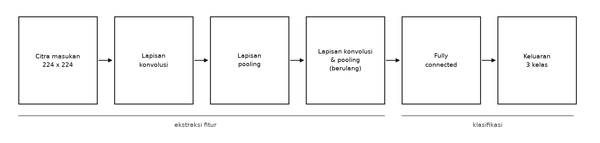
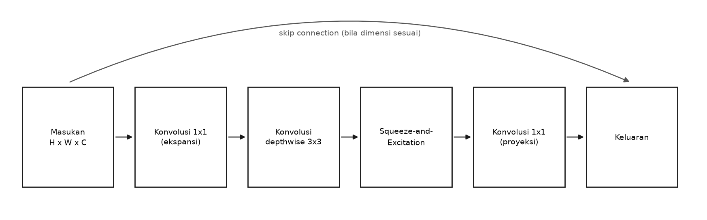
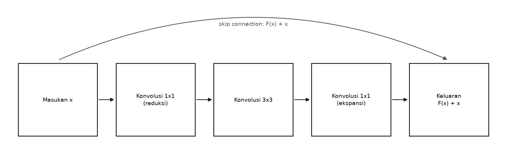

# BAB II

# TINJAUAN PUSTAKA

Bab ini membahas landasan teori yang menjadi dasar penelitian, mencakup kanker paru-paru dan citra CT, *Deep Learning* dan CNN, *transfer learning*, arsitektur EfficientNet dan ResNet, teknik optimisasi dan regularisasi, dataset LIDC-IDRI beserta metode penanganan labelnya, perangkat lunak yang digunakan, penelitian terkait, dan metode evaluasi sistem.

## 2.1 Kanker Paru-Paru

Kanker paru-paru muncul akibat pertumbuhan sel abnormal yang tidak terkendali pada jaringan paru, yang secara histopatologi umumnya dibagi menjadi dua kelompok besar: *Non-Small Cell Lung Cancer* (NSCLC), yang mencakup sekitar 80–85% kasus dan meliputi subtipe adenokarsinoma, karsinoma sel skuamosa, dan karsinoma sel besar; serta *Small Cell Lung Cancer* (SCLC) yang lebih agresif namun lebih jarang ditemukan. Nodul paru pada citra CT tidak selalu berarti kanker. Banyak nodul jinak (*benign*) yang menyerupai nodul ganas secara visual, seperti granuloma atau hamartoma, sehingga pembedaan jinak-ganas murni dari citra tanpa biopsi tetap menyisakan ketidakpastian bahkan bagi radiolog berpengalaman. Prognosis kanker paru-paru sangat bergantung pada stadium saat terdeteksi: tingkat kelangsungan hidup lima tahun untuk kasus yang ditemukan pada stadium lokal jauh lebih tinggi dibandingkan stadium metastasis, yang menjadi alasan utama mengapa deteksi dini lewat skrining CT dosis rendah terus didorong dalam praktik klinis.

## 2.2 Computed Tomography (CT) pada Paru-Paru

*Computed Tomography* (CT) menghasilkan citra penampang lintang tubuh dengan menggabungkan ratusan pengukuran atenuasi sinar-X dari berbagai sudut. Nilai atenuasi setiap voksel dinyatakan dalam satuan *Hounsfield Unit* (HU), sebuah skala terstandardisasi di mana udara bernilai −1000 HU dan air bernilai 0 HU. Jaringan paru yang normalnya berisi udara memiliki nilai HU sangat rendah, sedangkan nodul padat, pembuluh darah, dan struktur tulang memiliki nilai HU jauh lebih tinggi. Karena rentang nilai HU pada satu irisan CT bisa mencapai ribuan level sementara layar dan mata manusia (maupun kanal warna 8-bit yang lazim dipakai *Deep Learning*) hanya mampu membedakan 256 level abu-abu, diperlukan proses *windowing*: memilih *window level* (titik tengah) dan *window width* (rentang) tertentu, lalu memetakan nilai HU pada rentang tersebut ke skala 0–255. Jendela paru (*lung window*) yang lazim dipakai untuk menonjolkan struktur parenkim dan nodul menggunakan *level* sekitar −600 HU dan *width* sekitar 1500 HU, karena rentang ini mencakup baik jaringan berisi udara (HU sangat negatif) maupun nodul padat (HU mendekati 0 atau positif) dalam satu citra grayscale yang informatif.

Data CT disimpan dalam format DICOM (*Digital Imaging and Communications in Medicine*), yang menyimpan bukan hanya nilai piksel mentah tetapi juga metadata seperti identitas seri pemindaian (*Series Instance UID*), posisi irisan, dan parameter akuisisi. Satu pemeriksaan CT dada dapat terdiri dari satu atau lebih *series*, dan satu *series* dapat memuat puluhan hingga ratusan irisan (*slice*) 2D yang bila ditumpuk membentuk volume 3D.

## 2.3 Deep Learning dan Convolutional Neural Network (CNN)

*Deep Learning* adalah cabang *machine learning* yang mempelajari representasi data lewat jaringan saraf tiruan berlapis banyak. *Convolutional Neural Network* (CNN) adalah arsitektur *Deep Learning* yang dirancang khusus untuk data berstruktur *grid* seperti citra, dengan tiga jenis lapisan utama:

1. **Lapisan Konvolusi**, yang menggeser sejumlah *kernel* (filter) kecil ke seluruh permukaan citra untuk menghasilkan *feature map*. Lapisan-lapisan awal cenderung menangkap fitur sederhana seperti tepi dan tekstur, sedangkan lapisan yang lebih dalam menangkap fitur yang lebih abstrak seperti bentuk nodul secara keseluruhan.
2. **Lapisan Pooling**, yang mereduksi resolusi spasial *feature map* (misalnya lewat *max pooling*) sehingga jaringan menjadi lebih tahan terhadap pergeseran kecil posisi objek dan mengurangi jumlah komputasi pada lapisan berikutnya.
3. **Lapisan Fully Connected**, yang menerima fitur hasil ekstraksi dan memetakannya menjadi skor tiap kelas lewat fungsi aktivasi seperti *Softmax*.

Keunggulan utama CNN dibandingkan pendekatan *machine learning* klasik adalah kemampuannya melakukan ekstraksi fitur secara otomatis dari data mentah, tanpa memerlukan perekayasaan fitur manual (*handcrafted feature engineering*) yang lazim diperlukan pada metode citra medis konvensional seperti analisis tekstur atau bentuk secara eksplisit. Gambar 2.1 menunjukkan alur umum arsitektur ini, dari citra input hingga skor tiap kelas.

*Gambar 2.1 Arsitektur Umum Convolutional Neural Network (CNN)*

## 2.4 Transfer Learning

Melatih CNN dari nol (*from scratch*) membutuhkan data berlabel dalam jumlah sangat besar agar model tidak sekadar menghafal data latih. Pada domain citra medis, ketersediaan data berlabel jauh lebih terbatas dibandingkan domain citra umum, baik karena biaya anotasi oleh ahli maupun karena batasan privasi pasien. *Transfer learning* mengatasi keterbatasan ini dengan memanfaatkan bobot jaringan yang telah dilatih pada dataset besar seperti ImageNet (lebih dari satu juta citra, seribu kelas objek umum), lalu mengadaptasi bobot tersebut untuk tugas baru yang datanya lebih terbatas.

Penelitian ini menerapkan skema *transfer learning* dua fase:

1. **Fase *Feature Extraction*.** Seluruh bobot *backbone* (bagian ekstraksi fitur) dibekukan (*frozen*), hanya lapisan klasifikasi baru di ujung jaringan yang dilatih. Fase ini melatih model untuk memetakan fitur ImageNet yang sudah dipelajari sebelumnya ke kelas target (Malignant/Benign/Normal) tanpa merusak fitur dasar tersebut.
2. **Fase *Fine-Tuning*.** Sejumlah blok terakhir *backbone* dibuka (*unfrozen*) dan dilatih ulang dengan *learning rate* yang jauh lebih kecil dibanding fase pertama. Fase ini memungkinkan model menyesuaikan fitur tingkat tinggi yang lebih spesifik pada karakteristik visual nodul paru, yang berbeda dari objek-objek pada ImageNet.

Pemisahan dua fase ini penting karena membuka seluruh jaringan sejak awal pelatihan (tanpa fase *feature extraction* lebih dulu) berisiko merusak bobot *pre-trained* yang sudah baik lewat gradien besar dari lapisan klasifikasi yang masih diinisialisasi acak, sebuah fenomena yang dikenal sebagai *catastrophic forgetting*.

## 2.5 Arsitektur EfficientNet-B0

EfficientNet diperkenalkan oleh Tan & Le (2019) dengan gagasan utama *compound scaling*: alih-alih menskalakan kedalaman, lebar, atau resolusi jaringan secara terpisah seperti kebiasaan arsitektur CNN sebelumnya, EfficientNet menaikkan ketiga dimensi tersebut secara serentak memakai satu koefisien majemuk. Intuisinya, resolusi citra input yang lebih besar membutuhkan lebih banyak lapisan (agar *receptive field* mencakup keseluruhan objek yang lebih besar) sekaligus lebih banyak *channel* (agar mampu menangkap detail yang lebih halus), sehingga menaikkan satu dimensi saja tanpa dimensi lain menghasilkan keseimbangan yang suboptimal.

EfficientNet-B0 adalah anggota dasar (paling kecil) dari keluarga ini, dengan blok penyusun utama bernama *Mobile Inverted Bottleneck Convolution* (MBConv). Setiap blok MBConv melakukan ekspansi *channel* lewat konvolusi 1×1, dilanjutkan konvolusi *depthwise* yang memproses tiap *channel* secara terpisah (jauh lebih hemat komputasi dibanding konvolusi standar), lalu proyeksi kembali ke jumlah *channel* yang lebih kecil. Sebagian besar blok MBConv pada EfficientNet-B0 juga dilengkapi modul *Squeeze-and-Excitation* (SE), yang memberi bobot atensi berbeda pada tiap *channel* fitur berdasarkan seberapa informatif *channel* tersebut, sehingga jaringan bisa "memilih" fitur mana yang lebih relevan dengan tugas klasifikasi sebelum diteruskan ke lapisan berikutnya.

Dibandingkan arsitektur CNN klasik dengan jumlah parameter setara, EfficientNet-B0 dilaporkan mencapai akurasi ImageNet yang lebih tinggi dengan komputasi (FLOPs) jauh lebih rendah, menjadikannya pilihan yang wajar untuk *fine-tuning* pada data medis yang jumlahnya terbatas dan sumber daya komputasi yang tersedia untuk penelitian ini juga tidak besar. Gambar 2.2 menunjukkan susunan satu blok MBConv beserta modul SE yang dijelaskan di atas.

*Gambar 2.2 Blok MBConv dengan Squeeze-and-Excitation (EfficientNet-B0)*

## 2.6 Arsitektur ResNet50

ResNet (*Residual Network*), diperkenalkan oleh He et al. (2016), mengatasi masalah *vanishing gradient* pada jaringan yang sangat dalam lewat *skip connection* (koneksi pintasan): keluaran suatu blok tidak hanya dihitung dari transformasi berlapis konvolusi, tetapi dijumlahkan langsung dengan input blok tersebut (`output = F(x) + x`). Mekanisme ini membuat gradien bisa mengalir langsung ke lapisan-lapisan awal tanpa harus melewati seluruh transformasi non-linear, sehingga jaringan dengan puluhan hingga ratusan lapisan tetap bisa dilatih secara stabil. ResNet50 terdiri dari 50 lapisan berbobot yang disusun dalam blok *bottleneck* (konvolusi 1×1–3×3–1×1 dengan *skip connection*).

Dalam penelitian ini, ResNet50 dipakai berdampingan dengan EfficientNet-B0 khusus untuk membentuk *ensemble*: kedua arsitektur memiliki desain blok penyusun yang cukup berbeda (MBConv dengan atensi SE pada EfficientNet-B0, *bottleneck residual* pada ResNet50), sehingga pola kesalahan klasifikasi keduanya cenderung tidak identik satu sama lain, properti yang justru dimanfaatkan pada tahap *ensemble* (Bagian 2.9). Gambar 2.3 menunjukkan susunan satu blok *bottleneck residual* tersebut.

*Gambar 2.3 Blok Bottleneck Residual (ResNet50)*

## 2.7 Optimizer, Fungsi Kerugian, dan Penjadwalan Laju Pembelajaran

Proses pelatihan CNN pada dasarnya adalah pencarian nilai bobot yang meminimalkan fungsi kerugian (*loss function*) lewat iterasi berulang. Penelitian ini menggunakan komponen berikut:

**CrossEntropyLoss** adalah fungsi kerugian standar untuk klasifikasi multi-kelas, yang mengukur seberapa jauh distribusi probabilitas hasil prediksi model (setelah lapisan *Softmax*) menyimpang dari label sebenarnya. Karena distribusi tiga kelas pada dataset penelitian ini tidak seimbang (jumlah citra Malignant jauh lebih banyak daripada Benign), CrossEntropyLoss diberi bobot per kelas (*class-weighted*) berbanding terbalik dengan frekuensi kemunculan kelas tersebut, sehingga kesalahan pada kelas minoritas (Benign) dihukum lebih besar dibanding kesalahan pada kelas mayoritas (Malignant) yang jumlah datanya jauh lebih banyak.

**Adam** (*Adaptive Moment Estimation*), diperkenalkan oleh Kingma & Ba (2015), adalah *optimizer* yang menghitung estimasi adaptif momen pertama (rata-rata bergerak dari gradien) dan momen kedua (rata-rata bergerak dari kuadrat gradien) untuk menyesuaikan laju pembelajaran tiap parameter secara individual. Penelitian ini memakai Adam pada fase *feature extraction* dengan *learning rate* awal 1e-3, dan *learning rate* yang jauh lebih kecil (1e-5) pada fase *fine-tuning* agar penyesuaian bobot *backbone* yang sudah cukup baik dilakukan secara halus, bukan diguncang oleh langkah pembaruan yang terlalu besar.

**ReduceLROnPlateau** adalah metode penjadwalan laju pembelajaran yang memantau metrik validasi (dalam penelitian ini, macro-F1 pada data validasi) dan menurunkan *learning rate* dengan faktor tertentu (0,5) bila metrik tersebut berhenti membaik selama sejumlah *epoch* berturut-turut (*patience*). Mekanisme ini membantu model keluar dari kondisi stagnasi tanpa perlu menebak jadwal penurunan *learning rate* secara manual sejak awal.

**Early Stopping** menghentikan pelatihan secara otomatis bila metrik validasi tidak membaik selama sejumlah *epoch* berturut-turut, dan menyimpan bobot dari *epoch* dengan performa validasi terbaik sepanjang pelatihan (bukan bobot dari *epoch* terakhir), sehingga model akhir yang dipakai bukan model yang sudah mulai *overfitting*.

## 2.8 Data Augmentation

Augmentasi data adalah teknik memperbanyak variasi citra latih secara sintetis lewat transformasi acak yang tidak mengubah label kelasnya, bertujuan menekan risiko *overfitting* pada data latih yang jumlahnya terbatas. Penelitian ini menerapkan augmentasi berupa pembalikan horizontal acak (*random horizontal flip*), transformasi afin acak (rotasi, translasi, dan skala), serta perubahan warna acak (*color jitter*). Seluruh augmentasi ini hanya diterapkan pada data latih, tidak pada data validasi maupun data uji, agar evaluasi tetap mengukur performa pada citra asli yang representatif terhadap kondisi nyata.

## 2.9 Ensemble Model

Metode *ensemble* menggabungkan keluaran beberapa model untuk menghasilkan satu prediksi akhir yang diharapkan lebih stabil dan akurat dibandingkan model tunggal manapun, dengan asumsi bahwa kesalahan tiap model bersifat sebagian independen satu sama lain. Penelitian ini menerapkan dua skema ensemble secara bertahap:

**Soft-Voting** merata-ratakan probabilitas keluaran (bukan label akhirnya) dari seluruh model anggota ensemble, baik dengan bobot yang sama rata (*equal-weight*) maupun bobot yang disesuaikan menurut performa validasi tiap model (*val-F1-weighted*).

**Ensemble Stacking** melangkah lebih jauh: alih-alih merata-ratakan probabilitas dengan rumus tetap, sebuah model kedua yang lebih sederhana (dalam penelitian ini, regresi logistik multinomial) dilatih untuk mempelajari cara terbaik menggabungkan probabilitas keluaran model-model anggota berdasarkan data yang belum pernah dipakai anggota tersebut untuk berlatih (*out-of-fold*), sehingga kombinasi bobotnya tidak ditentukan lebih dulu secara manual melainkan dipelajari dari data. Pendekatan *stacking* semacam ini sejalan dengan metode yang dilaporkan Noman et al. (2025) pada LungCT-NET, yang juga menggabungkan beberapa model pre-trained lewat lapisan *stacking* untuk klasifikasi kanker paru-paru pada citra CT.

## 2.10 Dataset LIDC-IDRI dan Penanganan Label Ambigu

LIDC-IDRI (*Lung Image Database Consortium and Image Database Resource Initiative*) adalah koleksi data CT paru-paru dari 1.010 pasien yang didistribusikan lewat *The Cancer Imaging Archive* (TCIA), dikembangkan oleh konsorsium *National Cancer Institute* Amerika Serikat (Armato et al., 2011). Keunggulan utama LIDC-IDRI dibandingkan dataset citra CT lain yang beredar bebas di Kaggle adalah proses anotasinya: setiap kasus ditelaah secara independen oleh hingga empat radiolog berpengalaman, masing-masing menandai lokasi nodul yang mereka temukan beserta karakteristiknya, termasuk skor keganasan (*malignancy*) pada skala 1 (sangat mungkin jinak) sampai 5 (sangat mungkin ganas). Anotasi ini disimpan dalam berkas XML terpisah per seri pemindaian.

Karena tiap radiolog menandai nodul secara independen, satu nodul fisik yang sama bisa memiliki hingga empat penanda dari radiolog berbeda pada koordinat yang saling berdekatan namun tidak identik persis. Penelitian ini mengelompokkan penanda-penanda yang berjarak dekat (dalam batas toleransi tertentu, baik pada bidang irisan maupun antar-irisan) sebagai satu "nodul konsensus", lalu menghitung skor keganasan rata-rata dari seluruh radiolog yang menandai nodul tersebut. Skor rata-rata di atas 3 dilabeli Malignant, di bawah 3 dilabeli Benign, sedangkan skor rata-rata tepat 3 (yang berarti radiolog sendiri tidak sepakat) untuk sementara dianggap ambigu.

Alih-alih membuang nodul ambigu ini, penelitian ini mengikuti pendekatan yang diusulkan Zhang et al. (2022) dalam "*Re-thinking and Re-labeling LIDC-IDRI for Robust Pulmonary Cancer Prediction*": nodul ambigu dilabeli ulang berdasarkan kemiripan visualnya (lewat *k-nearest-neighbor* pada ruang fitur CNN *pre-trained*) terhadap nodul-nodul lain yang labelnya sudah pasti. Logikanya, meskipun skor keganasan radiologis untuk nodul tersebut berimbang, karakteristik visualnya (tekstur, bentuk, tepi) tetap bisa dibandingkan secara objektif dengan nodul lain yang sudah punya label pasti dari kesepakatan radiolog.

## 2.11 Perangkat Lunak yang Digunakan

Penelitian ini memakai beberapa perangkat lunak utama untuk memproses data, melatih model, dan menyajikan hasilnya. Bahasa pemrograman intinya adalah Python, yang dipilih karena ekosistem pustaka ilmiahnya matang dan menyediakan dukungan luas untuk komputasi numerik maupun *deep learning*. Pembangunan dan pelatihan arsitektur EfficientNet-B0 serta ResNet50 dijalankan di atas *framework* PyTorch, sedangkan pembacaan berkas DICOM dari LIDC-IDRI ditangani pustaka pydicom. Untuk mendemonstrasikan hasil klasifikasi kepada pengguna, dibangun antarmuka web memakai Streamlit. Penjelasan lebih rinci mengenai masing-masing perangkat lunak tersebut diuraikan pada sub-bab berikut.

### 2.11.1 Python dan PyTorch

Python dipilih sebagai bahasa pemrograman utama karena ekosistem pustaka ilmiahnya yang matang. PyTorch (Paszke et al., 2019) dipakai sebagai *framework Deep Learning* karena dukungan *dynamic computation graph*-nya yang memudahkan proses eksperimen dan *debugging*, serta ketersediaan model *pre-trained* (termasuk EfficientNet-B0 dan ResNet50) lewat modul `torchvision`.

### 2.11.2 pydicom dan SimpleITK

Pemrosesan berkas DICOM pada dataset LIDC-IDRI memerlukan pustaka khusus untuk membaca metadata dan nilai piksel mentah, dikonversi menjadi nilai HU, kemudian melalui proses *windowing* menjadi citra grayscale 8-bit sebagaimana dijelaskan pada Bagian 2.2.

### 2.11.3 Streamlit

Streamlit adalah *framework* Python untuk membangun aplikasi web interaktif langsung dari skrip Python tanpa memerlukan pengembangan *front-end* terpisah, dipakai dalam penelitian ini untuk membangun prototipe aplikasi demonstrasi.

## 2.12 Penelitian Terkait

Tabel 2.1 merangkum beberapa penelitian terdahulu mengenai klasifikasi kanker paru-paru pada citra CT yang menjadi rujukan metodologis dan pembanding dalam penelitian ini.

Tabel 2.1 Penelitian Terkait

| Peneliti (Tahun) | Objektif | Metode | Akurasi | Dataset |
|---|---|---|---|---|
| Armato et al. (2011) | Membangun basis data anotasi nodul paru untuk riset CAD | Anotasi manual oleh hingga 4 radiolog independen per kasus, disertai skor keganasan 1–5 | Tidak berlaku (bukan studi klasifikasi) | LIDC-IDRI (1.010 pasien) |
| Zhang et al. (2022) | Mengatasi label ambigu pada LIDC-IDRI untuk prediksi kanker paru yang lebih andal | Pelabelan ulang nodul berskor ambigu lewat *k-nearest-neighbor* pada ruang fitur CNN | Tidak dilaporkan sebagai angka tunggal | LIDC-IDRI |
| Noman et al. (2025) | Klasifikasi biner nodul paru (ganas vs jinak) yang akurat dan dapat dijelaskan | *Stacking ensemble* atas kombinasi model *pre-trained* terbaik (VGG-16, VGG-19, MobileNet-V2, InceptionNet-V3, EfficientNet-B0, ResNet152-V2, DenseNet-121) disertai SHAP (LungCT-NET) | 98,99% (AUC 98,15%) | Dataset CT publik |

Berbeda dari penelitian-penelitian di atas yang masing-masing berfokus pada satu aspek (anotasi, koreksi label, atau *ensemble*), penelitian ini mengintegrasikan ketiganya dalam satu jalur kerja: audit dan penggabungan dataset Kaggle dengan LIDC-IDRI, koreksi label ambigu mengikuti Zhang et al. (2022), dan *ensemble stacking* mengikuti Noman et al. (2025), lalu membandingkan kontribusi tiap tahap secara terpisah pada Bab IV.

Satu catatan penting dalam membaca Tabel 2.1: akurasi 98,99% yang dilaporkan Noman et al. (2025) dicapai pada tugas klasifikasi **biner** (ganas versus jinak), sedangkan penelitian ini menangani klasifikasi **tiga kelas** (Malignant, Benign, dan Normal) pada data gabungan dua sumber dengan karakteristik berbeda. Angka kedua penelitian karena itu tidak dapat dibandingkan secara langsung, karena jumlah kelas, komposisi data, dan tingkat kesulitan tugasnya berbeda. Yang diadopsi dari penelitian tersebut adalah pendekatan metodologisnya, yaitu penggabungan beberapa model *pre-trained* lewat *meta-learner* alih-alih agregasi dengan bobot tetap, bukan target angkanya.

## 2.13 Evaluasi dan Pengujian Sistem

Evaluasi dalam penelitian ini dilakukan pada dua tataran yang berbeda sifatnya. Tataran pertama menilai kemampuan model dalam mempelajari data, memakai *Stratified Group K-Fold Cross Validation* untuk menjaga agar citra dari pasien yang sama tidak pernah tersebar ke dua lipatan sekaligus, disertai sejumlah metrik kuantitatif untuk mengukur performa klasifikasinya. Tataran kedua menilai perilaku sistem pada tahap pengambilan keputusan, yaitu bagaimana ambang keputusan menentukan label akhir dari probabilitas yang dihasilkan model. Ketiga hal tersebut dijabarkan berturut-turut pada sub-bab berikut.

### 2.13.1 Stratified Group K-Fold Cross Validation

*K-Fold Cross Validation* membagi data menjadi *k* bagian (*fold*) yang bergantian menjadi data validasi sementara sisanya menjadi data latih, sehingga estimasi performa model tidak bergantung pada satu pembagian data yang kebetulan menguntungkan atau merugikan. Penelitian ini menerapkan varian *Stratified Group K-Fold*: "*stratified*" berarti proporsi tiap kelas dijaga tetap seimbang pada setiap *fold*, sedangkan "*group*" berarti seluruh citra yang berasal dari pasien atau kasus yang sama selalu berada pada *fold* yang sama, baik seluruhnya di data latih maupun seluruhnya di data validasi, tidak pernah tercampur. Aspek *group* ini krusial untuk mencegah *data leakage*: tanpa pengelompokan ini, dua irisan CT dari pasien yang sama (yang secara visual sangat mirip) bisa jatuh terpisah ke *train* dan *validation*, membuat performa validasi tampak lebih baik daripada performa sesungguhnya pada pasien yang benar-benar baru.

### 2.13.2 Metrik Evaluasi

Metrik yang dipakai untuk mengevaluasi model dihitung dari *confusion matrix*, yaitu tabel yang memetakan jumlah prediksi benar dan salah terhadap label sebenarnya. Empat komponen penyusunnya adalah TP (*True Positive*, kasus positif yang diprediksi positif), TN (*True Negative*, kasus negatif yang diprediksi negatif), FP (*False Positive*, kasus negatif yang keliru diprediksi positif), dan FN (*False Negative*, kasus positif yang keliru diprediksi negatif).

1. **Akurasi**, proporsi prediksi benar dari keseluruhan data uji:

$$Akurasi = \frac{TP + TN}{TP + TN + FP + FN}$$

2. **Presisi**, proporsi prediksi positif suatu kelas yang benar-benar termasuk kelas tersebut:

$$Presisi = \frac{TP}{TP + FP}$$

3. **Recall**, proporsi data yang sebenarnya termasuk suatu kelas yang berhasil diprediksi benar oleh model:

$$Recall = \frac{TP}{TP + FN}$$

Untuk kelas Malignant, metrik ini disebut *cancer recall* dan menjadi prioritas evaluasi utama dalam penelitian ini karena secara klinis, melewatkan kasus kanker (*false negative*) jauh lebih berbahaya daripada salah menandai kasus jinak sebagai kanker (*false positive*).

4. **F1-Score**, rata-rata harmonik presisi dan *recall*:

$$F1 = 2 \times \frac{Presisi \times Recall}{Presisi + Recall}$$

Metrik ini dipakai dalam bentuk *macro average*, yaitu rata-rata F1-Score seluruh kelas dengan bobot yang sama rata tanpa memandang jumlah data tiap kelas, agar kelas minoritas (Benign) tetap mendapat bobot evaluasi yang setara:

$$Macro\ F1 = \frac{1}{N} \sum_{i=1}^{N} F1_i$$

dengan $N$ adalah jumlah kelas (dalam penelitian ini 3: Malignant, Benign, dan Normal).

5. **ROC-AUC** (*Area Under the Receiver Operating Characteristic Curve*), mengukur kemampuan model membedakan antar kelas pada berbagai ambang keputusan, tidak hanya pada satu ambang tetap. Kurva ROC dibentuk dengan memplot *True Positive Rate* terhadap *False Positive Rate*:

$$TPR = \frac{TP}{TP + FN} \qquad FPR = \frac{FP}{FP + TN}$$

Nilai AUC berkisar antara 0,5 (model tidak lebih baik daripada tebakan acak) hingga 1,0 (pemisahan sempurna antar kelas).

### 2.13.3 Ambang Keputusan (Decision Threshold)

Secara *default*, model klasifikasi multi-kelas memilih kelas dengan probabilitas tertinggi (*argmax*) sebagai prediksi akhir. Pada konteks skrining kanker, ambang ini bisa disesuaikan: sistem dapat diatur untuk menandai suatu citra sebagai Malignant bila probabilitas kelas tersebut sudah melewati ambang tertentu (misalnya 30%), meski bukan probabilitas tertinggi di antara ketiga kelas. Menurunkan ambang ini membuat sistem lebih "waspada" (menaikkan *cancer recall*) dengan konsekuensi menaikkan jumlah alarm palsu (menurunkan presisi), sehingga pemilihan ambang perlu didasarkan pada kurva presisi-*recall* empiris, bukan ditetapkan sembarangan.
