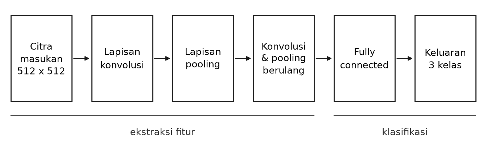
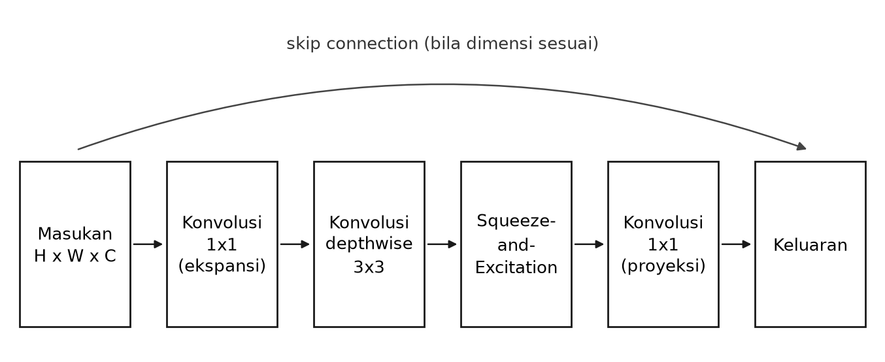
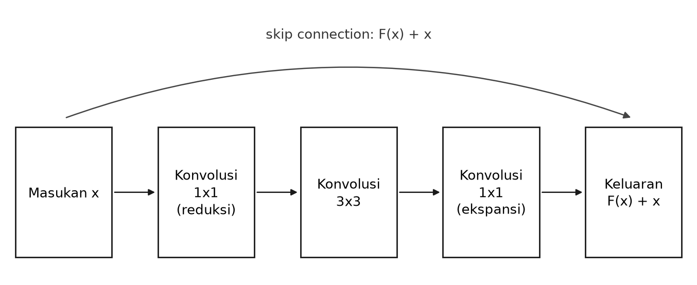

# BAB II

# TINJAUAN PUSTAKA

Bab ini membahas landasan teori yang menjadi dasar penelitian, mencakup kanker paru-paru dan citra CT, *Deep Learning* dan CNN, *transfer learning*, arsitektur EfficientNet-B0 dan ResNet50, fungsi kerugian, *optimizer*, dan regularisasi, *data augmentation*, *ensemble model*, dataset LIDC-IDRI beserta metode penanganan labelnya, perangkat lunak yang digunakan, penelitian terkait, serta metode evaluasi dan pengujian sistem.

## 2.1 Kanker Paru-Paru

Kanker paru-paru merupakan penyakit akibat pertumbuhan sel abnormal yang tidak terkendali pada jaringan paru. Secara global, kanker paru-paru adalah kanker yang paling sering didiagnosis pada tahun 2022 dengan hampir 2,5 juta kasus baru, atau satu dari setiap delapan kasus kanker di dunia, dan sekaligus penyebab utama kematian akibat kanker dengan sekitar 1,8 juta kematian atau 18,7% dari seluruh kematian akibat kanker (Bray et al., 2024). Besarnya beban tersebut mendorong diterapkannya skrining dengan tujuan menemukan kanker lebih awal, dan skrining memakai CT dosis rendah pada kelompok berisiko tinggi terbukti menurunkan kematian akibat kanker paru-paru sebesar 20% (Duma et al., 2019).

Secara histopatologi, kanker paru-paru umumnya dibagi menjadi dua kelompok besar, yaitu *Non-Small Cell Lung Cancer* (NSCLC) yang meliputi subtipe adenokarsinoma, karsinoma sel skuamosa, dan karsinoma sel besar, serta *Small Cell Lung Cancer* (SCLC) yang lebih agresif (Duma et al., 2019). Pada citra CT, temuan yang dicari berupa nodul paru, yaitu bercak padat berukuran kecil pada jaringan paru. Tidak setiap nodul merupakan kanker, dan pembedaan nodul jinak dari nodul ganas hanya berdasarkan citra tetap menjadi persoalan yang sulit, sehingga banyak penelitian terdahulu mengkhususkan diri pada klasifikasi nodul paru jinak dan ganas (Huang et al., 2022; Shi et al., 2022; Wang et al., 2022). Kesulitan yang sama muncul pada penelitian ini sebagai rendahnya *recall* kelas *Benign* dibandingkan kedua kelas lainnya.

## 2.2 *Computed Tomography* (CT) pada Paru-Paru

*Computed Tomography* (CT) menghasilkan citra penampang lintang tubuh dengan merekonstruksi ratusan pengukuran atenuasi sinar-X yang diambil dari berbagai sudut di sekeliling pasien. Nilai atenuasi setiap elemen volume dinyatakan dalam satuan *Hounsfield Unit* (HU), yaitu skala terstandardisasi yang menetapkan udara bernilai −1000 HU dan air bernilai 0 HU (Buzug, 2008). Jaringan paru yang normalnya berisi udara memiliki nilai HU sangat rendah, sedangkan nodul padat, pembuluh darah, dan struktur tulang memiliki nilai HU yang jauh lebih tinggi, sehingga tingkat keabuan pada citra CT berkaitan langsung dengan kerapatan jaringan yang digambarkannya.

Rentang nilai HU pada satu irisan CT mencapai ribuan tingkat, sementara layar maupun citra 8 bit yang lazim dipakai *Deep Learning* hanya mampu menampilkan 256 tingkat keabuan. Karena itu diperlukan proses *windowing*, yaitu memilih *window level* ($L$) sebagai titik tengah dan *window width* ($W$) sebagai lebar rentang, lalu memetakan nilai HU pada rentang tersebut ke skala 0 sampai 255 (Buzug, 2008). Nilai HU di luar rentang $L - W/2$ hingga $L + W/2$ terlebih dahulu dipotong ke batas terdekatnya, kemudian intensitas citra $I$ dihitung dengan persamaan (2.1).

$$I = 255 \times \frac{HU - (L - W/2)}{W}$$

Jendela paru yang dipakai pada penelitian ini menggunakan *level* −600 HU dan *width* 1500 HU, sehingga rentang yang ditampilkan adalah −1350 HU hingga 150 HU. Rentang ini mencakup jaringan berisi udara yang bernilai sangat negatif maupun nodul padat yang nilainya mendekati 0 atau positif dalam satu citra, sementara struktur yang jauh lebih padat seperti tulang tampil sebagai putih jenuh. Pilihan jendela yang sama diterapkan pada seluruh citra LIDC-IDRI agar tingkat keabuannya seragam antarpasien.

Data CT disimpan dalam format *Digital Imaging and Communications in Medicine* (DICOM), yang menyimpan bukan hanya nilai piksel mentah tetapi juga *metadata* seperti jenis pemindaian, identitas seri pemindaian (*Series Instance UID*), posisi irisan, dan parameter akuisisi. Satu pemeriksaan CT dada dapat terdiri atas satu atau lebih seri, dan satu seri dapat memuat puluhan hingga ratusan irisan dua dimensi yang bila ditumpuk membentuk volume tiga dimensi. Koleksi LIDC-IDRI yang dipakai dalam penelitian ini didistribusikan dalam format DICOM tersebut, disertai berkas XML yang memuat anotasi nodul dari para radiolog (Armato et al., 2011).

## 2.3 *Deep Learning* dan *Convolutional Neural Network* (CNN)

*Deep Learning* adalah metode pembelajaran representasi yang memakai model komputasi dengan banyak lapisan pemrosesan, sehingga data dapat dipelajari pada beberapa tingkat abstraksi sekaligus, dari pola sederhana hingga konsep yang lebih kompleks (LeCun et al., 2015). *Convolutional Neural Network* (CNN) adalah arsitektur *Deep Learning* yang dirancang khusus untuk data berstruktur kisi seperti citra, dan dibangun dari tiga jenis lapisan utama (Goodfellow et al., 2016) sebagai berikut:

1. Lapisan konvolusi, yang menggeser sejumlah *kernel* atau filter kecil ke seluruh permukaan citra untuk menghasilkan *feature map*. Lapisan-lapisan awal cenderung menangkap fitur sederhana seperti tepi dan tekstur, sedangkan lapisan yang lebih dalam menangkap fitur yang lebih abstrak seperti bentuk nodul secara keseluruhan.
2. Lapisan *pooling*, yang mereduksi resolusi spasial *feature map*, misalnya lewat *max pooling*, sehingga jaringan menjadi lebih tahan terhadap pergeseran kecil posisi objek dan jumlah komputasi pada lapisan berikutnya berkurang.
3. Lapisan *fully connected*, yang menerima fitur hasil ekstraksi dan memetakannya menjadi skor tiap kelas, lalu fungsi aktivasi *softmax* mengubah skor tersebut menjadi probabilitas yang jumlahnya satu.

Keunggulan utama CNN dibandingkan pendekatan *machine learning* klasik adalah kemampuannya melakukan ekstraksi fitur secara otomatis dari data mentah, tanpa memerlukan perekayasaan fitur manual (*handcrafted feature engineering*) yang lazim diperlukan pada metode citra medis konvensional seperti analisis tekstur atau bentuk secara eksplisit. Gambar 2.1 menunjukkan alur umum arsitektur ini, dari citra masukan berukuran 512×512 piksel hingga skor tiga kelas. Kemampuan inilah yang menjadikan CNN pendekatan dominan dalam analisis citra medis, mulai dari klasifikasi dan deteksi hingga segmentasi (Litjens et al., 2017; Shen et al., 2017).

Gambar 2.1 Arsitektur Umum *Convolutional Neural Network* (CNN)

## 2.4 *Transfer Learning*

Melatih CNN dari nol (*from scratch*) membutuhkan data berlabel dalam jumlah sangat besar agar model tidak sekadar menghafal data latih. Pada domain citra medis, ketersediaan data berlabel jauh lebih terbatas dibandingkan domain citra umum, baik karena biaya anotasi oleh ahli maupun karena batasan privasi pasien. *Transfer learning* mengatasi keterbatasan ini dengan memanfaatkan bobot jaringan yang telah dilatih pada dataset besar seperti ImageNet, yang berisi lebih dari satu juta citra dari seribu kelas objek umum, lalu mengadaptasi bobot tersebut untuk tugas baru yang datanya lebih terbatas. Tinjauan literatur Kim et al. (2022) merangkum dua cara utama memanfaatkan model *pre-trained* ImageNet pada klasifikasi citra medis, yaitu sebagai pengekstraksi fitur dengan bobot yang dibekukan dan lewat *fine-tuning* sebagian atau seluruh lapisannya. Cara ini berhasil karena fitur pada lapisan awal CNN bersifat umum, sedangkan fitur pada lapisan akhir semakin spesifik terhadap tugas asalnya (Yosinski et al., 2014). Kedua cara tersebut dijalankan berurutan pada penelitian ini dalam dua fase sebagai berikut:

1. Fase *feature extraction*. Seluruh bobot *backbone*, yaitu bagian ekstraksi fitur, dibekukan (*frozen*), dan hanya lapisan klasifikasi baru di ujung jaringan yang dilatih. Fase ini melatih model memetakan fitur ImageNet yang sudah dipelajari ke kelas target tanpa mengubah fitur dasar tersebut.
2. Fase *fine-tuning*. Sejumlah blok terakhir *backbone* dibuka (*unfrozen*) dan dilatih ulang dengan *learning rate* yang jauh lebih kecil dibanding fase pertama. Fase ini memungkinkan model menyesuaikan fitur tingkat tinggi dengan karakteristik visual citra CT paru-paru yang berbeda dari objek-objek pada ImageNet.

Pemisahan kedua fase ini mempunyai dasar teoretis. Kumar et al. (2022) menunjukkan bahwa ketika seluruh jaringan langsung di-*fine-tune* bersama lapisan klasifikasi yang masih acak, lapisan-lapisan bawah ikut berubah pada saat yang sama dan merusak fitur *pre-trained* yang sudah baik. Strategi dua langkah, yaitu melatih lapisan klasifikasi lebih dahulu lalu melakukan *fine-tuning*, menggabungkan keunggulan keduanya: lapisan klasifikasi sudah berada pada kondisi yang wajar ketika *backbone* mulai disesuaikan, sehingga gradien yang diterima *backbone* tidak lagi berasal dari tebakan acak.

## 2.5 Arsitektur EfficientNet-B0

EfficientNet diperkenalkan oleh Tan & Le (2019) dengan gagasan utama *compound scaling*: alih-alih menskalakan kedalaman, lebar, atau resolusi jaringan secara terpisah seperti kebiasaan arsitektur CNN sebelumnya, EfficientNet menaikkan ketiga dimensi tersebut secara serentak memakai satu koefisien majemuk. Intuisinya, resolusi citra masukan yang lebih besar membutuhkan lebih banyak lapisan agar *receptive field* mencakup keseluruhan objek yang lebih besar, sekaligus lebih banyak *channel* agar mampu menangkap detail yang lebih halus, sehingga menaikkan satu dimensi saja tanpa dimensi lain menghasilkan keseimbangan yang kurang optimal.

EfficientNet-B0 adalah anggota dasar dan paling kecil dari keluarga ini, dengan blok penyusun utama bernama *Mobile Inverted Bottleneck Convolution* (MBConv). Setiap blok MBConv melakukan ekspansi *channel* lewat konvolusi 1×1, dilanjutkan konvolusi *depthwise* yang memproses tiap *channel* secara terpisah sehingga jauh lebih hemat komputasi dibanding konvolusi standar, lalu proyeksi kembali ke jumlah *channel* yang lebih kecil. Sebagian besar blok MBConv pada EfficientNet-B0 juga dilengkapi modul *Squeeze-and-Excitation* (SE), yang memberi bobot atensi berbeda pada tiap *channel* fitur berdasarkan seberapa informatif *channel* tersebut, sehingga jaringan dapat menonjolkan fitur yang lebih relevan dengan tugas klasifikasi sebelum diteruskan ke lapisan berikutnya.

Dibandingkan arsitektur CNN klasik dengan jumlah parameter setara, EfficientNet-B0 dilaporkan mencapai akurasi ImageNet yang lebih tinggi dengan jumlah operasi hitung (*floating point operations*, FLOPs) yang jauh lebih rendah (Tan & Le, 2019). Sifat hemat ini menjadikannya pilihan yang wajar untuk *fine-tuning* pada data medis yang jumlahnya terbatas, terlebih karena sumber daya komputasi yang tersedia untuk penelitian ini juga terbatas. Gambar 2.2 menunjukkan susunan satu blok MBConv beserta modul SE yang dijelaskan di atas.

Gambar 2.2 Blok MBConv dengan *Squeeze-and-Excitation* pada EfficientNet-B0 (diadaptasi dari Tan & Le, 2019)

## 2.6 Arsitektur ResNet50

ResNet (*Residual Network*), diperkenalkan oleh He et al. (2016), mengatasi masalah *vanishing gradient* pada jaringan yang sangat dalam lewat *skip connection* atau koneksi pintasan. Keluaran suatu blok *residual* $y$ tidak hanya dihitung dari transformasi berlapis konvolusi $F(x)$, tetapi dijumlahkan langsung dengan masukan blok tersebut $x$ sebagaimana ditunjukkan persamaan (2.2).

$$y = F(x) + x$$

Mekanisme ini membuat gradien dapat mengalir langsung ke lapisan-lapisan awal tanpa harus melewati seluruh transformasi tak linear, sehingga jaringan dengan puluhan hingga ratusan lapisan tetap dapat dilatih secara stabil. ResNet50 terdiri atas 50 lapisan berbobot yang disusun dalam blok *bottleneck*, yaitu rangkaian konvolusi 1×1, 3×3, dan 1×1 yang dilengkapi *skip connection* (He et al., 2016).

Dalam penelitian ini, ResNet50 dipakai berdampingan dengan EfficientNet-B0 khusus untuk membentuk *ensemble*. Kedua arsitektur memiliki desain blok penyusun yang cukup berbeda, yaitu MBConv dengan atensi SE pada EfficientNet-B0 dan *bottleneck residual* pada ResNet50, sehingga pola kesalahan klasifikasi keduanya cenderung tidak identik satu sama lain. Sifat inilah yang justru dimanfaatkan pada tahap *ensemble* sebagaimana dijelaskan pada Bagian 2.9. Gambar 2.3 menunjukkan susunan satu blok *bottleneck residual* tersebut.

Gambar 2.3 Blok *Bottleneck Residual* pada ResNet50 (diadaptasi dari He et al., 2016)

## 2.7 Fungsi Kerugian, *Optimizer*, dan Regularisasi

Proses pelatihan CNN pada dasarnya adalah pencarian nilai bobot yang meminimalkan fungsi kerugian (*loss function*) lewat iterasi berulang. Pada setiap iterasi, gradien fungsi kerugian terhadap setiap bobot dihitung lewat propagasi balik, lalu bobot diperbarui ke arah yang menurunkan kerugian dengan besar langkah yang diatur oleh *learning rate* (Goodfellow et al., 2016). Karena model dengan jumlah parameter besar mudah menghafal data latih yang terbatas, pelatihan juga memerlukan teknik regularisasi yang menahan *overfitting*. Komponen yang dipakai dalam penelitian ini diuraikan pada paragraf-paragraf berikut.

Fungsi kerugian yang dipakai adalah *cross-entropy loss*, yaitu fungsi kerugian standar untuk klasifikasi multikelas yang mengukur seberapa jauh distribusi probabilitas hasil prediksi model menyimpang dari label sebenarnya (Goodfellow et al., 2016). Karena distribusi tiga kelas pada dataset penelitian ini tidak seimbang, dengan jumlah citra *Malignant* jauh lebih banyak daripada *Benign*, setiap kelas diberi bobot yang berbanding terbalik dengan frekuensinya. Pembobotan kelas semacam ini merupakan salah satu pendekatan tingkat algoritma untuk menangani ketidakseimbangan kelas pada *Deep Learning* (Johnson & Khoshgoftaar, 2019). Untuk satu citra berlabel kelas $c$ dengan probabilitas prediksi $\hat{p}_c$, kerugiannya dihitung dengan persamaan (2.3), sedangkan bobot kelasnya dihitung dengan persamaan (2.4).

$$\mathcal{L} = -w_c \log \hat{p}_c$$

$$w_c = \frac{N}{C \times n_c}$$

Pada persamaan (2.4), $N$ adalah jumlah seluruh citra latih, $C$ adalah jumlah kelas, dan $n_c$ adalah jumlah citra latih pada kelas $c$. Dengan bobot ini, kesalahan pada kelas minoritas *Benign* dihukum lebih besar dibanding kesalahan pada kelas mayoritas *Malignant*, sehingga model tidak dapat memperoleh kerugian rendah hanya dengan selalu menebak kelas yang paling banyak jumlah datanya.

*Optimizer* Adam (*Adaptive Moment Estimation*), yang diperkenalkan oleh Kingma & Ba (2015), menghitung estimasi adaptif momen pertama, yaitu rata-rata bergerak dari gradien, dan momen kedua, yaitu rata-rata bergerak dari kuadrat gradien, untuk menyesuaikan laju pembelajaran tiap parameter secara individual. Penelitian ini memakai Adam pada fase *feature extraction* dengan *learning rate* awal 0,001 dan *learning rate* yang jauh lebih kecil, yaitu 0,00001, pada fase *fine-tuning* agar penyesuaian bobot *backbone* yang sudah cukup baik dilakukan secara halus, bukan diguncang oleh langkah pembaruan yang terlalu besar.

Varian Adam yang banyak dipakai belakangan ini adalah AdamW, yang memisahkan peluruhan bobot (*weight decay*) dari pembaruan berbasis gradien sehingga regularisasinya bekerja sebagaimana mestinya (Loshchilov & Hutter, 2019). Penelitian ini tetap memakai Adam tanpa peluruhan bobot, dan regularisasi dilakukan melalui tiga mekanisme lain yang dijelaskan berikut, yaitu *dropout* pada lapisan klasifikasi, *early stopping*, dan augmentasi data yang dibahas tersendiri pada Bagian 2.8.

*Dropout* adalah teknik regularisasi yang menonaktifkan sebagian unit jaringan secara acak pada setiap langkah pelatihan, sehingga unit-unit tersebut tidak dapat saling bergantung secara berlebihan dan jaringan dipaksa mempelajari fitur yang lebih kokoh (Srivastava et al., 2014). Pada tahap pengujian, seluruh unit kembali dipakai tanpa penonaktifan. Penelitian ini memasang *dropout* dengan probabilitas 0,3 tepat sebelum lapisan klasifikasi akhir, yaitu bagian jaringan yang dilatih dari bobot acak dan karena itu paling rawan menghafal data latih.

Penjadwalan laju pembelajaran dilakukan dengan `ReduceLROnPlateau` yang disediakan PyTorch (Paszke et al., 2019). Mekanisme ini memantau metrik validasi, yang dalam penelitian ini adalah *macro-F1* pada data validasi, lalu menurunkan *learning rate* dengan faktor tertentu, yaitu 0,5, bila metrik tersebut berhenti membaik selama sejumlah *epoch* berturut-turut yang disebut *patience*. Dengan cara ini model dapat keluar dari kondisi stagnasi tanpa perlu menebak jadwal penurunan *learning rate* secara manual sejak awal pelatihan.

*Early stopping* menghentikan pelatihan secara otomatis bila metrik validasi tidak membaik selama sejumlah *epoch* berturut-turut, lalu mengembalikan bobot dari *epoch* dengan performa validasi terbaik, bukan bobot dari *epoch* terakhir (Goodfellow et al., 2016). Karena bobot yang dipakai berasal dari titik terbaik sebelum model mulai menghafal data latih, *early stopping* berfungsi sebagai regularisasi yang murah sekaligus menghemat waktu pelatihan, sebab *epoch* yang tidak lagi memperbaiki performa validasi tidak perlu dijalankan.

## 2.8 *Data Augmentation*

Augmentasi data adalah teknik memperbanyak variasi citra latih secara sintetis lewat transformasi acak yang tidak mengubah label kelasnya, dengan tujuan menekan risiko *overfitting* pada data latih yang jumlahnya terbatas. Shorten & Khoshgoftaar (2019) mengelompokkan teknik augmentasi citra antara lain ke dalam transformasi geometris, seperti pembalikan, rotasi, translasi, dan penskalaan, serta transformasi ruang warna, seperti perubahan kecerahan dan kontras. Karena transformasi dilakukan secara acak setiap kali citra dimuat, model hampir tidak pernah melihat citra latih yang persis sama dua kali, sehingga lebih sulit baginya untuk sekadar menghafal.

Pada citra medis, pemilihan transformasi perlu mempertimbangkan sifat modalitasnya agar citra hasil augmentasi tetap wajar secara klinis (Chlap et al., 2021). Penelitian ini menguji tiga kekuatan augmentasi, yaitu tanpa augmentasi, augmentasi ringan berupa pembalikan horizontal acak (*random horizontal flip*) dan rotasi hingga 7°, serta augmentasi penuh yang menambahkan translasi, penskalaan, dan perubahan kecerahan serta kontras (*color jitter*), lalu menetapkan augmentasi ringan sebagai konfigurasi final. Seluruh augmentasi hanya diterapkan pada data latih, tidak pada data validasi maupun data uji, agar evaluasi tetap mengukur performa pada citra asli yang mewakili kondisi pemakaian nyata.

## 2.9 *Ensemble Model*

Metode *ensemble* menggabungkan keluaran beberapa model untuk menghasilkan satu prediksi akhir. Penggabungan ini bermanfaat karena model-model yang dilatih secara berbeda umumnya tidak melakukan kesalahan yang sama pada data uji, sehingga rata-rata prediksinya cenderung memiliki galat yang lebih kecil daripada model tunggal penyusunnya (Goodfellow et al., 2016). Manfaat tersebut makin besar bila kesalahan antar anggota *ensemble* makin tidak berkorelasi, dan inilah alasan penelitian ini memadukan dua arsitektur yang berbeda desainnya. Penelitian ini menerapkan dua skema *ensemble* secara bertahap, yaitu *soft-voting* dan *ensemble stacking*.

*Soft-voting* menggabungkan probabilitas keluaran, bukan label akhirnya, dari $M$ model anggota *ensemble*. Probabilitas akhir kelas $c$ dihitung sebagai jumlah tertimbang probabilitas setiap model sebagaimana persamaan (2.5), dengan bobot $\alpha_m$ yang jumlahnya satu. Bobot dapat dibuat sama rata, yaitu $\alpha_m = 1/M$ untuk setiap model, atau disesuaikan menurut performa validasi tiap model, yaitu sebanding dengan *macro-F1* validasinya. Pada kedua varian, bobot ditetapkan sebelum penggabungan dan tidak berubah untuk kelas maupun citra yang berbeda.

$$\hat{p}(c) = \sum_{m=1}^{M} \alpha_m \, p_m(c)$$

*Ensemble stacking* atau *stacked generalization* melangkah lebih jauh: alih-alih merata-ratakan probabilitas dengan rumus tetap, sebuah model tingkat kedua dilatih untuk mempelajari cara terbaik menggabungkan keluaran model-model tingkat pertama (Wolpert, 1992). Agar model tingkat kedua tidak belajar dari prediksi yang terlalu optimistis, data latihnya disusun dari prediksi model tingkat pertama pada data yang tidak dipakai model tersebut untuk berlatih (*out-of-fold*). Dalam penelitian ini model tingkat kedua atau *meta-learner* tersebut berupa regresi logistik multinomial. Pendekatan *stacking* semacam ini sejalan dengan metode yang dilaporkan Noman et al. (2025) pada LungCT-NET, yang juga menggabungkan beberapa model *pre-trained* lewat lapisan *stacking* untuk klasifikasi kanker paru-paru pada citra CT.

## 2.10 Dataset LIDC-IDRI dan Penanganan Label Ambigu

LIDC-IDRI (*Lung Image Database Consortium and Image Database Resource Initiative*) adalah koleksi data CT paru-paru dari 1.010 pasien yang didistribusikan lewat *The Cancer Imaging Archive* (TCIA), dikembangkan oleh konsorsium *National Cancer Institute* Amerika Serikat (Armato et al., 2011). Keunggulan utama LIDC-IDRI dibandingkan dataset citra CT lain yang beredar bebas di Kaggle adalah proses anotasinya: setiap kasus ditelaah secara independen oleh hingga empat radiolog berpengalaman, masing-masing menandai lokasi nodul yang mereka temukan beserta karakteristiknya, termasuk skor keganasan (*malignancy*) pada skala 1 (sangat mungkin jinak) sampai 5 (sangat mungkin ganas). Anotasi ini disimpan dalam berkas XML terpisah untuk setiap seri pemindaian.

Karena tiap radiolog menandai nodul secara independen, satu nodul fisik yang sama dapat memiliki hingga empat penanda dari radiolog berbeda pada koordinat yang saling berdekatan tetapi tidak identik persis. Penelitian ini mengelompokkan penanda-penanda yang berjarak dekat, dalam batas toleransi tertentu pada bidang irisan maupun antaririsan, sebagai satu nodul konsensus, lalu menghitung skor keganasan rata-rata dari seluruh radiolog yang menandai nodul tersebut. Skor rata-rata di atas 3 dilabeli *Malignant*, di bawah 3 dilabeli *Benign*, sedangkan skor rata-rata tepat 3, yang berarti radiolog sendiri tidak sepakat, untuk sementara dianggap ambigu.

Alih-alih membuang nodul ambigu ini, penelitian ini mengikuti pendekatan yang diusulkan Zhang et al. (2022) dalam "*Re-thinking and Re-labeling LIDC-IDRI for Robust Pulmonary Cancer Prediction*": nodul ambigu dilabeli ulang berdasarkan kemiripan visualnya lewat *k-nearest-neighbor* pada ruang fitur CNN *pre-trained* terhadap nodul-nodul lain yang labelnya sudah pasti. Logikanya, meskipun skor keganasan radiologis untuk nodul tersebut berimbang, karakteristik visualnya seperti tekstur, bentuk, dan tepi tetap dapat dibandingkan secara objektif dengan nodul lain yang sudah memiliki label pasti dari kesepakatan radiolog.

## 2.11 Perangkat Lunak yang Digunakan

Penelitian ini memakai beberapa perangkat lunak utama untuk memproses data, melatih model, dan menyajikan hasilnya. Bahasa pemrograman intinya adalah Python, yang dipilih karena ekosistem pustaka ilmiahnya matang dan menyediakan dukungan luas untuk komputasi numerik maupun *Deep Learning*. Pembangunan dan pelatihan arsitektur EfficientNet-B0 serta ResNet50 dijalankan di atas *framework* PyTorch, pembagian data dan *meta-learner* memakai scikit-learn, pembacaan berkas DICOM dari LIDC-IDRI ditangani pustaka pydicom, dan antarmuka *web* untuk mendemonstrasikan hasil klasifikasi dibangun memakai Streamlit. Penjelasan masing-masing perangkat lunak tersebut diuraikan pada sub-subbab berikut.

### 2.11.1 Python dan PyTorch

Python adalah bahasa pemrograman tingkat tinggi yang banyak dipakai dalam penelitian ilmiah karena sintaksnya ringkas dan tersedianya pustaka komputasi yang lengkap. Salah satu pustaka dasarnya adalah NumPy, yang menyediakan struktur larik multidimensi beserta operasi vektor yang efisien dan menjadi fondasi bagi hampir seluruh pustaka ilmiah Python (Harris et al., 2020). Dalam penelitian ini NumPy dipakai untuk menyusun vektor probabilitas masukan *meta-learner*, menghitung metrik evaluasi, dan mengolah larik piksel hasil pembacaan berkas DICOM.

PyTorch adalah *framework Deep Learning* yang membangun graf komputasi secara dinamis pada saat program dijalankan, sehingga model dapat ditulis dan diperiksa seperti program Python biasa dan proses eksperimen maupun *debugging* menjadi lebih mudah (Paszke et al., 2019). Melalui modul `torchvision`, PyTorch menyediakan arsitektur EfficientNet-B0 dan ResNet50 beserta bobot *pre-trained* ImageNet yang dipakai sebagai titik awal *transfer learning*. PyTorch juga menjalankan pelatihan pada *Graphics Processing Unit* (GPU) lewat *Compute Unified Device Architecture* (CUDA), termasuk pelatihan presisi campuran (*automatic mixed precision*) yang dipakai penelitian ini untuk mempercepat pelatihan pada resolusi 512 piksel.

### 2.11.2 scikit-learn

scikit-learn adalah modul Python yang memadukan beragam algoritma *machine learning* untuk persoalan *supervised* maupun *unsupervised* berskala menengah, dengan penekanan pada kemudahan pemakaian, performa, dokumentasi, dan konsistensi antarmuka pemrogramannya (Pedregosa et al., 2011). Karena setiap algoritma di dalamnya mengikuti pola pemakaian yang seragam, komponen seperti pembagi data, model, dan fungsi metrik dapat dirangkai dengan cara yang sama sehingga kode eksperimen menjadi ringkas dan mudah diperiksa ulang.

Dalam penelitian ini scikit-learn dipakai pada tiga bagian penting. Pertama, kelas `StratifiedGroupKFold` membagi data menjadi *held-out test set* dan lima *fold* dengan menjaga proporsi kelas sekaligus memastikan citra dari pasien yang sama tidak tersebar ke dua bagian. Kedua, kelas `LogisticRegression` menjadi *meta-learner* pada *ensemble stacking*. Ketiga, modul metrik scikit-learn menghitung *confusion matrix*, presisi, *recall*, *F1-Score*, dan ROC-AUC yang dilaporkan pada Bab IV.

### 2.11.3 pydicom

pydicom adalah pustaka Python sumber terbuka untuk membaca dan menulis berkas DICOM, sehingga data citra medis beserta metadatanya dapat diolah langsung dari program Python tanpa perangkat lunak radiologi khusus (Mason, 2011). Setiap berkas DICOM yang dibaca pydicom menjadi satu objek yang atributnya, misalnya jenis pemindaian atau parameter konversi nilai piksel, dapat diakses seperti atribut objek Python biasa, sedangkan nilai piksel mentahnya tersedia sebagai larik NumPy.

Pada penelitian ini pydicom berperan pada dua tahap pemrosesan LIDC-IDRI. Pada tahap penyaringan, hanya kepala berkas yang dibaca untuk mencatat tag `Modality` dari seluruh 1.308 seri pemindaian, sehingga prosesnya cepat karena nilai piksel tidak ikut dimuat. Pada tahap ekstraksi, nilai piksel mentah dibaca lalu dikonversi ke HU memakai atribut `RescaleSlope` dan `RescaleIntercept` pada berkas yang sama, sebelum dipetakan ke citra 8 bit dengan *windowing* sebagaimana persamaan (2.1).

### 2.11.4 Streamlit

Streamlit adalah *framework* sumber terbuka untuk membangun dan menjalankan aplikasi *web* sepenuhnya dengan bahasa Python, tanpa perlu menulis kode antarmuka seperti *HyperText Markup Language* (HTML) atau JavaScript secara terpisah (Khorasani et al., 2022). Setiap komponen antarmuka, misalnya tombol, penggeser nilai, dan kolom unggah berkas, dibuat dengan memanggil satu fungsi Python, lalu Streamlit menjalankan ulang skrip dari atas setiap kali pengguna berinteraksi sehingga tampilan selalu mengikuti nilai masukan terbaru.

Dalam penelitian ini Streamlit dipakai untuk membangun prototipe aplikasi demonstrasi klasifikasi. Karena skrip dijalankan ulang pada setiap interaksi, pemuatan kesepuluh model dasar, *meta-learner*, dan model validasi input dibungkus dengan dekorator `@st.cache_resource` agar model hanya dimuat sekali dan disimpan di memori. Komponen `st.file_uploader` dipakai untuk menerima citra dari pengguna, sedangkan `st.slider` dipakai untuk menggeser ambang keputusan kelas *Malignant* secara interaktif.

## 2.12 Penelitian Terkait

Tabel 2.1 merangkum penelitian terdahulu mengenai klasifikasi kanker paru-paru dan nodul paru pada citra CT yang menjadi rujukan metodologis sekaligus pembanding dalam penelitian ini. Penelitian-penelitian tersebut diurutkan menurut tahun terbitnya dan dirangkum berdasarkan objektif, metode, akurasi yang dilaporkan, serta dataset yang dipakai, sehingga perbedaan kondisi pengujian antarpenelitian dapat terlihat dengan jelas.

Tabel 2.1 Penelitian Terkait

| Peneliti (Tahun) | Objektif | Metode | Akurasi | Dataset |
|---|---|---|---|---|
| Al-Yasriy et al. (2020) | Diagnosis citra CT paru ke dalam kelas normal, jinak, dan ganas | CNN dengan arsitektur AlexNet | 93,548% (sensitivitas 95,714%, spesifisitas 95%) | IQ-OTH/NCCD, dikumpulkan dari rumah sakit di Irak |
| Huang et al. (2022) | Klasifikasi nodul paru jinak dan ganas pada CT toraks | *Self-supervised transfer learning* berbasis adaptasi domain pada CNN tiga dimensi (SSTL-DA) | 91,07% (AUC 95,84%) | LIDC-IDRI |
| Shi et al. (2022) | Diagnosis nodul paru jinak dan ganas pada CT dada | *Semi-supervised deep transfer learning* (SDTL) yang turut memanfaatkan nodul tanpa label | 88,3% (AUC 91,0%); 74,5% pada data uji independen | 3.038 nodul berlabel patologi dan 14.735 nodul tanpa label |
| Wang et al. (2022) | Membedakan nodul paru solid ganas dari jinak | *Transfer learning* Inception V3 pada CT nonkontras irisan tipis dengan validasi silang lima lipatan | 98,9% (AUC 0,999) pada data validasi | 210 lesi dari 3 institusi, terkonfirmasi histopatologi |
| Zhang et al. (2022) | Mengatasi label ambigu pada LIDC-IDRI untuk prediksi kanker paru yang lebih andal | Pelabelan ulang nodul berskor ambigu lewat *k-nearest-neighbor* pada ruang fitur CNN | Tidak dilaporkan sebagai angka tunggal | LIDC-IDRI |
| Raza et al. (2023) | Klasifikasi kanker paru ke dalam kelas jinak, ganas, dan normal | Lung-EffNet, yaitu *transfer learning* EfficientNet-B0 sampai B4 dengan lapisan atas tambahan | 99,10% | IQ-OTH/NCCD |
| Saha et al. (2024) | Deteksi kanker paru empat kelas pada citra CT dada | VER-Net, yaitu penumpukan tiga model *transfer learning* | 91% | Citra CT dada empat kelas (adenokarsinoma, sel besar, sel skuamosa, normal) |
| Sandag & Kabo (2024) | Membandingkan EfficientNet dan ResNet untuk klasifikasi kanker paru | *Transfer learning* ResNet50, ResNet101, serta EfficientNetB1, B3, B5, dan B7 | 97,78% (EfficientNetB3) | 1.000 citra CT paru empat kelas |
| Alqhatani et al. (2025) | Klasifikasi tahap kanker paru yang dapat dijelaskan | EfficientNet-B0 disertai *Gradient-weighted Class Activation Mapping* (Grad-CAM) | 99% | IQ-OTH/NCCD (1.190 citra) |
| Noman et al. (2025) | Klasifikasi biner nodul paru (ganas dan jinak) yang akurat dan dapat dijelaskan | *Stacking ensemble* atas kombinasi model *pre-trained* terbaik (VGG-16, VGG-19, MobileNet-V2, InceptionNet-V3, EfficientNet-B0, ResNet152-V2, DenseNet-121) disertai *SHapley Additive exPlanations* (SHAP) pada LungCT-NET | 98,99% (AUC 98,15%) | Dataset CT publik |
| Patange et al. (2026) | Deteksi dini kanker paru ke dalam kelas jinak, ganas, dan normal | Perbandingan enam arsitektur (VGG16, CNN kustom, MobileNetV2, ResNet50, InceptionV3, EfficientNetB0) | 89,39% ± 2,10% (VGG16) | IQ-OTH/NCCD |

Arah penelitian Huang et al. (2022) kemudian dikembangkan oleh Wu et al. (2023) melalui kerangka *self-supervised transfer learning* yang dipandu perhatian visual untuk klasifikasi nodul paru jinak dan ganas pada CT dada. Kedua penelitian tersebut memperlihatkan bahwa pemanfaatan bobot *pre-trained* pada data nodul yang terbatas menjadi benang merah berbagai penelitian di bidang ini, sama seperti pendekatan *transfer learning* yang dipilih penelitian ini, meskipun cara mereka memperoleh bobot awal berbeda, yaitu lewat pembelajaran mandiri alih-alih bobot ImageNet.

Dua pola terbaca dari Tabel 2.1. Pertama, penelitian pada dataset IQ-OTH/NCCD melaporkan akurasi yang sangat tinggi, yaitu 89,39% hingga 99,10%, sedangkan penelitian pada nodul LIDC-IDRI maupun data rumah sakit berlabel patologi melaporkan angka yang lebih rendah, dan akurasi Shi et al. (2022) bahkan turun dari 88,3% menjadi 74,5% ketika diuji pada data independen. Perbedaan ini sejalan dengan temuan penelitian ini pada Bab IV, Bagian 4.8, bahwa tingkat kesulitan kedua jenis sumber data memang tidak sama. Kedua, penggabungan beberapa model telah ditempuh sebelumnya, baik lewat penumpukan model (Saha et al., 2024) maupun *stacking ensemble* dengan *meta-learner* (Noman et al., 2025).

Berbeda dari penelitian-penelitian di atas yang masing-masing berfokus pada satu aspek, yaitu arsitektur, koreksi label, atau *ensemble*, penelitian ini mengintegrasikan ketiganya dalam satu jalur kerja: audit dan penggabungan dataset Kaggle dengan LIDC-IDRI, koreksi label ambigu mengikuti Zhang et al. (2022), dan *ensemble stacking* mengikuti Noman et al. (2025), lalu mengukur kontribusi *fine-tuning*, *data augmentation*, dan *ensemble model* secara terpisah pada Bab IV.

Satu catatan penting dalam membaca Tabel 2.1 adalah bahwa angka-angka tersebut diperoleh pada jumlah kelas, komposisi data, dan skema evaluasi yang berbeda-beda. Akurasi 98,99% yang dilaporkan Noman et al. (2025), misalnya, dicapai pada klasifikasi biner, yaitu ganas dan jinak, sedangkan penelitian ini menangani klasifikasi tiga kelas, yaitu *Malignant*, *Benign*, dan Normal, pada data gabungan dua sumber dengan karakteristik berbeda. Karena itu angka-angka tersebut tidak dapat dibandingkan secara langsung dengan hasil penelitian ini. Yang diadopsi dari penelitian terdahulu adalah pendekatan metodologisnya, misalnya penggabungan beberapa model *pre-trained* lewat *meta-learner* alih-alih agregasi dengan bobot tetap, bukan target angkanya.

## 2.13 Evaluasi dan Pengujian Sistem

Evaluasi dalam penelitian ini dilakukan pada tiga tataran yang berbeda sifatnya. Tataran pertama menilai kemampuan model mempelajari data, memakai skema validasi silang yang menjaga agar citra dari pasien yang sama tidak tersebar ke dua lipatan sekaligus, disertai metrik kuantitatif dan uji statistik untuk membandingkan konfigurasi. Tataran kedua menilai perilaku sistem pada tahap pengambilan keputusan, yaitu bagaimana ambang keputusan menentukan label akhir dari probabilitas yang dihasilkan model. Tataran ketiga menilai prototipe aplikasi sebagai perangkat lunak, yaitu apakah setiap fiturnya berfungsi sesuai spesifikasi. Ketiga tataran tersebut dijabarkan dalam lima sub-subbab berikut.

### 2.13.1 *Stratified Group K-Fold Cross Validation*

*K-Fold Cross Validation* membagi data menjadi $k$ bagian (*fold*) yang bergantian menjadi data validasi sementara sisanya menjadi data latih, sehingga estimasi performa model tidak bergantung pada satu pembagian data yang kebetulan menguntungkan atau merugikan (Friedl et al., 2002). Setiap citra dengan demikian tepat satu kali menjadi data validasi, dan performa model dapat dilaporkan sebagai rata-rata beserta sebarannya pada $k$ pembagian yang berbeda. Penelitian ini memakai $k$ = 5, sehingga setiap model dilatih pada empat *fold* dan divalidasi pada satu *fold* sisanya.

Penelitian ini menerapkan varian *Stratified Group K-Fold*. Kata *stratified* berarti proporsi tiap kelas dijaga tetap seimbang pada setiap *fold*, sedangkan kata *group* berarti seluruh citra yang berasal dari pasien atau kasus yang sama selalu berada pada *fold* yang sama, baik seluruhnya di data latih maupun seluruhnya di data validasi. Aspek *group* ini krusial untuk mencegah *data leakage*: tanpa pengelompokan, dua irisan CT dari pasien yang sama yang secara visual sangat mirip dapat jatuh terpisah ke data latih dan data validasi, sehingga performa validasi tampak lebih baik daripada performa sesungguhnya pada pasien yang benar-benar baru.

### 2.13.2 Metrik Evaluasi

Metrik yang dipakai untuk mengevaluasi model dihitung dari *confusion matrix*, yaitu tabel yang memetakan jumlah prediksi benar dan salah terhadap label sebenarnya (Sokolova & Lapalme, 2009). Empat komponen penyusunnya adalah *True Positive* (TP), yaitu kasus positif yang diprediksi positif, *True Negative* (TN), yaitu kasus negatif yang diprediksi negatif, *False Positive* (FP), yaitu kasus negatif yang keliru diprediksi positif, dan *False Negative* (FN), yaitu kasus positif yang keliru diprediksi negatif. Pada klasifikasi tiga kelas, keempat komponen tersebut dihitung untuk setiap kelas dengan menganggap kelas itu sebagai kelas positif dan kedua kelas lainnya sebagai kelas negatif. Akurasi, yaitu proporsi prediksi benar dari keseluruhan data uji, dihitung dengan persamaan (2.6).

$$Akurasi = \frac{TP + TN}{TP + TN + FP + FN}$$

Presisi menyatakan proporsi prediksi positif suatu kelas yang benar-benar termasuk kelas tersebut, sedangkan *recall* menyatakan proporsi data yang sebenarnya termasuk suatu kelas yang berhasil dikenali oleh model (Sokolova & Lapalme, 2009). Kedua metrik ini saling melengkapi, sebab model dapat mencapai presisi tinggi dengan sangat jarang menebak suatu kelas, atau mencapai *recall* tinggi dengan terlalu sering menebaknya. Presisi dan *recall* dihitung dengan persamaan (2.7) dan persamaan (2.8).

$$Presisi = \frac{TP}{TP + FP}$$

$$Recall = \frac{TP}{TP + FN}$$

Untuk kelas *Malignant*, metrik *recall* disebut *cancer recall* dan menjadi prioritas evaluasi utama dalam penelitian ini. Secara klinis, melewatkan kasus kanker atau *false negative* jauh lebih berbahaya daripada salah menandai kasus bukan kanker sebagai kanker atau *false positive*, sebab kesalahan jenis kedua masih akan tertangkap pada pemeriksaan lanjutan sedangkan kesalahan jenis pertama dapat membuat pasien tidak ditangani. Karena itu, konfigurasi yang hanya unggul pada akurasi tetapi menurunkan *cancer recall* tidak dianggap lebih baik dalam penelitian ini.

*F1-Score* merupakan rata-rata harmonik presisi dan *recall* pada satu kelas, sehingga nilainya hanya tinggi bila keduanya sama-sama tinggi, sebagaimana persamaan (2.9). Pada klasifikasi multikelas, *F1-Score* setiap kelas dapat dirata-ratakan dengan cara makro, yaitu memberi bobot yang sama untuk setiap kelas tanpa memandang jumlah datanya (Sokolova & Lapalme, 2009). Penelitian ini memakai rata-rata makro tersebut, yang disebut *macro-F1*, sebagaimana persamaan (2.10), dengan $N$ adalah jumlah kelas, yaitu tiga, agar kelas minoritas *Benign* tetap mendapat bobot evaluasi yang setara dengan kedua kelas lainnya.

$$F1 = 2 \times \frac{Presisi \times Recall}{Presisi + Recall}$$

$$Macro\ F1 = \frac{1}{N} \sum_{i=1}^{N} F1_i$$

ROC-AUC (*Receiver Operating Characteristic – Area Under the Curve*) mengukur kemampuan model membedakan kelas pada berbagai ambang keputusan, tidak hanya pada satu ambang tetap. Kurva ROC dibentuk dengan memplot *True Positive Rate* (TPR) terhadap *False Positive Rate* (FPR) pada setiap kemungkinan ambang, dan kedua besaran tersebut dihitung dengan persamaan (2.11) dan persamaan (2.12) (Fawcett, 2006).

$$TPR = \frac{TP}{TP + FN}$$

$$FPR = \frac{FP}{FP + TN}$$

Luas daerah di bawah kurva ROC (AUC) setara dengan peluang model memberi skor lebih tinggi kepada satu data positif yang dipilih acak dibandingkan satu data negatif yang dipilih acak (Fawcett, 2006). Nilainya berkisar dari 0,5, yang berarti model tidak lebih baik daripada tebakan acak, hingga 1,0, yang berarti pemisahan sempurna antarkelas. Karena tidak bergantung pada satu ambang tertentu, ROC-AUC dapat menunjukkan bahwa suatu model sebenarnya mampu memeringkat citra suatu kelas dengan baik meskipun *recall* kelas tersebut pada ambang baku masih rendah.

### 2.13.3 Ambang Keputusan (*Decision Threshold*)

Secara baku, model klasifikasi multikelas memilih kelas dengan probabilitas tertinggi (*argmax*) sebagai prediksi akhir. Pada konteks skrining kanker, aturan ini dapat disesuaikan: sistem dapat diatur untuk menandai suatu citra sebagai *Malignant* bila probabilitas kelas tersebut sudah melewati ambang tertentu, misalnya 30%, meskipun bukan probabilitas tertinggi di antara ketiga kelas. Setiap nilai ambang menghasilkan satu titik yang berbeda pada ruang ROC, sehingga pemilihan ambang pada dasarnya adalah pemilihan titik kerja pada kurva tersebut (Fawcett, 2006).

Menurunkan ambang membuat sistem lebih waspada karena lebih banyak kasus kanker tertangkap, dengan konsekuensi jumlah alarm palsu ikut naik dan presisi turun. Sebaliknya, menaikkan ambang menurunkan alarm palsu tetapi memperbesar peluang kasus kanker terlewat. Karena kedua jenis kesalahan tersebut memiliki akibat klinis yang berbeda, pemilihan ambang dalam penelitian ini didasarkan pada pengukuran empiris atas berbagai nilai ambang pada data uji, bukan ditetapkan secara sembarangan.

### 2.13.4 Uji McNemar

Uji McNemar adalah uji statistik untuk membandingkan dua proporsi yang berpasangan, yaitu dua pengukuran yang dilakukan pada subjek yang sama (McNemar, 1947). Dalam perbandingan dua model klasifikasi pada data uji yang sama, setiap citra dipetakan ke salah satu dari empat kemungkinan: benar pada kedua model, salah pada kedua model, benar hanya pada model A, atau benar hanya pada model B. Hanya dua kemungkinan terakhir yang membawa informasi tentang perbedaan kedua model, sehingga uji ini bertumpu pada jumlah citra yang hanya benar pada model A ($b$) dan jumlah citra yang hanya benar pada model B ($c$), sebagaimana persamaan (2.13).

$$\chi^2 = \frac{(b - c)^2}{b + c}$$

Bila jumlah $b + c$ kecil, pendekatan khi-kuadrat pada persamaan (2.13) menjadi kurang tepat, sehingga dipakai versi eksak yang memandang $b$ sebagai hasil $b + c$ percobaan binomial dengan peluang 0,5, yaitu kondisi ketika kedua model sebenarnya sama baiknya. Penelitian ini memakai versi eksak tersebut untuk membandingkan konfigurasi augmentasi pada 442 citra uji yang sama. Perbedaan dinyatakan bermakna secara statistik bila nilai p lebih kecil dari 0,05, dan dinyatakan tidak berbeda bermakna bila nilai p sama dengan atau lebih besar dari 0,05.

### 2.13.5 *Black Box Testing*

*Black Box Testing* merupakan metode pengujian perangkat lunak yang berfokus sepenuhnya pada fungsionalitas sistem tanpa memperhatikan struktur logika internal atau kode program yang membangunnya. Dalam pendekatan ini, penguji memandang aplikasi sebagai sebuah kotak tertutup, sehingga evaluasi dilakukan hanya berdasarkan kesesuaian antara masukan yang diberikan dengan keluaran yang dihasilkan sistem. Karena kasus ujinya diturunkan dari spesifikasi kebutuhan, bukan dari isi kode, pengujian ini juga dikenal sebagai pengujian berbasis spesifikasi (Nidhra & Dondeti, 2012).

Penerapan *Black Box Testing* bertujuan menemukan kesalahan dalam beberapa kategori, yaitu fungsi yang tidak benar atau hilang, kesalahan antarmuka, kesalahan pada struktur data atau akses basis data, kesalahan perilaku atau kinerja, serta kesalahan inisialisasi dan terminasi program (Khan, 2011). Setiap kasus uji dirumuskan sebagai pasangan antara skenario masukan dan hasil yang diharapkan, lalu hasil aktual yang diperoleh saat aplikasi dijalankan dibandingkan dengan harapan tersebut untuk menentukan apakah fitur dinyatakan berhasil.

Dalam penelitian ini, pengujian difokuskan pada elemen-elemen interaktif prototipe aplikasi, yaitu komponen pengunggahan citra, lapisan validasi input, panel hasil prediksi, *slider* ambang keputusan, serta panel rincian anggota *ensemble*. Dengan demikian, metode ini memastikan aplikasi beroperasi stabil dan memberikan respons yang sesuai kepada pengguna tanpa perlu menilai kebenaran kode programnya satu per satu.
