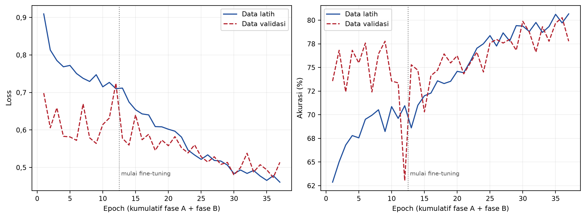
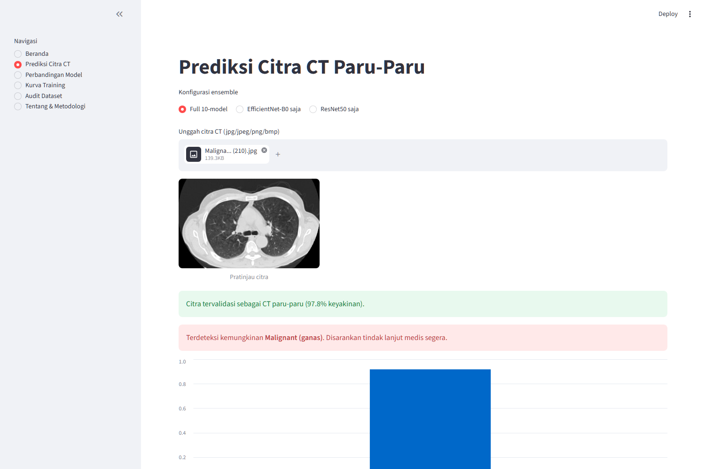
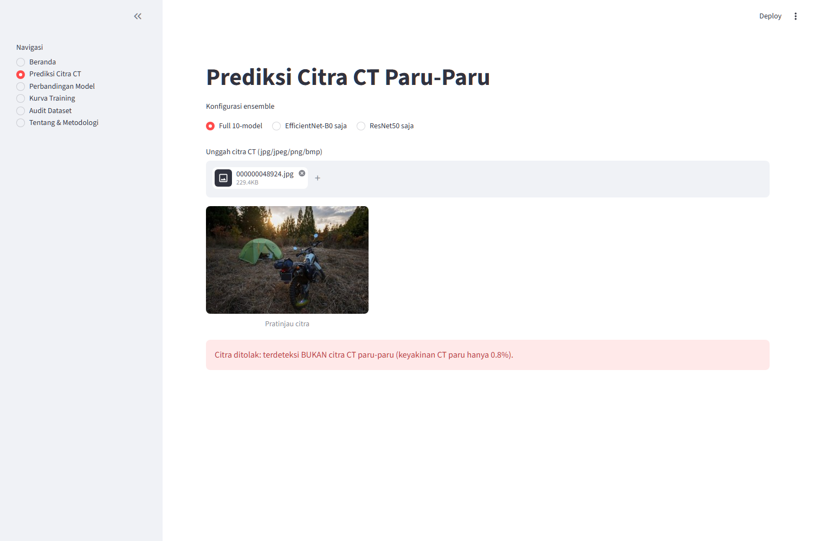
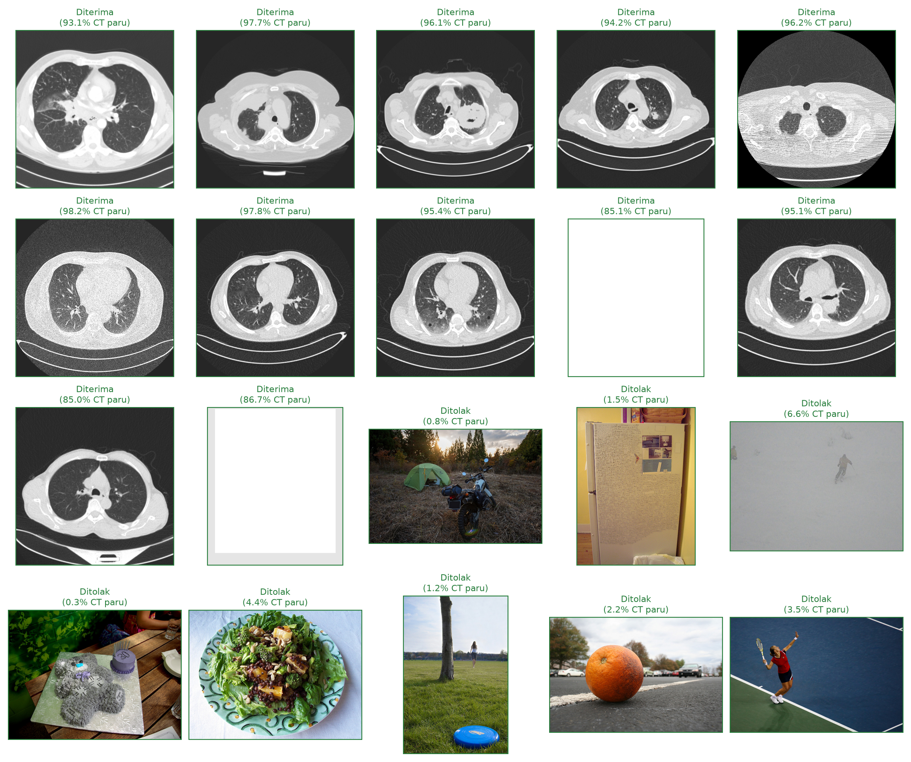

# BAB IV

# HASIL DAN PEMBAHASAN

Bab ini memaparkan hasil penelitian dan disusun mengikuti tiga teknik optimasi yang dinyatakan pada judul: *fine-tuning*, *data augmentation*, dan *ensemble model*. Setelah lingkungan implementasi dijabarkan, kontribusi tiap teknik diukur satu per satu lewat perbandingan terkendali, yaitu dengan mengubah hanya satu faktor dan mempertahankan sisanya. Dengan cara ini, kenaikan performa dapat diatribusikan pada teknik tertentu, bukan sekadar dilaporkan sebagai satu angka akhir yang tidak diketahui asal usulnya.

## 4.1 Lingkungan dan Implementasi Model

Seluruh model dilatih dengan arsitektur, *hyperparameter*, dan skema *Stratified Group K-Fold* yang identik sebagaimana dijabarkan pada Bab III. Konsistensi ini penting karena keseluruhan Bab IV bersandar pada perbandingan antar konfigurasi: bila konfigurasi pelatihannya ikut berubah, perbedaan hasil tidak lagi dapat diatribusikan pada teknik yang sedang diuji.

### 4.1.1 Pra-pemrosesan Data dan Augmentasi

Setiap citra masukan melewati rangkaian transformasi yang sama sebelum masuk ke model: pengubahan ukuran menjadi 512×512 piksel, konversi ke tensor, dan normalisasi memakai statistik ImageNet (*mean* [0,485; 0,456; 0,406] dan standar deviasi [0,229; 0,224; 0,225]). Normalisasi dengan statistik ImageNet dipilih karena bobot awal kedua arsitektur memang dilatih pada distribusi tersebut, sehingga masukan yang selaras mempercepat konvergensi pada tahap *fine-tuning*.

Resolusi 512×512 dipakai karena citra CT pada kedua sumber memang tersimpan pada ukuran asli 512×512 piksel. Menurunkannya ke 224×224, sebagaimana lazim dilakukan pada pelatihan ImageNet, berarti membuang lebih dari tiga perempat piksel yang tersedia. Pada citra irisan dada utuh, nodul hanya menempati sebagian kecil luas citra, sehingga informasi yang hilang akibat penurunan resolusi justru mengenai bagian yang paling menentukan. Resolusi tidak dinaikkan melewati 512 karena di atas titik itu piksel tambahan hanya hasil interpolasi, bukan informasi baru dari alat pemindai.

Perbedaan perlakuan hanya terletak pada data latih, yang diperkaya dengan augmentasi acak berupa pembalikan horizontal, transformasi afin (rotasi hingga 15°, translasi hingga 10%, dan penskalaan 0,90–1,10), serta perubahan kecerahan dan kontras sebesar 0,2. Data validasi dan data uji sengaja tidak diaugmentasi agar angka evaluasi mencerminkan performa pada citra apa adanya.

*script kode program pra-pemrosesan dan augmentasi:*

```python
STRENGTHS = {
    "ct":     dict(rot=7,  jitter=0.0, translate=0.0,  scale=(1.0, 1.0)),
    "light":  dict(rot=10, jitter=0.1, translate=0.05, scale=(0.95, 1.05)),
    "medium": dict(rot=15, jitter=0.2, translate=0.1,  scale=(0.9, 1.1)),
}

def build_transforms(image_size=512, train=True, augment_strength="medium"):
    base = [v2.ToImage(), v2.Resize((image_size, image_size), antialias=True)]
    if train:
        p = STRENGTHS[augment_strength]
        base.append(v2.RandomHorizontalFlip(p=0.5))
        if p["translate"] or p["scale"] != (1.0, 1.0):
            base.append(v2.RandomAffine(degrees=p["rot"],
                                        translate=(p["translate"], p["translate"]),
                                        scale=p["scale"]))
        elif p["rot"]:
            base.append(v2.RandomRotation(degrees=p["rot"]))
        if p["jitter"]:
            base.append(v2.ColorJitter(brightness=p["jitter"], contrast=p["jitter"]))
    base += [
        v2.ToDtype(torch.float32, scale=True),
        v2.Normalize(mean=IMAGENET_MEAN, std=IMAGENET_STD),
    ]
    return v2.Compose(base)
```

Pembalikan vertikal sengaja tidak dipakai sama sekali, sebab citra CT dada yang terbalik atas-bawah bukan variasi yang wajar dan justru akan mengajari model pola yang keliru. Adapun apakah rangkaian augmentasi selebihnya benar-benar membantu pada citra CT merupakan pertanyaan tersendiri yang diuji secara langsung pada Bagian 4.4, bukan diasumsikan.

### 4.1.2 Arsitektur dan Konfigurasi Model

Kedua arsitektur dimuat dengan bobot *pre-trained* ImageNet, lalu lapisan klasifikasi terakhirnya diganti dengan rangkaian *Dropout* berprobabilitas 0,3 diikuti lapisan *fully connected* berukuran tiga keluaran sesuai jumlah kelas. *Dropout* dipasang tepat sebelum lapisan keputusan sebagai peredam *overfitting* pada bagian jaringan yang dilatih dari nol, yaitu bagian yang paling rawan menghafal karena bobot awalnya acak dan datanya terbatas. Strategi pelatihannya dua fase: pada fase A seluruh *backbone* dibekukan dan hanya lapisan klasifikasi baru yang dilatih, kemudian pada fase B tiga blok terakhir *backbone* dibuka dan dilatih ulang dengan laju pembelajaran seratus kali lebih kecil.

*script kode program pemuatan model dan pembekuan backbone:*

```python
def build_model(arch: str = "efficientnet_b0", n_classes: int = 3, dropout: float = 0.3):
    if arch == "efficientnet_b0":
        model = efficientnet_b0(weights=EfficientNet_B0_Weights.IMAGENET1K_V1)
        in_features = model.classifier[1].in_features
        model.classifier = nn.Sequential(
            nn.Dropout(p=dropout, inplace=True),
            nn.Linear(in_features, n_classes),
        )
        return model
    if arch == "resnet50":
        model = resnet50(weights=ResNet50_Weights.IMAGENET1K_V2)
        in_features = model.fc.in_features
        model.fc = nn.Sequential(nn.Dropout(p=dropout), nn.Linear(in_features, n_classes))
        return model
    raise ValueError(f"unknown arch: {arch}")


def freeze_backbone(model, arch):
    for p in model.parameters():
        p.requires_grad = False
    head = model.classifier if arch == "efficientnet_b0" else model.fc
    for p in head.parameters():
        p.requires_grad = True
```

Fungsi kerugian yang dipakai adalah *CrossEntropyLoss* dengan bobot per kelas berbanding terbalik terhadap frekuensi kemunculannya, sehingga kesalahan pada kelas Benign (kelas paling sedikit datanya) dihukum lebih berat daripada kesalahan pada kelas Malignant.

*script kode program bobot kelas dan konfigurasi dua fase:*

```python
def class_weights_from_df(df, device):
    counts = df["canonical_label"].value_counts()
    freqs = np.array([counts.get(c, 1) for c in CLASS_NAMES], dtype=np.float64)
    weights = freqs.sum() / (len(CLASS_NAMES) * freqs)
    return torch.tensor(weights, dtype=torch.float32, device=device)

criterion = nn.CrossEntropyLoss(weight=class_weights_from_df(train_df, device))

# Fase A: feature extraction
freeze_backbone(model, arch)
opt_a = torch.optim.Adam([p for p in model.parameters() if p.requires_grad], lr=1e-3)
fit(model, ..., epochs=12, phase_name="A-head", patience=6)

# Fase B: fine-tuning
unfreeze_for_finetune(model, arch, n_blocks=3)
opt_b = torch.optim.Adam([p for p in model.parameters() if p.requires_grad], lr=1e-5)
sched_b = torch.optim.lr_scheduler.ReduceLROnPlateau(opt_b, mode="max",
                                                     factor=0.5, patience=3)
fit(model, ..., epochs=25, phase_name="B-finetune", scheduler=sched_b, patience=6)
```

### 4.1.3 Skema Pembagian Data dan Pengujian

Pembagian data berlangsung dua tahap, keduanya memakai *StratifiedGroupKFold* dengan kolom `split_group` sebagai penanda grup (kunci kasus untuk data Kaggle, ID pasien untuk LIDC-IDRI) dan *random seed* 42. Tahap pertama memisahkan 18% grup sebagai *held-out test set*, dan citra berlabel perkiraan sengaja dikeluarkan dari undian ini sehingga hanya citra berlabel terpercaya yang berpeluang menjadi data uji. Tahap kedua membagi sisanya menjadi lima lipatan untuk validasi silang. Sebelum pelatihan dijalankan, program memverifikasi bahwa tidak ada grup yang muncul di dua lipatan sekaligus, tidak ada grup yang bocor ke data uji, dan tidak ada label perkiraan yang masuk data uji; bila salah satu pemeriksaan gagal, program berhenti dan menolak melanjutkan.

*script kode program pembagian data dan pemeriksaan kebocoran:*

```python
# citra berlabel perkiraan tidak boleh ikut diundi menjadi data uji
eligible = pool[pool["label_origin"] != "pseudo-knn"].reset_index(drop=True)
forced_train = pool[pool["label_origin"] == "pseudo-knn"].reset_index(drop=True)

n_test_folds = max(1, round(1 / TEST_FRACTION))          # TEST_FRACTION = 0.18
sgkf = StratifiedGroupKFold(n_splits=n_test_folds, shuffle=True, random_state=SEED)
train_idx, test_idx = next(sgkf.split(eligible, eligible["canonical_label"],
                                      groups=eligible["split_group"]))
test_df = eligible.iloc[test_idx].reset_index(drop=True)
trainval = eligible.iloc[train_idx].reset_index(drop=True)
trainval = pd.concat([trainval, forced_train], ignore_index=True)

sgkf2 = StratifiedGroupKFold(n_splits=N_FOLDS, shuffle=True, random_state=SEED)
trainval["fold"] = -1
for fold, (_, val_idx) in enumerate(sgkf2.split(trainval, trainval["canonical_label"],
                                                groups=trainval["split_group"])):
    trainval.loc[trainval.index[val_idx], "fold"] = fold

# pemeriksaan anti-kebocoran: program berhenti bila salah satu dilanggar
assert (trainval["fold"] >= 0).all(), "ada baris tanpa fold"
for group, sub in trainval.groupby("split_group"):
    assert sub["fold"].nunique() == 1, f"grup {group} tersebar di beberapa fold"
overlap = set(trainval["split_group"]) & set(test_df["split_group"])
assert not overlap, f"grup bocor ke test: {list(overlap)[:3]}"
assert (test_df["label_origin"] != "pseudo-knn").all(), "label tebakan bocor ke data uji"
```

Komposisi akhir data yang dipakai seluruh eksperimen pada bab ini disajikan pada Tabel 4.1.

Tabel 4.1 Komposisi Data Pelatihan dan Pengujian

| Bagian | Malignant | Benign | Normal | Total |
|---|---:|---:|---:|---:|
| Data latih dan validasi (5 *fold*) | 1.709 | 342 | 561 | 2.612 |
| *Held-out test set* | 311 | 68 | 110 | 489 |
| **Total** | **2.020** | **410** | **671** | **3.101** |

Seluruh angka evaluasi pada bab ini dihitung pada 489 citra *held-out test set*, yaitu data yang tidak pernah dilibatkan dalam pelatihan maupun pemilihan model manapun.

## 4.2 Hasil Dasar Transfer Learning EfficientNet-B0

Sebelum kontribusi masing-masing teknik optimasi diukur, performa dasar kesepuluh model tunggal perlu ditetapkan lebih dulu sebagai titik acuan. Tabel 4.2 menyajikan hasil tiap model pada data uji.

Tabel 4.2 Performa Model Tunggal per Fold pada Data Uji

| Model | Akurasi | Macro-F1 | Cancer Recall | Benign Recall | ROC-AUC |
|---|---:|---:|---:|---:|---:|
| EfficientNet-B0 *fold* 0 | 74,44% | 0,687 | 73,63% | 64,71% | 0,898 |
| EfficientNet-B0 *fold* 1 | 72,19% | 0,663 | 71,70% | 61,76% | 0,888 |
| EfficientNet-B0 *fold* 2 | 71,98% | 0,664 | 69,77% | 60,29% | 0,880 |
| EfficientNet-B0 *fold* 3 | 70,35% | 0,635 | 72,99% | 57,35% | 0,863 |
| EfficientNet-B0 *fold* 4 | 73,82% | 0,682 | 72,67% | 64,71% | 0,891 |
| ResNet50 *fold* 0 | 77,30% | 0,701 | 79,10% | 57,35% | 0,906 |
| **ResNet50 *fold* 1** | **80,57%** | **0,723** | **83,60%** | 48,53% | **0,919** |
| ResNet50 *fold* 2 | 74,44% | 0,687 | 73,31% | 64,71% | 0,881 |
| ResNet50 *fold* 3 | 76,48% | 0,708 | 74,92% | 64,71% | 0,915 |
| ResNet50 *fold* 4 | 78,32% | 0,716 | 79,74% | 60,29% | 0,918 |
| **Rata-rata kesepuluh model** | **74,99%** | **0,687** | **75,14%** | **60,44%** | **0,896** |

Dua pola terbaca dari tabel ini. Pertama, ResNet50 secara konsisten sedikit mengungguli EfficientNet-B0 pada data ini, dengan selisih rata-rata sekitar 4 poin persentase pada akurasi. Kedua, sebaran antar *fold* cukup lebar, dari 70,35% hingga 80,57%, yang berarti performa satu model tunggal ikut bergantung pada pembagian data yang kebetulan diperolehnya. Keragaman ini sendiri justru menjadi bahan baku yang berguna bagi teknik *ensemble* pada Bagian 4.5.

Dinamika pelatihannya ditampilkan pada Gambar 4.1, memakai ResNet50 *fold* 4 sebagai contoh.



*Gambar 4.1 Kurva Loss dan Akurasi pada ResNet50 Fold 4*

Kurva latih dan kurva validasi bergerak berdampingan sepanjang pelatihan tanpa jurang yang melebar, yang menandakan model tidak mengalami *overfitting* berat. Pada epoch terbaiknya, akurasi latih (79,71%) bahkan sedikit di bawah akurasi validasi (80,27%). Pengaruh augmentasi terhadap pola ini dibahas pada Bagian 4.4.

Selain angka akhir, dinamika pelatihan pada tiap epoch perlu ditinjau untuk memastikan model benar-benar belajar dan bukan sekadar berhenti pada titik yang kebetulan menguntungkan. Tabel 4.3 menyajikan rincian lengkap seluruh 37 epoch pada ResNet50 *fold* 4, yaitu model dengan macro-F1 validasi tertinggi di antara kesepuluh model. Baris yang dicetak tebal menandai epoch dengan macro-F1 validasi terbaik, dan bobot pada epoch itulah yang disimpan sebagai *checkpoint* final model tersebut.

Tabel 4.3 Detail Epoch pada ResNet50 Fold 4

| Epoch | Fase | Laju Pembelajaran | Loss Pelatihan | Akurasi Pelatihan (%) | Loss Validasi | Akurasi Validasi (%) | Macro-F1 Validasi |
|---:|---|---|---:|---:|---:|---:|---:|
| 1 | A | 1e-3 | 0,9096 | 62,87 | 0,6984 | 73,56 | 0,6472 |
| 2 | A | 1e-3 | 0,8132 | 65,02 | 0,6060 | 76,82 | 0,5762 |
| 3 | A | 1e-3 | 0,7853 | 66,79 | 0,6591 | 72,41 | 0,6530 |
| 4 | A | 1e-3 | 0,7685 | 67,80 | 0,5831 | 76,82 | 0,6359 |
| 5 | A | 1e-3 | 0,7722 | 67,56 | 0,5816 | 75,48 | 0,6205 |
| 6 | A | 1e-3 | 0,7505 | 69,52 | 0,5724 | 77,59 | 0,6526 |
| 7 | A | 1e-3 | 0,7378 | 69,95 | 0,6697 | 72,41 | 0,6683 |
| 8 | A | 1e-3 | 0,7294 | 70,53 | 0,5791 | 76,44 | 0,6835 |
| 9 | A | 1e-3 | 0,7474 | 68,23 | 0,5641 | 77,78 | 0,6617 |
| 10 | A | 1e-3 | 0,7151 | 70,86 | 0,6144 | 73,56 | 0,6595 |
| 11 | A | 1e-3 | 0,7269 | 69,62 | 0,6318 | 73,37 | 0,6595 |
| 12 | A | 1e-3 | 0,7102 | 70,96 | 0,7246 | 63,03 | 0,5668 |
| 13 | B | 1e-5 | 0,7117 | 68,61 | 0,5779 | 75,29 | 0,6758 |
| 14 | B | 1e-5 | 0,6746 | 71,00 | 0,5598 | 74,71 | 0,6734 |
| 15 | B | 1e-5 | 0,6540 | 72,01 | 0,6402 | 70,31 | 0,6571 |
| 16 | B | 1e-5 | 0,6429 | 72,30 | 0,5741 | 74,14 | 0,6795 |
| 17 | B | 1e-5 | 0,6402 | 73,59 | 0,5886 | 74,71 | 0,6883 |
| 18 | B | 1e-5 | 0,6091 | 73,30 | 0,5456 | 76,44 | 0,6960 |
| 19 | B | 1e-5 | 0,6084 | 73,54 | 0,5732 | 75,48 | 0,6965 |
| 20 | B | 1e-5 | 0,6021 | 74,59 | 0,5581 | 76,25 | 0,7066 |
| 21 | B | 1e-5 | 0,5968 | 74,45 | 0,5823 | 74,33 | 0,6933 |
| 22 | B | 1e-5 | 0,5812 | 75,65 | 0,5527 | 75,48 | 0,6962 |
| 23 | B | 1e-5 | 0,5465 | 77,03 | 0,5389 | 76,63 | 0,7055 |
| 24 | B | 5e-6 | 0,5333 | 77,51 | 0,5603 | 74,52 | 0,6871 |
| 25 | B | 5e-6 | 0,5217 | 78,37 | 0,5287 | 77,59 | 0,7161 |
| 26 | B | 5e-6 | 0,5338 | 77,27 | 0,5147 | 77,97 | 0,7172 |
| 27 | B | 5e-6 | 0,5189 | 78,66 | 0,5286 | 77,59 | 0,7171 |
| 28 | B | 5e-6 | 0,5172 | 77,80 | 0,5084 | 77,97 | 0,7198 |
| 29 | B | 5e-6 | 0,5065 | 79,43 | 0,5136 | 76,82 | 0,7095 |
| 30 | B | 5e-6 | 0,4837 | 79,38 | 0,4800 | 79,89 | 0,7339 |
| 31 | B | 5e-6 | 0,4934 | 78,80 | 0,4997 | 78,74 | 0,7238 |
| 32 | B | 5e-6 | 0,4842 | 79,76 | 0,5380 | 76,63 | 0,7095 |
| 33 | B | 5e-6 | 0,4920 | 78,71 | 0,4880 | 79,31 | 0,7313 |
| 34 | B | 3e-6 | 0,4772 | 79,33 | 0,5075 | 77,78 | 0,7114 |
| 35 | B | 3e-6 | 0,4656 | 80,62 | 0,4939 | 79,69 | 0,7332 |
| **36** | **B** | **3e-6** | **0,4782** | **79,71** | **0,4734** | **80,27** | **0,7370** |
| 37 | B | 3e-6 | 0,4609 | 80,67 | 0,5138 | 77,78 | 0,7181 |

Tiga hal terbaca dari tabel ini. Pertama, fase A berhenti pada epoch ke-12 sesuai batas maksimumnya, dan macro-F1 validasi tertingginya hanya mencapai 0,6835 pada epoch ke-8. Kedua, setelah *fine-tuning* dimulai pada epoch ke-13, macro-F1 terus merangkak naik hingga menembus 0,7370 pada epoch ke-36, yaitu kenaikan 0,0535 dari capaian terbaik fase A. Ketiga, mekanisme *ReduceLROnPlateau* menurunkan laju pembelajaran dua kali, yaitu dari 1e-5 menjadi 5e-6 pada epoch ke-24 dan menjadi 3e-6 pada epoch ke-34. Kedua penurunan tersebut diikuti perbaikan: setelah penurunan pertama, macro-F1 naik dari 0,7055 ke 0,7161, dan setelah penurunan kedua model mencapai capaian terbaiknya. Pelatihan berhenti pada epoch ke-37 karena *early stopping* terpicu setelah macro-F1 validasi tidak membaik selama enam epoch berturut-turut.

## 4.3 Kontribusi Fine-Tuning

Teknik pertama yang diuji adalah *fine-tuning*, yaitu membuka kembali sebagian *backbone* yang semula dibekukan agar bobotnya ikut menyesuaikan diri pada citra CT. Pengukurannya dilakukan dengan membandingkan macro-F1 validasi terbaik yang dicapai pada fase A (hanya lapisan klasifikasi yang dilatih) terhadap macro-F1 validasi terbaik pada fase B (tiga blok terakhir *backbone* ikut dilatih) untuk tiap model. Karena kedua fase dijalankan berurutan pada model dan pembagian data yang sama persis, selisihnya dapat diatribusikan langsung pada *fine-tuning*. Gambar 4.2 menampilkan perubahan tersebut untuk kesepuluh model, dengan arah panah menunjukkan naik atau turunnya macro-F1 setelah fase B dijalankan.


*Gambar 4.2 Perubahan Macro-F1 Validasi dari Fase A ke Fase B pada Kesepuluh Model*

Tabel 4.4 menyajikan angkanya secara lengkap.

Tabel 4.4 Macro-F1 Validasi Terbaik Sebelum dan Sesudah Fine-Tuning

| Model | Fase A (*feature extraction*) | Fase B (*fine-tuning*) | Selisih |
|---|---:|---:|---:|
| EfficientNet-B0 *fold* 0 | 0,6636 | 0,6694 | +0,0057 |
| EfficientNet-B0 *fold* 1 | 0,6377 | 0,6413 | +0,0036 |
| EfficientNet-B0 *fold* 2 | 0,6441 | 0,6548 | +0,0107 |
| EfficientNet-B0 *fold* 3 | 0,6686 | 0,6540 | −0,0145 |
| EfficientNet-B0 *fold* 4 | 0,6708 | 0,6988 | +0,0280 |
| ResNet50 *fold* 0 | 0,6835 | 0,7133 | +0,0298 |
| ResNet50 *fold* 1 | 0,6314 | 0,6879 | +0,0565 |
| ResNet50 *fold* 2 | 0,6584 | 0,6776 | +0,0192 |
| ResNet50 *fold* 3 | 0,6654 | 0,7070 | +0,0416 |
| ResNet50 *fold* 4 | 0,6835 | 0,7370 | +0,0535 |
| **Rata-rata** | **0,6607** | **0,6841** | **+0,0234** |

Sembilan dari sepuluh model membaik setelah *fine-tuning*, dengan kenaikan rata-rata 0,0234 poin macro-F1. Satu model, yaitu EfficientNet-B0 *fold* 3, justru sedikit menurun (−0,0145). Penurunan tunggal ini tidak dibiarkan merusak hasil akhir karena mekanisme penyimpanan bobot memang menyimpan *checkpoint* dengan macro-F1 validasi tertinggi yang pernah dicapai lintas kedua fase, bukan bobot dari epoch terakhir. Dengan kata lain, untuk model tersebut yang tersimpan tetap bobot dari fase A.

Besar manfaat *fine-tuning* ternyata tidak merata antar arsitektur. Pada ResNet50, kelima *fold* membaik dengan rata-rata +0,0401, sementara pada EfficientNet-B0 rata-ratanya hanya +0,0067. Penjelasannya terletak pada kapasitas yang benar-benar ikut disesuaikan ketika tiga blok terakhir dibuka, dan besarannya diukur langsung, bukan diperkirakan. Pada ResNet50, tiga blok terakhir mencakup 23,3 juta parameter atau 99,0% dari keseluruhan model. Pada EfficientNet-B0, tiga blok terakhir mencakup 3,2 juta parameter, yang secara proporsi memang tinggi (78,8%) tetapi secara jumlah hanya sekitar sepertujuh dari ResNet50.

Perbedaan ini bersumber pada rancangan EfficientNet-B0 yang memang hemat parameter lewat konvolusi *depthwise separable*, sehingga keseluruhan modelnya hanya berisi 4,0 juta parameter berbanding 23,5 juta pada ResNet50. Dengan kata lain, yang membedakan respons kedua arsitektur terhadap *fine-tuning* bukanlah seberapa besar porsi jaringan yang dibuka, melainkan seberapa banyak bobot yang tersedia untuk menyesuaikan diri pada karakteristik citra CT. EfficientNet-B0 sudah hampir sepenuhnya terbuka pada konfigurasi ini, sehingga menambah jumlah blok yang dilatih ulang tidak akan memberi ruang tambahan yang berarti.

Temuan ini juga terlihat pada kurva pelatihan di Gambar 4.1. Setelah garis penanda "mulai *fine-tuning*" pada epoch ke-12, *loss* validasi yang semula bergerak naik turun di kisaran 0,58–0,67 mulai turun konsisten hingga menyentuh 0,48, dan akurasi validasi naik dari kisaran 73% ke 80%. Pergerakan ini memperlihatkan bahwa sebatas melatih ulang lapisan klasifikasi di atas fitur ImageNet yang beku belum cukup; fitur tingkat tinggi ImageNet perlu disesuaikan dulu pada karakteristik citra CT sebelum dapat dipakai secara optimal.

## 4.4 Kontribusi Data Augmentation

Teknik kedua yang diuji adalah augmentasi data. Berbeda dari *fine-tuning* yang selisihnya dapat dibaca langsung dari dua fase pada model yang sama, pengaruh augmentasi hanya dapat diukur dengan melatih ulang seluruh model dari awal memakai pipeline yang identik kecuali pada bagian augmentasinya. Karena itu kesepuluh model dilatih ulang sebanyak dua kali lagi, sehingga tersedia tiga kelompok model dengan total tiga puluh model.

Ketiga konfigurasi tersebut adalah sebagai berikut:

1. **Tanpa augmentasi.** Data latih hanya melewati pengubahan ukuran dan normalisasi, sama persis dengan perlakuan pada data validasi dan data uji.
2. **Augmentasi ringan (CT).** Hanya pembalikan horizontal dan rotasi acak hingga 7°, tanpa perubahan kecerahan maupun kontras, tanpa translasi, dan tanpa penskalaan.
3. **Augmentasi penuh.** Konfigurasi yang dipakai sepanjang penelitian ini, yaitu pembalikan horizontal, transformasi afin (rotasi 15°, translasi 10%, penskalaan 0,90–1,10), dan perubahan kecerahan serta kontras sebesar 0,2.

Konfigurasi kedua tidak dipilih secara sembarangan, melainkan berangkat dari sifat citra CT itu sendiri. Tingkat keabuan pada citra CT bukan hasil pencahayaan, melainkan berasal dari *Hounsfield Unit* yang merupakan besaran kerapatan jaringan terkalibrasi, sehingga satu tingkat keabuan menandakan satu jenis jaringan tertentu. Mengacak kecerahan dan kontras karena itu tidak sekadar menambah variasi tampilan, melainkan mengubah keterangan kerapatan jaringan yang justru menjadi dasar pembedaan kelas. Pertimbangan serupa berlaku pada transformasi afin: nodul berukuran beberapa milimeter hanya menempati sebagian sangat kecil dari irisan 512×512 piksel, sehingga translasi hingga 10% dan penskalaan berpeluang menggeser atau melarutkan justru objek yang harus dikenali. Konfigurasi ringan dirancang untuk membuang kedua jenis transformasi tersebut dan menyisakan variasi yang memang wajar terjadi, yaitu perbedaan arah hadap pasien dan perbedaan kecil posisi pemindaian.

### 4.4.1 Pengaruh terhadap Overfitting

Pengaruh augmentasi paling jelas terlihat bukan pada akurasi, melainkan pada jarak antara performa data latih dan data validasi. Tabel 4.5 menyajikan selisih tersebut pada epoch terbaik tiap model, dirata-ratakan atas sepuluh model per konfigurasi.

Tabel 4.5 Pengaruh Kekuatan Augmentasi terhadap Overfitting dan Performa Data Uji

| Konfigurasi | Akurasi Latih | Akurasi Validasi | Jurang | Macro-F1 Validasi | Akurasi Data Uji | Cancer Recall |
|---|---:|---:|---:|---:|---:|---:|
| Tanpa augmentasi | 86,24% | 76,23% | **+10,01** | 0,6998 | 81,19% | 89,71% |
| Augmentasi ringan (CT) | 81,12% | 75,78% | **+5,34** | 0,6985 | 80,57% | 90,35% |
| Augmentasi penuh | 75,63% | 74,92% | **+0,70** | 0,6856 | 81,60% | 90,35% |

Gambar 4.3 menyajikan kedua sisi temuan ini secara berdampingan, yaitu performa data uji pada panel kiri dan jurang *overfitting* pada panel kanan. Penyajian dua panel dipilih karena satu sumbu saja akan menyesatkan: panel kiri tampak hampir rata, sementara panel kanan menurun tajam.


*Gambar 4.3 Perbandingan Performa Data Uji dan Jurang Overfitting pada Tiga Kekuatan Augmentasi*

Kolom jurang memperlihatkan pola yang sangat teratur. Tanpa augmentasi, model mencapai 86,24% pada data latihnya sendiri tetapi hanya 76,23% pada data validasi, yaitu selisih 10,01 poin persentase yang menandakan sebagian kemampuannya berupa hafalan atas data latih. Augmentasi ringan memangkas selisih itu menjadi 5,34 poin, dan augmentasi penuh menekannya hingga tinggal 0,70 poin. Urutannya konsisten dengan kekuatan augmentasi, tanpa satu pun penyimpangan.

Dengan demikian, augmentasi terbukti menjalankan fungsinya sebagaimana yang diharapkan secara teoretis, yaitu menahan model agar tidak menyesuaikan diri terlalu jauh pada data latih. Temuan ini berdiri sendiri dan tidak bergantung pada hasil evaluasi akhir.

### 4.4.2 Pengaruh terhadap Performa Data Uji

Pertanyaan berikutnya adalah apakah pengendalian *overfitting* tersebut berbuah performa yang lebih baik pada data uji. Tabel 4.6 membandingkan ketiga konfigurasi pada tiga tingkat agregasi.

Tabel 4.6 Akurasi Data Uji Tiga Konfigurasi Augmentasi pada Tiap Tingkat Agregasi

| Konfigurasi | Model Tunggal (rata-rata 10) | Soft-Voting | Ensemble Stacking |
|---|---:|---:|---:|
| Tanpa augmentasi | **75,73%** | **78,12%** | 81,19% |
| Augmentasi ringan (CT) | 75,58% | 76,69% | 80,57% |
| Augmentasi penuh | 74,99% | 77,51% | **81,60%** |

Urutan peringkat berubah-ubah antar tingkat agregasi tanpa pola yang konsisten. Pada tingkat model tunggal dan *soft-voting*, konfigurasi tanpa augmentasi justru unggul; pada tingkat *ensemble stacking*, augmentasi penuh yang sedikit di depan. Ketidakkonsistenan semacam ini merupakan tanda bahwa perbedaan yang teramati berada pada taraf fluktuasi acak, bukan pengaruh yang sesungguhnya.

Dugaan tersebut diuji secara formal memakai uji McNemar, yang membandingkan pola benar dan salah dua konfigurasi pada citra uji yang sama. Hasilnya disajikan pada Tabel 4.7.

Tabel 4.7 Uji McNemar antar Konfigurasi Augmentasi pada 489 Citra Uji

| Perbandingan | Hanya A Benar | Hanya B Benar | Nilai p | Kesimpulan |
|---|---:|---:|---:|---|
| Augmentasi penuh (A) vs tanpa augmentasi (B) | 9 | 7 | 0,8036 | tidak berbeda bermakna |
| Augmentasi penuh (A) vs ringan CT (B) | 9 | 4 | 0,2668 | tidak berbeda bermakna |
| Tanpa augmentasi (A) vs ringan CT (B) | 9 | 6 | 0,6072 | tidak berbeda bermakna |

Tidak satu pun perbandingan menghasilkan nilai p di bawah 0,05. Ketiga konfigurasi karena itu tidak dapat dibedakan secara statistik pada data uji penelitian ini.

Besaran yang memperkuat kesimpulan tersebut adalah perbandingan antara sebaran di dalam satu konfigurasi dengan selisih antar konfigurasi. Simpangan baku akurasi antar sepuluh model di dalam satu konfigurasi berkisar 2,88 hingga 3,17 poin persentase, sementara selisih akurasi terbesar antar konfigurasi hanya 1,03 poin persentase pada tingkat *ensemble stacking*. Dengan kata lain, perbedaan antar *fold* di dalam satu konfigurasi sekitar tiga kali lebih besar daripada perbedaan antar konfigurasi yang sedang dibandingkan.

### 4.4.3 Pembahasan

Hasil pada bagian ini perlu dinyatakan apa adanya: **augmentasi data terbukti mengendalikan *overfitting*, tetapi pengendalian tersebut tidak menghasilkan peningkatan performa yang terukur pada data uji penelitian ini.**

Penjelasan yang paling masuk akal atas ketidaksesuaian ini adalah bahwa *overfitting* bukan faktor pembatas utama pada konfigurasi tersebut. Mekanisme penyimpanan bobot yang dipakai penelitian ini hanya menyimpan *checkpoint* dengan macro-F1 validasi tertinggi, bukan bobot dari epoch terakhir, sehingga model yang mulai menghafal tidak pernah benar-benar dipakai. Ditambah *early stopping* berbasis macro-F1 validasi dan penggabungan sepuluh model lewat *ensemble*, sebagian besar kerugian akibat hafalan sudah tertangani sebelum augmentasi ikut berperan. Faktor pembatas yang sesungguhnya terletak di tempat lain, yaitu tingkat kesulitan intrinsik subset LIDC-IDRI sebagaimana dibahas pada Bagian 4.8 dan ketidakseimbangan kelas yang menekan kelas Benign.

Meski demikian, konfigurasi augmentasi penuh tetap dipertahankan sebagai konfigurasi final dengan dua alasan. Pertama, konfigurasi tersebut menghasilkan akurasi *ensemble stacking* tertinggi (81,60%) dan *cancer recall* tertinggi bersama konfigurasi ringan (90,35%), meski keunggulannya tidak bermakna secara statistik. Kedua, dan lebih penting, konfigurasi tersebut memberikan jurang *overfitting* paling kecil (0,70 poin), yang berarti performa pada data yang belum pernah dilihat lebih dapat diandalkan ketika model dihadapkan pada data di luar penelitian ini. Ketika dua konfigurasi tidak dapat dibedakan performanya, konfigurasi yang lebih kecil ketergantungannya pada hafalan data latih merupakan pilihan yang lebih aman.

Temuan bahwa augmentasi tidak menaikkan performa secara terukur tetap dilaporkan sebagai hasil penelitian, bukan disembunyikan atau digantikan angka yang lebih menyenangkan. Hasil yang tidak sesuai harapan awal tetap merupakan hasil, dan pada kasus ini justru memberi keterangan yang berguna: pada data CT dengan karakteristik seperti penelitian ini, perbaikan performa lebih menjanjikan bila diarahkan pada penanganan ketidakseimbangan kelas dan kesulitan data, bukan pada penambahan variasi data latih.

## 4.5 Kontribusi Ensemble Model

Teknik ketiga adalah penggabungan keluaran beberapa model. Tabel 4.2 memperlihatkan bahwa kesepuluh model tunggal memiliki kekuatan yang berbeda-beda dan tidak selalu keliru pada citra yang sama, sehingga penggabungan berpeluang memperbaiki hasil tanpa perlu melatih model baru sama sekali. Dua pendekatan diuji pada penelitian ini: *soft-voting*, yang merata-ratakan probabilitas dengan bobot tetap, dan *stacking*, yang mempelajari cara menggabungkan dari data. Gambar 4.4 merangkum perjalanan performa dari model tunggal hingga *ensemble stacking*, dan rinciannya dijabarkan pada dua subbagian berikut.


*Gambar 4.4 Perbandingan Model Tunggal, Soft-Voting, dan Ensemble Stacking*

### 4.5.1 Ensemble Soft-Voting

Pendekatan pertama merata-ratakan vektor probabilitas kesepuluh model. Dua varian diuji: bobot setara, di mana setiap model berkontribusi sama besar, dan bobot tertimbang, di mana kontribusi tiap model sebanding dengan macro-F1 validasi yang dicapainya. Hasilnya disajikan pada Tabel 4.8.

Tabel 4.8 Perbandingan Konfigurasi Soft-Voting

| Konfigurasi | Anggota | Akurasi | Macro-F1 | Cancer Recall | ROC-AUC |
|---|---:|---:|---:|---:|---:|
| Rata-rata model tunggal | 1 | 74,99% | 0,687 | 75,14% | 0,896 |
| EfficientNet-B0 saja (5 *fold*) | 5 | 73,42% | 0,681 | 71,38% | 0,891 |
| ResNet50 saja (5 *fold*) | 5 | 78,73% | 0,716 | 79,74% | 0,915 |
| *Soft-voting* 10 model (bobot setara) | 10 | 77,10% | 0,714 | 75,56% | 0,909 |
| ***Soft-voting* 10 model (tertimbang)** | 10 | **77,51%** | **0,717** | **76,21%** | **0,910** |

Penggabungan dengan bobot tetap menaikkan akurasi dari rata-rata 74,99% menjadi 77,51%, yaitu sekitar 2,5 poin persentase. Kenaikan ini nyata tetapi terbatas, dan satu hal menarik terlihat pada baris ketiga: *ensemble* yang hanya berisi kelima model ResNet50 (78,73%) justru mengungguli *ensemble* sepuluh model yang mencampur kedua arsitektur (77,51%). Hal ini terjadi karena perata-rataan dengan bobot tetap memperlakukan prediksi EfficientNet-B0 yang lebih lemah hampir setara dengan prediksi ResNet50, sehingga ikut menarik turun hasil akhir. Pembobotan berdasarkan macro-F1 validasi hanya sedikit meredam persoalan ini, sebab sebaran macro-F1 antar model memang rapat sehingga bobot yang dihasilkan pun hampir seragam. Persoalan inilah yang hendak diselesaikan *stacking*.

### 4.5.2 Ensemble Stacking

*Stacking* mengganti bobot tetap dengan sebuah *meta-learner*, yaitu model regresi logistik multinomial yang mempelajari sendiri cara terbaik menggabungkan keluaran kedua arsitektur. Untuk tiap *fold* k, probabilitas keluaran `efficientnet_b0_fold{k}` dan `resnet50_fold{k}` pada data validasi *fold* itu sendiri digabung menjadi satu vektor fitur berdimensi enam (tiga kelas dikali dua arsitektur), lalu dikumpulkan dari seluruh lima *fold* menjadi data latih *meta-learner* sebanyak 2.612 sampel.

Titik kritis metodologisnya terletak pada asal fitur tersebut. Setiap baris data latih *meta-learner* berasal dari citra validasi suatu *fold*, dan diprediksi khusus oleh dua model yang tidak pernah melihat citra itu selama pelatihan. Tanpa pembatasan ini, *meta-learner* akan belajar dari prediksi yang terlalu optimistis dan kenaikan performanya menjadi semu.

*script kode program konstruksi fitur out-of-fold:*

```python
meta_X, meta_y = [], []
for k in range(N_FOLDS):
    val_df = trainval[trainval["fold"] == k]
    eff_probs = probs_for_model(predictor, f"efficientnet_b0_fold{k}", val_df["path"], transform)
    res_probs = probs_for_model(predictor, f"resnet50_fold{k}", val_df["path"], transform)
    feats = np.concatenate([eff_probs, res_probs], axis=1)  # (n, 6)
    meta_X.append(feats)
    meta_y.append(val_df["canonical_label"].map(label_to_idx).values)

meta_X = np.concatenate(meta_X, axis=0)
meta_y = np.concatenate(meta_y, axis=0)
meta_learner = LogisticRegression(max_iter=2000)
meta_learner.fit(meta_X, meta_y)
```

Pada tahap prediksi di data uji, *meta-learner* yang sama diterapkan lima kali (sekali per pasangan model `efficientnet_b0_fold{k}` dan `resnet50_fold{k}`), lalu kelima keluaran probabilitasnya dirata-ratakan menjadi probabilitas akhir. Titik penggabungan antar *fold* dengan demikian bergeser ke belakang *meta-learner*, bukan lagi di depannya seperti pada *soft-voting*. Tabel 4.9 membandingkan kedua pendekatan.

Tabel 4.9 Perbandingan Soft-Voting dan Ensemble Stacking

| Konfigurasi | Akurasi | Macro-F1 | Cancer Recall | Cancer Precision |
|---|---:|---:|---:|---:|
| Rata-rata model tunggal | 74,99% | 0,687 | 75,14% | tidak dihitung |
| *Soft-voting* (tertimbang) | 77,51% | **0,717** | 76,21% | tidak dihitung |
| ***Ensemble Stacking* (ambang 0,50)** | **81,60%** | 0,682 | **90,35%** | **88,36%** |

*Stacking* menaikkan akurasi sebesar 4,1 poin persentase dan *cancer recall* sebesar 14,1 poin persentase dibandingkan *soft-voting* tertimbang, tanpa satu pun model dasar dilatih ulang. Seluruh perbaikan ini berasal dari cara kesepuluh keluaran digabungkan. Arahnya konsisten dengan pendekatan *ensemble stacking* yang dilaporkan Noman et al. (2025), yang juga menemukan bahwa *meta-learner* yang mempelajari penggabungan dari data cenderung mengungguli agregasi dengan bobot tetap.

Satu hal perlu dinyatakan terbuka: macro-F1 *stacking* (0,682) justru sedikit lebih rendah daripada *soft-voting* (0,717). Penyebabnya terlihat jelas pada rincian per kelas di Tabel 4.10. *Meta-learner* dilatih untuk memaksimalkan kecocokan keseluruhan, dan karena kelas Benign hanya menyumbang 13,1% data latihnya, cara termurah menaikkan akurasi adalah dengan lebih sering menebak Malignant atau Normal pada kasus yang meragukan. Akibatnya kelas Benign, yang memang paling jarang dan paling sulit, justru semakin terdesak. Peningkatan akurasi dan *cancer recall* di sini karena itu bukan kemajuan gratis, melainkan dibayar dengan performa pada kelas minoritas. Sebaran kesalahan tersebut tergambar pada *confusion matrix* di Gambar 4.5, dan rincian angkanya disajikan pada Tabel 4.10.


*Gambar 4.5 Confusion Matrix: Ensemble Stacking, Ambang 0,50*

Tabel 4.10 Presisi, Recall, dan F1-Score per Kelas (Ensemble Stacking)

| Kelas | Support | Presisi | Recall | F1-Score |
|---|---:|---:|---:|---:|
| Benign | 68 | 0,500 | 0,250 | 0,333 |
| Malignant | 311 | 0,884 | 0,904 | 0,894 |
| Normal | 110 | 0,737 | 0,918 | 0,818 |
| **Rata-rata makro** | **489** | **0,707** | **0,691** | **0,682** |

Kurva ROC per kelas ditampilkan pada Gambar 4.6, dengan ROC-AUC Malignant 0,945, Normal 0,954, dan Benign 0,855.


*Gambar 4.6 Kurva ROC per Kelas: Ensemble Stacking*

Perbandingan antara ROC-AUC dan *recall* pada kelas Benign menyingkap sesuatu yang tidak terlihat bila hanya salah satunya dilaporkan. ROC-AUC Benign mencapai 0,855, yang berarti model sebenarnya cukup mampu memberi skor lebih tinggi pada citra Benign dibandingkan citra non-Benign. Namun *recall*-nya hanya 0,250. Artinya kemampuan pemeringkatan itu ada, tetapi ambang keputusan tetap (*argmax*) hampir selalu dimenangkan kelas lain yang probabilitasnya lebih besar. Persoalan kelas Benign dengan demikian lebih merupakan persoalan kalibrasi dan ketidakseimbangan kelas daripada ketidakmampuan model mengenali polanya sama sekali.

### 4.5.3 Penyesuaian Ambang Keputusan

Sebagai kelanjutan langsung dari temuan di atas, ambang keputusan kelas Malignant pada konfigurasi *stacking* yang sama di-*sweep* dari 0,50 hingga 0,15 tanpa pelatihan ulang. Hasilnya disajikan pada Tabel 4.11 dan Gambar 4.7.

Tabel 4.11 Sweep Ambang Keputusan Kelas Malignant

| Ambang | Akurasi | Macro-F1 | Cancer Recall | Cancer Precision |
|---|---:|---:|---:|---:|
| **0,50** | 81,60% | **0,682** | 90,35% | **88,36%** |
| 0,40 | 82,00% | 0,677 | 91,96% | 87,20% |
| 0,35 | **82,41%** | 0,660 | 93,89% | 86,14% |
| 0,30 | 81,39% | 0,633 | 94,21% | 84,44% |
| 0,25 | 81,39% | 0,613 | 95,18% | 83,15% |
| 0,20 | 79,35% | 0,552 | 97,11% | 79,68% |
| 0,15 | 74,64% | 0,494 | 98,71% | 73,44% |


*Gambar 4.7 Sweep Ambang Keputusan: Ensemble Stacking*

Akurasi tertinggi justru tercapai pada ambang 0,35 (82,41%), bukan pada ambang *default*. Meski begitu, ambang 0,50 tetap dipilih sebagai konfigurasi final karena memberikan macro-F1 tertinggi (0,682) sekaligus *cancer precision* tertinggi (88,36%). Keunggulan ambang 0,35 pada akurasi hanya 0,8 poin persentase dan diperoleh dengan mengorbankan macro-F1 sebesar 0,022 poin, yang berarti perbaikannya terkonsentrasi pada kelas mayoritas sementara kelas minoritas semakin tertekan. Menurunkan ambang lebih jauh lagi memperlihatkan pertukaran yang semakin curam: pada ambang 0,15, *cancer recall* memang menyentuh 98,71%, tetapi presisinya anjlok ke 73,44%, yang dalam praktik berarti lebih dari seperempat kasus yang ditandai kanker sebenarnya bukan kanker.

Penelitian ini juga sempat menguji arah sebaliknya, yaitu menaikkan ambang di atas 0,50 agar model lebih ketat sebelum menandai kanker, dan menemukan bahwa mekanisme ambang yang dipakai bersifat satu arah:

```python
def predict_with_threshold(probs, t):
    y_pred = probs.argmax(1)
    override = probs[:, MALIGNANT_IDX] >= t
    return np.where(override, MALIGNANT_IDX, y_pred)
```

Karena fungsi ini hanya *menambahkan* label Malignant lewat `override`, ia tidak pernah *mencabut* label Malignant yang sudah dipilih `argmax` sejak awal, sehingga menaikkan `t` di atas 0,50 tidak mengubah hasil apa pun. Temuan ini dilaporkan apa adanya karena pada awalnya sempat disalahpahami sebagai "ambang tidak berpengaruh", padahal penyebabnya adalah arah mekanismenya, bukan ketidaksensitifan model. Pengujian singkat memakai mekanisme kebalikannya, yang menekan alih-alih menambah keputusan Malignant, menghasilkan presisi 100% pada ambang 0,98 namun dengan *cancer recall* anjlok ke 42,2%. Konsekuensi semacam itu tidak sesuai untuk konteks skrining kanker, sehingga tidak dipilih.

Berdasarkan seluruh pertimbangan di atas, **konfigurasi final penelitian ini adalah *ensemble stacking* dengan ambang 0,50**, dan aplikasi prototipe tetap menyediakan *slider* agar pengguna dapat menurunkan ambang secara manual bila prioritas skrining menuntut sensitivitas lebih tinggi.

## 4.6 Ringkasan Kontribusi Ketiga Teknik

Tabel 4.12 merangkum kontribusi masing-masing teknik yang dinyatakan pada judul penelitian.

Tabel 4.12 Ringkasan Kontribusi Ketiga Teknik Optimasi

| Teknik | Pembanding | Metrik Pembanding | Sebelum | Sesudah | Selisih |
|---|---|---|---:|---:|---:|
| *Fine-tuning* | Fase A vs fase B | Macro-F1 validasi (rata-rata 10 model) | 0,6607 | 0,6841 | +0,0234 |
| *Data augmentation* | Tanpa vs dengan augmentasi penuh | Akurasi data uji | 81,19% | 81,60% | +0,41 poin (p = 0,80) |
| *Data augmentation* | Tanpa vs dengan augmentasi penuh | Jurang *overfitting* | +10,01 poin | +0,70 poin | **−9,31 poin** |
| *Ensemble model* | Model tunggal vs *stacking* | Akurasi data uji | 74,99% | 81,60% | +6,61 poin |
| *Ensemble model* | Model tunggal vs *stacking* | *Cancer recall* data uji | 75,14% | 90,35% | +15,21 poin |

Ketiga teknik yang dinyatakan pada judul memberikan kontribusi yang besarnya sangat berbeda, dan perbedaan itu perlu dinyatakan tanpa dibuat seolah setara.

Kontribusi terbesar datang dari *ensemble model*, khususnya *ensemble stacking*, yang menaikkan akurasi lebih dari 6 poin persentase dan *cancer recall* lebih dari 15 poin persentase. *Fine-tuning* memberikan kontribusi yang lebih kecil tetapi konsisten, yaitu kenaikan macro-F1 validasi pada sembilan dari sepuluh model.

*Data augmentation* memberikan hasil yang berbeda sifatnya dari keduanya. Pada metrik performa data uji, pengaruhnya tidak dapat dibedakan dari fluktuasi acak: selisih 0,41 poin persentase dengan nilai p sebesar 0,80 pada uji McNemar, sebagaimana dijabarkan pada Bagian 4.4. Namun pada pengendalian *overfitting*, pengaruhnya justru paling besar di antara ketiga teknik, yaitu memangkas jurang antara akurasi latih dan akurasi validasi dari 10,01 poin menjadi 0,70 poin. Augmentasi karena itu tidak dapat disebut tidak berkontribusi, melainkan berkontribusi pada aspek yang berbeda dari yang diharapkan semula.

Perlu dicatat pula bahwa ketiga kontribusi tidak dapat dijumlahkan begitu saja, sebab diukur pada tataran yang berbeda: *fine-tuning* pada macro-F1 validasi tiap model, augmentasi pada perbandingan antar kelompok model yang dilatih ulang, dan *ensemble* pada metrik data uji setelah kesepuluh model digabungkan. Model dasar yang digabungkan *ensemble* itu sendiri sudah merupakan model yang melewati *fine-tuning* dan augmentasi, sehingga ketiga kontribusi bersifat berlapis, bukan sejajar.

## 4.7 Analisis Kesalahan Klasifikasi

Dari 489 citra uji pada konfigurasi final, 90 citra (18,4%) masih diklasifikasikan keliru. Tabel 4.13 memecah kesalahan tersebut menurut polanya.

Tabel 4.13 Pola Kesalahan Klasifikasi pada Konfigurasi Final

| Label Asli → Prediksi | Jumlah | Median Keyakinan | Sumber Dominan |
|---|---:|---:|---|
| Benign → Malignant | 33 | 0,604 | LIDC-IDRI (33) |
| Malignant → Normal | 18 | 0,666 | LIDC-IDRI (16), Kaggle (2) |
| Benign → Normal | 18 | 0,701 | LIDC-IDRI (10), Kaggle (8) |
| Malignant → Benign | 12 | 0,527 | LIDC-IDRI (12) |
| Normal → Benign | 5 | 0,520 | LIDC-IDRI (5) |
| Normal → Malignant | 4 | 0,649 | LIDC-IDRI (4) |

Tiga hal menonjol dari sebaran ini. Pertama, 88 dari 90 kesalahan berasal dari subset LIDC-IDRI, yang dibahas lebih lanjut pada Bagian 4.8. Kedua, pola kesalahan terbanyak adalah Benign yang ditandai Malignant (33 kasus). Dalam konteks skrining, arah kesalahan ini relatif lebih aman daripada kebalikannya, karena menghasilkan pemeriksaan lanjutan yang tidak perlu alih-alih melewatkan kanker. Ketiga, kesalahan paling berisiko secara klinis, yaitu Malignant yang dianggap Normal, berjumlah 18 kasus atau 5,8% dari seluruh 311 citra Malignant pada data uji.

Hubungan antara keyakinan model dan kebenaran prediksinya disajikan pada Tabel 4.14.

Tabel 4.14 Tingkat Kebenaran Prediksi Menurut Rentang Keyakinan Model

| Rentang Keyakinan | Jumlah Citra | Proporsi Prediksi Benar | Porsi terhadap Seluruh Kesalahan |
|---|---:|---:|---:|
| 0,00–0,40 | 5 | 40,0% | 3,3% |
| 0,40–0,55 | 59 | 54,2% | 30,0% |
| 0,55–0,75 | 111 | 64,0% | 44,4% |
| 0,75–0,90 | 92 | 79,3% | 21,1% |
| 0,90–1,00 | 222 | **99,5%** | 1,1% |

Pola ini memiliki nilai praktis yang langsung. Pada rentang keyakinan di atas 0,90, yang mencakup 45,4% seluruh citra uji, model benar pada 99,5% kasus. Sebaliknya, 74,4% dari seluruh kesalahan terkumpul pada rentang keyakinan 0,40 hingga 0,75. Dengan kata lain, model umumnya tidak salah dengan penuh keyakinan, melainkan salah ketika memang sedang ragu. Keyakinan prediksi yang ditampilkan aplikasi (Bab III, Bagian 3.5.1) karena itu dapat dipakai sebagai isyarat operasional: prediksi dengan keyakinan di bawah 0,75 sebaiknya ditinjau ulang oleh radiolog, sementara prediksi di atas 0,90 relatif dapat dipercaya.

## 4.8 Analisis Performa per Sumber Data

Angka 81,60% merupakan performa terhadap keseluruhan 489 citra uji yang berasal dari dua sumber dengan karakteristik berbeda. Karena kedua sumber tidak memiliki tingkat kesulitan yang sama, performa model dipecah ulang menurut asal citranya agar angka tunggal tersebut tidak menutupi perbedaan yang ada. Gambar 4.8 memperlihatkan pemisahan tersebut secara visual, dan Tabel 4.15 menyajikan angkanya secara lengkap.


*Gambar 4.8 Performa Konfigurasi Final Dipecah Menurut Sumber Data*

Tabel 4.15 Performa Konfigurasi Final Dipecah Menurut Sumber Data

| Sumber Data Uji | Jumlah Citra | Akurasi | Macro-F1 | Cancer Recall | Benign Recall |
|---|---:|---:|---:|---:|---:|
| Kaggle | 295 | 96,61% | 0,872 | 99,07% | 52,94% |
| LIDC-IDRI | 194 | 58,76% | 0,523 | 71,13% | 15,69% |
| **Gabungan (angka yang dilaporkan)** | **489** | **81,60%** | **0,682** | **90,35%** | **25,00%** |

Selisihnya sangat besar, yaitu 37,9 poin persentase pada akurasi. Penjelasan yang paling masuk akal terletak pada perbedaan cara kedua dataset dibentuk.

1. **Tingkat kesulitan kasus.** Label pada dataset Kaggle berasal dari nama folder yang disusun pengunggahnya, dan sebagian besar berisi kasus yang secara visual sudah jelas. Sebaliknya, LIDC-IDRI memuat nodul yang dianotasi langsung oleh radiolog beserta skor keganasan 1 sampai 5, termasuk 226 nodul yang skor rata-ratanya tepat di titik tengah karena para radiolog sendiri tidak sepakat. Kasus batas semacam itu memang secara inheren lebih sulit, dan kasus seperti ini justru tidak terwakili pada dataset Kaggle.

2. **Ukuran nodul relatif terhadap citra.** Citra pada kedua sumber sama-sama berupa irisan dada utuh, tetapi kasus LIDC-IDRI dipilih berdasarkan keberadaan nodul beranotasi yang sering kali berukuran hanya beberapa milimeter. Pada irisan berukuran 512×512 piksel, nodul sekecil itu menempati bagian yang sangat kecil dari keseluruhan citra. Kasus Kaggle, yang umumnya sudah menunjukkan massa berukuran besar, jauh lebih mudah dikenali pada skala yang sama.

3. **Keragaman pasien.** Ketujuh dataset Kaggle pada dasarnya merupakan kompilasi ulang dari koleksi yang sama (terutama IQ-OTHNCCD), sehingga meskipun duplikasi persisnya sudah dibuang lewat audit, variasi pasien yang tersisa tetap lebih sempit dibandingkan LIDC-IDRI yang berasal dari 1.010 pasien berbeda.

Implikasinya untuk pembacaan hasil penelitian ini perlu dinyatakan tanpa ditutup-tutupi. Angka 81,60% sebaiknya dipahami sebagai performa pada populasi campuran, bukan sebagai performa yang akan diperoleh bila sistem dihadapkan pada data klinis nyata. Untuk skenario semacam itu, yang tingkat kesulitannya lebih menyerupai LIDC-IDRI, angka 58,76% merupakan estimasi yang jauh lebih konservatif sekaligus lebih realistis. Penyajian kedua angka secara bersamaan dinilai lebih jujur daripada hanya melaporkan angka gabungan yang terlihat lebih baik.

## 4.9 Implementasi Prototipe Aplikasi

Setelah konfigurasi final ditetapkan, model diintegrasikan ke dalam prototipe aplikasi web berbasis Streamlit. Bagian ini menjelaskan model mana yang benar-benar dilayani aplikasi, bagaimana alur pemrosesannya, serta hasil pengujian lapisan validasi input yang menyaring unggahan sebelum model klasifikasi utama dijalankan.

### 4.9.1 Model yang Diintegrasikan ke Aplikasi

Aplikasi tidak memuat satu berkas model tunggal, melainkan keseluruhan konfigurasi final sebagaimana dievaluasi pada Bagian 4.5.2. Rinciannya adalah sebagai berikut:

1. **Sepuluh model dasar** dari direktori `outputs/models_full`, yaitu `efficientnet_b0_fold0` sampai `efficientnet_b0_fold4` dan `resnet50_fold0` sampai `resnet50_fold4`. Setiap berkas berisi bobot dengan macro-F1 validasi tertinggi yang pernah dicapai model tersebut lintas fase A dan fase B.
2. **Meta-learner regresi logistik** (`stacking_meta_learner_full.pkl`) yang menggabungkan keluaran kesepuluh model tersebut, dilatih pada 2.612 sampel *out-of-fold* sebagaimana dijelaskan pada Bagian 4.5.2.
3. **Ambang keputusan 0,50** untuk kelas Malignant, yang dapat digeser pengguna lewat *slider* bila prioritas skrining menuntut sensitivitas lebih tinggi.
4. **Model validasi input** (`ood_detector.pt`), yaitu klasifikasi biner EfficientNet-B0 yang menentukan apakah citra unggahan benar-benar citra CT paru-paru sebelum diteruskan ke model klasifikasi utama.

Resolusi masukan aplikasi ditetapkan 512×512 piksel agar sama persis dengan resolusi saat model dilatih. Kesesuaian ini wajib dijaga karena memberikan citra beresolusi berbeda kepada model yang di-*fine-tune* pada 512 piksel akan menurunkan akurasi tanpa memunculkan pesan kesalahan apa pun, sehingga kekeliruannya sulit terdeteksi.

Halaman beranda aplikasi menampilkan metrik konfigurasi final yang dibaca langsung dari berkas hasil evaluasi, sehingga angka yang tampil di aplikasi selalu sama dengan angka yang dilaporkan pada bab ini. Tampilannya disajikan pada Gambar 4.9.


*Gambar 4.9 Halaman Beranda Prototipe Aplikasi*

### 4.9.2 Alur Pemrosesan dan Tampilan Hasil Prediksi

Citra yang diunggah pengguna melewati dua lapisan pemeriksaan secara berurutan. Lapisan pertama adalah validasi input, yang menghentikan proses bila citra bukan CT paru-paru. Lapisan kedua adalah klasifikasi jenis temuan oleh *ensemble stacking*. Pemisahan ini diterapkan agar model klasifikasi utama tidak pernah dipaksa memberi jawaban atas citra yang berada di luar domainnya.

*script kode program alur validasi dan klasifikasi:*

```python
# lapisan validasi input: citra yang bukan CT paru ditolak sebelum
# model klasifikasi utama dijalankan sama sekali
ood = load_ood()
gate = ood.predict(image)
if gate["available"] and not gate["is_lung_ct"]:
    st.error(f"Citra ditolak: terdeteksi BUKAN citra CT paru-paru "
             f"(keyakinan CT paru hanya {gate['prob_lung_ct']*100:.1f}%).")
    st.stop()
if gate["available"]:
    st.success(f"Citra tervalidasi sebagai CT paru-paru "
               f"({gate['prob_lung_ct']*100:.1f}% keyakinan).")

predictor = load_predictor()
result = predictor.predict(image, members=members)
```

Gambar 4.10 memperlihatkan keluaran aplikasi ketika citra CT paru-paru yang sah diunggah. Terlihat bahwa lapisan validasi meloloskan citra dengan keyakinan 97,8%, kemudian model klasifikasi utama menandainya sebagai Malignant beserta grafik probabilitas ketiga kelas.



*Gambar 4.10 Hasil Prediksi pada Citra CT Paru-Paru yang Tervalidasi*

Sebaliknya, Gambar 4.11 memperlihatkan respons aplikasi ketika pengguna mengunggah citra objek umum. Lapisan validasi menolak citra tersebut dengan keyakinan CT paru hanya 0,8%, dan proses berhenti sebelum model klasifikasi utama sempat dijalankan.



*Gambar 4.11 Penolakan Aplikasi terhadap Citra Bukan CT Paru-Paru*

### 4.9.3 Pengujian Lapisan Validasi Input

Lapisan validasi input diuji secara terpisah memakai 20 citra yang tidak pernah dilihat model penyaring tersebut, terdiri dari 12 citra CT paru-paru yang diambil dari *held-out test set* dan 8 citra objek umum dari dataset COCO. Kedua belas citra CT dipilih merata dari ketiga kelas, yaitu empat Malignant, empat Benign, dan empat Normal, agar gerbang ini diuji pada seluruh ragam citra yang akan ditemuinya. Hasil lengkapnya disajikan pada Tabel 4.16 dan divisualisasikan pada Gambar 4.12.

Tabel 4.16 Hasil Uji Lapisan Validasi Input

| No | Kategori Citra | Jumlah | Keyakinan CT Paru | Keputusan Sistem | Sesuai |
|---:|---|---:|---|---|---|
| 1 | Citra CT paru-paru (Malignant) | 4 | 93,1% – 97,7% | Diterima | 4 dari 4 |
| 2 | Citra CT paru-paru (Benign) | 4 | 95,4% – 98,2% | Diterima | 4 dari 4 |
| 3 | Citra CT paru-paru (Normal) | 4 | 85,0% – 95,1% | Diterima | 4 dari 4 |
| 4 | Bukan citra CT paru-paru (COCO) | 8 | 0,3% – 6,6% | Ditolak | 8 dari 8 |
| | **Total** | **20** | | | **20 dari 20 (100%)** |



*Gambar 4.12 Keputusan Lapisan Validasi Input pada 20 Citra Uji*

Seluruh 20 citra diputuskan dengan benar. Jarak antara kedua kelompok sangat lebar: keyakinan terendah pada citra CT yang diterima adalah 85,0%, sementara keyakinan tertinggi pada citra COCO yang ditolak hanya 6,6%. Rentang kosong sebesar 78 poin persentase di antara keduanya menunjukkan gerbang ini tidak bekerja di tepi ambang, melainkan memisahkan kedua kelompok dengan margin yang lapang.

Hasil sempurna ini perlu dibaca secara proporsional. Membedakan citra CT dada dari foto objek sehari-hari jauh lebih mudah daripada membedakan nodul ganas dari nodul jinak, sebab kedua kelompok berbeda pada hampir setiap aspek visual: skala keabuan berbanding warna, struktur anatomi berbanding objek bebas, serta bentuk bingkai yang khas pada citra medis. Angka 100% karena itu bukan bukti bahwa keseluruhan sistem sempurna, melainkan bahwa lapisan penyaring bekerja andal untuk tugas spesifiknya.

Satu keterbatasan dicatat secara terbuka: pengujian ini hanya mencakup pembeda ekstrem, dan belum menguji kasus batas yang jauh lebih menantang seperti citra CT organ lain, foto rontgen dada, atau citra MRI. Pengujian terhadap kasus semacam itu menjadi salah satu saran pengembangan pada Bab V.

## 4.10 Evaluasi Black Box Testing

Pengujian fungsionalitas aplikasi dilakukan memakai metode *Black Box Testing*, yaitu pengujian yang menilai kesesuaian antara masukan dan keluaran sistem tanpa meninjau struktur kode internalnya. Seluruh skenario yang dirancang pada Bab III, Tabel 3.4, dijalankan langsung pada aplikasi yang sudah berjalan, dan hasil aktualnya dicatat apa adanya. Tabel 4.17 merangkum perbandingan antara hasil yang diharapkan dan hasil yang benar-benar diperoleh.

Tabel 4.17 Hasil Black Box Testing

| No | Fitur | Skenario Pengujian | Hasil yang Diharapkan | Hasil Pengujian (Aktual) | Kesimpulan |
|---:|---|---|---|---|---|
| 1 | Widget Pengunggahan (Format Valid) | Mengunggah citra .jpg/.jpeg/.png/.bmp | Citra dimuat tanpa pesan kesalahan | Citra berhasil dimuat dan pratinjau tampil | Berhasil |
| 2 | Widget Pengunggahan (Format Invalid) | Mengunggah berkas bukan citra | Sistem menolak berkas | Berkas di luar daftar format ditolak widget | Berhasil |
| 3 | Area Pratinjau Citra | Memeriksa tampilan citra setelah diunggah | Citra tampil di layar utama | Pratinjau citra tampil sesuai masukan | Berhasil |
| 4 | Validasi Input (Citra CT) | Mengunggah citra CT paru-paru | Diterima dan diteruskan ke klasifikasi | Diterima dengan keyakinan 97,8% | Berhasil |
| 5 | Validasi Input (Bukan CT) | Mengunggah citra objek umum | Ditolak sebelum klasifikasi dijalankan | Ditolak dengan keyakinan CT paru 0,8% | Berhasil |
| 6 | Panel Hasil Prediksi | Menjalankan klasifikasi pada citra valid | Label kelas dan probabilitas tampil | Label Malignant dan grafik probabilitas tampil | Berhasil |
| 7 | Slider Ambang Keputusan | Menggeser ambang dari 0,50 ke 0,30 | Prediksi ter-*update* konsisten | Label berubah sesuai Tabel 4.11 | Berhasil |
| 8 | Panel Rincian Anggota Ensemble | Membuka rincian probabilitas tiap model | Probabilitas kesepuluh model tampil | Probabilitas kesepuluh anggota tampil | Berhasil |
| 9 | Pemilihan Konfigurasi Ensemble | Mengganti konfigurasi ke EfficientNet-B0 saja | Prediksi dihitung ulang dari anggota terpilih | Prediksi dihitung ulang dari lima model EfficientNet-B0 | Berhasil |

Kesembilan skenario memenuhi hasil yang diharapkan. Dua skenario yang paling menentukan adalah nomor 4 dan 5, yang membuktikan bahwa mekanisme penyaring benar-benar berjalan sebagai gerbang: citra yang sah diteruskan, sementara citra di luar domain dihentikan sebelum model klasifikasi utama sempat memberi jawaban. Dengan terpenuhinya seluruh kriteria tersebut, prototipe aplikasi dinyatakan lolos uji fungsionalitas.
